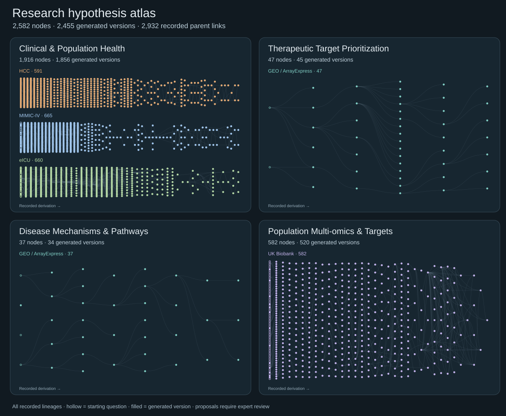

# Blinded expert scientific review

Please open the linked **anonymous English scientific proposal** before judging the research question. Each domain page groups questions by dataset and shows only recorded parent links. A node may be an initial question, a revision, or a new direction; operational outcomes are intentionally absent.

Choose a domain:

- [Clinical & Population Health Research](domains/01-clinical-population.md)
- [Therapeutic Target Prioritization](domains/02-therapeutic-targets.md)
- [Disease Mechanisms & Pathway Hypotheses](domains/03-disease-mechanisms.md)
- [Population Multi-omics & Disease Targets](domains/04-population-multiomics.md)

For any question you choose to review, record its anonymous ID and answer:

1. Is the question scientifically important, and what is the strongest alternative explanation?
2. Is its proposed contrast testable with the named dataset or study family? What additional evidence would be needed?
3. Which follow-up would most efficiently distinguish the competing explanations?
4. Would you prioritize, revise, defer, or reject the question? Why?

A useful negative or inconclusive result can still advance research. An association or expression pattern alone does not establish a causal mechanism or therapeutic effect.

Please review independently before discussing judgments with other reviewers. We will reconcile disagreements and record what evidence would change the decision. The form deliberately does not show any model assessment or operational milestone.

## Review blinding

Use the current domain catalogs and anonymous proposal copies for your initial assessment. Do not consult aggregate campaign information or repository history until you have submitted your independent review. Record only the anonymous hypothesis ID on the review form.

Every proposal uses the same review header. Producer, provider, campaign, authoring-date metadata, and individual provenance links are withheld. Exact originals and source-to-review mappings are retained privately. Scientific methods, citations, and dataset descriptions are preserved; a model mentioned in a cited study is part of the scientific context, not an attribution of the hypothesis.

The hypotheses retain their scientific wording and therefore may still differ in style. This is explicit-attribution blinding, not a guarantee against inference from style or prior familiarity. See [English edition notes](TRANSLATION.md).
