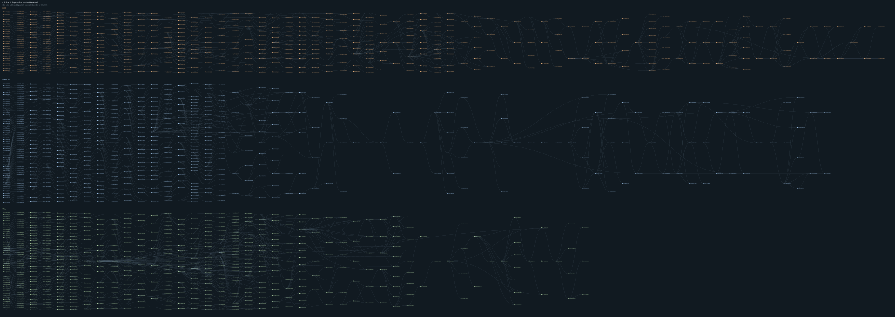

# Clinical & Population Health Research

258 nodes in this frozen domain forest. A node is one recorded hypothesis version or starting question; arrows show recorded derivation. Distinct roots remain distinct.

## HCC

75 nodes

### D1-07900E75B1 · early workflow timing versus later recorded-state signal

**Full scientific proposal:** [Read the public review copy](../proposals/D1-07900E75B1.md)

**Derived from:** D1-4DC8CED798

### D1-0E3BCD2C45 · assay content versus a competing observation process

**Full scientific proposal:** [Read the public review copy](../proposals/D1-0E3BCD2C45.md)

**Derived from:** D1-3C2D0A046F

### D1-12F0DFF455 · audited first-recorded-TACE question

**Full scientific proposal:** [Read the public review copy](../proposals/D1-12F0DFF455.md)

**Derived from:** D1-6086BEF6C2

### D1-146510A2BB · HCC day-42 endpoint triangulation for operational repeat-TACE transport

**Full scientific proposal:** [Read the public review copy](../proposals/D1-146510A2BB.md)

**Derived from:** D1-B3F939C4BE

### D1-1654426DD6 · Day-42 HCC recorded-assay transport: auditable support, workflow separation, and an adjudication gate

**Full scientific proposal:** [Read the public review copy](../proposals/D1-1654426DD6.md)

**Derived from:** D1-5D8E980060

### D1-1807E9040E · HCC day-42 trajectory: corroboration-timing falsifier

**Full scientific proposal:** [Read the public review copy](../proposals/D1-1807E9040E.md)

**Derived from:** D1-8617A21725

### D1-1E675458FC · stable assay profile versus within-person change

**Full scientific proposal:** [Read the public review copy](../proposals/D1-1E675458FC.md)

**Derived from:** D1-7EC9555350

### D1-2B4AFF4CA4 · a day-42, censoring-aware test of recorded assay state versus care process after first dated exact-code TACE

**Full scientific proposal:** [Read the public review copy](../proposals/D1-2B4AFF4CA4.md)

**Derived from:** D1-12F0DFF455

### D1-2D1B24C03C · day-42 HCC assay state with support-gated workflow and non-TACE checks

**Full scientific proposal:** [Read the public review copy](../proposals/D1-2D1B24C03C.md)

**Derived from:** D1-2FCD04CB6F

### D1-2EB18075AE · pre-endpoint documentation-conditioned assay contrast

**Full scientific proposal:** [Read the public review copy](../proposals/D1-2EB18075AE.md)

**Derived from:** D1-CDE65D829E

### D1-2EBBBEBF95 · assay content versus a competing observation process

**Full scientific proposal:** [Read the public review copy](../proposals/D1-2EBBBEBF95.md)

**Derived from:** D1-3C2D0A046F

### D1-2FCD04CB6F · Day-42 HCC: recorded assay state versus a pre-outcome review-workflow proxy

**Full scientific proposal:** [Read the public review copy](../proposals/D1-2FCD04CB6F.md)

**Derived from:** D1-4DC8CED798

### D1-30D443CBBA · temporal and competing-care boundary for the day-42 HCC assay-state experiment

**Full scientific proposal:** [Read the public review copy](../proposals/D1-30D443CBBA.md)

**Derived from:** D1-2D1B24C03C

### D1-33F4EB6948 · HCC branch A: treatment recovery versus care-process signal

**Full scientific proposal:** [Read the public review copy](../proposals/D1-33F4EB6948.md)

**Derived from:** —

### D1-346AA34A90 · HCC post-TACE trajectory: measurement-validity successor

**Full scientific proposal:** [Read the public review copy](../proposals/D1-346AA34A90.md)

**Derived from:** D1-ADFE2F1C70

### D1-3A5A592644 · stable assay profile versus within-person change

**Full scientific proposal:** [Read the public review copy](../proposals/D1-3A5A592644.md)

**Derived from:** D1-7EC9555350

### D1-3C2D0A046F · post-procedure coherence versus planned documentation

**Full scientific proposal:** [Read the public review copy](../proposals/D1-3C2D0A046F.md)

**Derived from:** D1-509B2BB429

### D1-3E165367F0 · independent audit and endpoint-provenance repair

**Full scientific proposal:** [Read the public review copy](../proposals/D1-3E165367F0.md)

**Derived from:** D1-3C2D0A046F

### D1-4196B57F22 · day-42 repeat-TACE risk, separated assay state from observation and retreatment process

**Full scientific proposal:** [Read the public review copy](../proposals/D1-4196B57F22.md)

**Derived from:** D1-7FD7A4513B

### D1-451BC03183 · index-anchored timing and competing-observation sensitivity

**Full scientific proposal:** [Read the public review copy](../proposals/D1-451BC03183.md)

**Derived from:** D1-DB561C90DA

### D1-47F05BE8F9 · assay content versus assay opportunity

**Full scientific proposal:** [Read the public review copy](../proposals/D1-47F05BE8F9.md)

**Derived from:** D1-7B826F0F09

### D1-4BDCC43C2D · stable assay profile versus within-person change

**Full scientific proposal:** [Read the public review copy](../proposals/D1-4BDCC43C2D.md)

**Derived from:** D1-7EC9555350

### D1-4DC8CED798 · Day-42 HCC exact-code repeat-TACE: patient-held-out state-versus-workflow test

**Full scientific proposal:** [Read the public review copy](../proposals/D1-4DC8CED798.md)

**Derived from:** D1-A0840A7635

### D1-4FCFF4A8F1 · HCC repeat-TACE episode validity: a decision-facing adjudication gate

**Full scientific proposal:** [Read the public review copy](../proposals/D1-4FCFF4A8F1.md)

**Derived from:** D1-8CB0C4FF88

**Scientific question:** The hypothesis is > In the inherited day-42 population, if the assay-state increment is reproducible for O1, it will remain positive after the parent’s workflow and lead-time controls, with O1 supported by timed examination/order evidence rather than by untimed pathology/diagnosis coverage; this pattern should justify a clinical adjudication study of the operational episode.

### D1-509B2BB429 · assay content versus observation/workflow

**Full scientific proposal:** [Read the public review copy](../proposals/D1-509B2BB429.md)

**Derived from:** D1-851952DF2A

### D1-5206902561 · measurement and endpoint validity refinement for the HCC post-TACE trajectory

**Full scientific proposal:** [Read the public review copy](../proposals/D1-5206902561.md)

**Derived from:** D1-ADFE2F1C70

### D1-572E82E965 · HCC nested trajectory increment beyond the day-42 snapshot

**Full scientific proposal:** [Read the public review copy](../proposals/D1-572E82E965.md)

**Derived from:** D1-EB5DEF3532

### D1-5D4D4A3548 · stable assay profile versus within-person day-42 change

**Full scientific proposal:** [Read the public review copy](../proposals/D1-5D4D4A3548.md)

**Derived from:** D1-F7F97BBFE0

### D1-5D8E980060 · Day-42 recorded-assay signal: transportability across observation and care-process strata

**Full scientific proposal:** [Read the public review copy](../proposals/D1-5D8E980060.md)

**Derived from:** D1-4196B57F22

### D1-5F38D86C29 · Does the early post-TACE lab trajectory persist?

**Full scientific proposal:** [Read the public review copy](../proposals/D1-5F38D86C29.md)

**Derived from:** D1-AA180FF03E

### D1-6086BEF6C2 · HCC method exploration: dynamic response versus care-process explanation

**Full scientific proposal:** [Read the public review copy](../proposals/D1-6086BEF6C2.md)

**Derived from:** —

### D1-61EA7808AA · HCC successor: pre-procedure versus post-procedure corroboration of the day-42 trajectory

**Full scientific proposal:** [Read the public review copy](../proposals/D1-61EA7808AA.md)

**Derived from:** D1-8617A21725

### D1-6429CB1062 · assay content versus a competing observation process

**Full scientific proposal:** [Read the public review copy](../proposals/D1-6429CB1062.md)

**Derived from:** D1-3C2D0A046F

### D1-7213C066BD · representation-boundary memo

**Full scientific proposal:** [Read the public review copy](../proposals/D1-7213C066BD.md)

**Derived from:** D1-4DC8CED798

### D1-7388786269 · Day-42 HCC assay transportability: frozen support and workflow/state interpretation

**Full scientific proposal:** [Read the public review copy](../proposals/D1-7388786269.md)

**Derived from:** D1-5D8E980060

### D1-7B826F0F09 · pre-outcome day-28 check for day-42 observation selection

**Full scientific proposal:** [Read the public review copy](../proposals/D1-7B826F0F09.md)

**Derived from:** D1-E3EB90F6D6

### D1-7EC9555350 · assay-result content versus observation and capture clocks

**Full scientific proposal:** [Read the public review copy](../proposals/D1-7EC9555350.md)

**Derived from:** D1-CDE65D829E

### D1-7FD7A4513B · a day-42, censoring-aware test of recorded assay state versus care process after first dated exact-code TACE

**Full scientific proposal:** [Read the public review copy](../proposals/D1-7FD7A4513B.md)

**Derived from:** D1-EBEF993805

### D1-851952DF2A · HCC trajectory repair: observation-selection-robust day-42 increment

**Full scientific proposal:** [Read the public review copy](../proposals/D1-851952DF2A.md)

**Derived from:** D1-EB5DEF3532

### D1-8617A21725 · observation-transport and downstream documentation falsification

**Full scientific proposal:** [Read the public review copy](../proposals/D1-8617A21725.md)

**Derived from:** D1-E00B81A67B

### D1-8AEA2217FF · Dynamic post-TACE liver-state signal versus observation process in HCC

**Full scientific proposal:** [Read the public review copy](../proposals/D1-8AEA2217FF.md)

**Derived from:** D1-6086BEF6C2

### D1-8CB0C4FF88 · HCC day-42 endpoint triangulation for operational repeat-TACE transport

**Full scientific proposal:** [Read the public review copy](../proposals/D1-8CB0C4FF88.md)

**Derived from:** D1-B3F939C4BE

### D1-8D2896BDC1 · day-42 repeat-TACE risk, separated assay state from observation and retreatment process

**Full scientific proposal:** [Read the public review copy](../proposals/D1-8D2896BDC1.md)

**Derived from:** D1-7FD7A4513B

### D1-96488D2B0D · documentation-balanced endpoint coherence at day 42

**Full scientific proposal:** [Read the public review copy](../proposals/D1-96488D2B0D.md)

**Derived from:** D1-E00B81A67B

### D1-9AD6A0E452 · assay-result information beyond care/documentation workflow

**Full scientific proposal:** [Read the public review copy](../proposals/D1-9AD6A0E452.md)

**Derived from:** D1-7B826F0F09

### D1-A0840A7635 · Day-42 HCC recorded-assay transport: auditable support, workflow separation, and an adjudication gate

**Full scientific proposal:** [Read the public review copy](../proposals/D1-A0840A7635.md)

**Derived from:** D1-5D8E980060

### D1-A43E31E6EA · HCC post-TACE trajectory: endpoint-validity and competing-event

**Full scientific proposal:** [Read the public review copy](../proposals/D1-A43E31E6EA.md)

**Derived from:** D1-DB561C90DA

### D1-A4759CE145 · assay content versus a competing observation process

**Full scientific proposal:** [Read the public review copy](../proposals/D1-A4759CE145.md)

**Derived from:** D1-3C2D0A046F

### D1-A6811F5958 · a day-42, censoring-aware test of recorded assay state versus care process after first dated exact-code TACE

**Full scientific proposal:** [Read the public review copy](../proposals/D1-A6811F5958.md)

**Derived from:** D1-12F0DFF455

### D1-AA180FF03E · transient versus sustained liver-reserve change after TACE

**Full scientific proposal:** [Read the public review copy](../proposals/D1-AA180FF03E.md)

**Derived from:** —

### D1-AD7D26470F · HCC endpoint-validity : lead-time corroboration around the day-42 trajectory

**Full scientific proposal:** [Read the public review copy](../proposals/D1-AD7D26470F.md)

**Derived from:** D1-851952DF2A

### D1-ADFE2F1C70 · HCC hypothesis and Harbor experiment

**Full scientific proposal:** [Read the public review copy](../proposals/D1-ADFE2F1C70.md)

**Derived from:** —

### D1-AFD03EDFC2 · pre-endpoint documentation-conditioned assay contrast

**Full scientific proposal:** [Read the public review copy](../proposals/D1-AFD03EDFC2.md)

**Derived from:** D1-CDE65D829E

### D1-B3F939C4BE · Day-42 HCC assay transportability: frozen support and workflow/state interpretation

**Full scientific proposal:** [Read the public review copy](../proposals/D1-B3F939C4BE.md)

**Derived from:** D1-5D8E980060

### D1-B7C4381DDF · assay content versus a competing observation process

**Full scientific proposal:** [Read the public review copy](../proposals/D1-B7C4381DDF.md)

**Derived from:** D1-3C2D0A046F

### D1-B82E02C704 · stable assay profile versus within-person day-42 change

**Full scientific proposal:** [Read the public review copy](../proposals/D1-B82E02C704.md)

**Derived from:** D1-F7F97BBFE0

### D1-B923C7B951 · Day-42 HCC: recorded assay state versus a pre-outcome review-workflow proxy

**Full scientific proposal:** [Read the public review copy](../proposals/D1-B923C7B951.md)

**Derived from:** D1-2FCD04CB6F

### D1-BF06BA7FFA · an earlier competing-observation check for the HCC assay-change question

**Full scientific proposal:** [Read the public review copy](../proposals/D1-BF06BA7FFA.md)

**Derived from:** D1-E3EB90F6D6

### D1-C0992BBC98 · HCC day-42 endpoint triangulation for operational repeat-TACE transport

**Full scientific proposal:** [Read the public review copy](../proposals/D1-C0992BBC98.md)

**Derived from:** D1-B3F939C4BE

### D1-CDE65D829E · closure plus capture-aware negative control

**Full scientific proposal:** [Read the public review copy](../proposals/D1-CDE65D829E.md)

**Derived from:** D1-3C2D0A046F

### D1-CE85CFEA72 · HCC process-conditioned assay innovation after day-42 TACE

**Full scientific proposal:** [Read the public review copy](../proposals/D1-CE85CFEA72.md)

**Derived from:** D1-B3F939C4BE

### D1-D89D69F651 · process-conditioned assay-content

**Full scientific proposal:** [Read the public review copy](../proposals/D1-D89D69F651.md)

**Derived from:** D1-F3AEFEE90E

### D1-DB561C90DA · HCC post-TACE trajectory: transportability and observation-process

**Full scientific proposal:** [Read the public review copy](../proposals/D1-DB561C90DA.md)

**Derived from:** D1-346AA34A90

### D1-E00B81A67B · endpoint coherence under day-42 observation selection

**Full scientific proposal:** [Read the public review copy](../proposals/D1-E00B81A67B.md)

**Derived from:** D1-851952DF2A, D1-8CB0C4FF88

**Scientific question:** The unresolved question is whether a laboratory trajectory observed by day 42 contains reproducible held-out information about a later coherent, operational retreatment episode, after two distinct explanations have been addressed 1.

### D1-E38F989919 · Dynamic post-TACE liver-state information versus observation process in locally recorded HCC care

**Full scientific proposal:** [Read the public review copy](../proposals/D1-E38F989919.md)

**Derived from:** D1-6086BEF6C2

### D1-E3EB90F6D6 · stable assay profile versus within-person change

**Full scientific proposal:** [Read the public review copy](../proposals/D1-E3EB90F6D6.md)

**Derived from:** D1-7EC9555350

### D1-E4ED410897 · temporal and competing-operational-care boundary for day-42 HCC assay state

**Full scientific proposal:** [Read the public review copy](../proposals/D1-E4ED410897.md)

**Derived from:** D1-2D1B24C03C

### D1-E5C881125D · Day-42 landmark HCC : assay payload versus care process, with an irregular-event audit

**Full scientific proposal:** [Read the public review copy](../proposals/D1-E5C881125D.md)

**Derived from:** D1-7FD7A4513B

**Scientific question:** The unresolved question is whether a recorded post-TACE assay signal contains information beyond the process that produced the record.

### D1-EB067220B0 · assay content versus a competing observation process

**Full scientific proposal:** [Read the public review copy](../proposals/D1-EB067220B0.md)

**Derived from:** D1-3C2D0A046F

### D1-EB5DEF3532 · HCC repeat-TACE: pre-index-to-day-42 assay trajectory versus snapshot and workflow

**Full scientific proposal:** [Read the public review copy](../proposals/D1-EB5DEF3532.md)

**Derived from:** D1-4FCFF4A8F1

**Scientific question:** The hypothesis is predictive/descriptive for a recorded operational event.

### D1-EBEF993805 · a day-42, censoring-aware test of recorded assay state versus care process after first dated exact-code TACE

**Full scientific proposal:** [Read the public review copy](../proposals/D1-EBEF993805.md)

**Derived from:** D1-12F0DFF455

### D1-F19B129986 · decision estimand for recorded post-TACE retreatment

**Full scientific proposal:** [Read the public review copy](../proposals/D1-F19B129986.md)

**Derived from:** D1-12F0DFF455

### D1-F3AEFEE90E · process-conditioned assay-content

**Full scientific proposal:** [Read the public review copy](../proposals/D1-F3AEFEE90E.md)

**Derived from:** D1-F7F97BBFE0

### D1-F64C24D63C · HCC assay trajectory versus day-42 snapshot for repeat-TACE endpoint validity

**Full scientific proposal:** [Read the public review copy](../proposals/D1-F64C24D63C.md)

**Derived from:** D1-4FCFF4A8F1

### D1-F7F97BBFE0 · closure plus capture-aware negative control

**Full scientific proposal:** [Read the public review copy](../proposals/D1-F7F97BBFE0.md)

**Derived from:** D1-3C2D0A046F

## MIMIC-IV

82 nodes

### D1-039A23F6CB · Residual physiologic instability immediately before alive ICU discharge: a competing-risk MIMIC-IV test

**Full scientific proposal:** [Read the public review copy](../proposals/D1-039A23F6CB.md)

**Derived from:** —

### D1-03CB2B9D07 · Residual physiologic instability immediately before ICU discharge

**Full scientific proposal:** [Read the public review copy](../proposals/D1-03CB2B9D07.md)

**Derived from:** D1-BB8FA55243

### D1-06E45555A9 · unknown-aware ICU-discharge instability with a preserved temporal boundary

**Full scientific proposal:** [Read the public review copy](../proposals/D1-06E45555A9.md)

**Derived from:** D1-D33B4E15C4

### D1-0709D28AB0 · all-eligible observation-aware ICU-discharge instability with a paired temporal boundary check

**Full scientific proposal:** [Read the public review copy](../proposals/D1-0709D28AB0.md)

**Derived from:** D1-06E45555A9

### D1-08C3B9CAF6 · discordant kidney recovery after ICU AKI

**Full scientific proposal:** [Read the public review copy](../proposals/D1-08C3B9CAF6.md)

**Derived from:** D1-9876D4A6BA

### D1-0CFA099A4B · When apparent AKI recovery is discordant: a MIMIC-IV landmark study

**Full scientific proposal:** [Read the public review copy](../proposals/D1-0CFA099A4B.md)

**Derived from:** D1-CCCA6C6FC4

### D1-0D40E102C0 · MIMIC AKI discordance: residual severity and observation-opportunity audit

**Full scientific proposal:** [Read the public review copy](../proposals/D1-0D40E102C0.md)

**Derived from:** D1-83D576D3DB

### D1-0F7D26F066 · Outcome-ascertainment audit: discordant-AKI recovery

**Full scientific proposal:** [Read the public review copy](../proposals/D1-0F7D26F066.md)

**Derived from:** D1-95A9815838

### D1-119B84C5D6 · MIMIC-IV renal-discordance: longitudinal discriminator repair

**Full scientific proposal:** [Read the public review copy](../proposals/D1-119B84C5D6.md)

**Derived from:** D1-D9BC622BA8

### D1-197F6B8C76 · landmark selection and residual severity in discordant-AKI recovery

**Full scientific proposal:** [Read the public review copy](../proposals/D1-197F6B8C76.md)

**Derived from:** D1-08C3B9CAF6

### D1-1A8D5C7229 · Persistent deep sedation after stabilization

**Full scientific proposal:** [Read the public review copy](../proposals/D1-1A8D5C7229.md)

**Derived from:** —

### D1-1AD6D49208 · Branch C — residual instability before ICU discharge

**Full scientific proposal:** [Read the public review copy](../proposals/D1-1AD6D49208.md)

**Derived from:** D1-BB8FA55243

### D1-1F4434AB17 · all-eligible observation-aware ICU-discharge instability with a paired temporal boundary check

**Full scientific proposal:** [Read the public review copy](../proposals/D1-1F4434AB17.md)

**Derived from:** D1-D33B4E15C4

### D1-2211A2AB58 · Repair : observed discordant renal recovery at the ICU-discharge landmark

**Full scientific proposal:** [Read the public review copy](../proposals/D1-2211A2AB58.md)

**Derived from:** D1-EF7877D7B1

### D1-264991677A · lagged temporal validation of discordant-AKI recovery

**Full scientific proposal:** [Read the public review copy](../proposals/D1-264991677A.md)

**Derived from:** D1-95A9815838

### D1-26CF39D19D · Creatinine increases during diuresis

**Full scientific proposal:** [Read the public review copy](../proposals/D1-26CF39D19D.md)

**Derived from:** —

### D1-2818CDDEC7 · support-ordered, noncausal lagged discordant-AKI comparison

**Full scientific proposal:** [Read the public review copy](../proposals/D1-2818CDDEC7.md)

**Derived from:** D1-48BBDB76D9

### D1-2F88EC208E · Support-aware successor of the lagged discordant-AKI design

**Full scientific proposal:** [Read the public review copy](../proposals/D1-2F88EC208E.md)

**Derived from:** D1-DCF524E46D

### D1-32F033D3AE · Residual physiologic instability immediately before alive ICU discharge: a competing-risk MIMIC-IV test

**Full scientific proposal:** [Read the public review copy](../proposals/D1-32F033D3AE.md)

**Derived from:** —

### D1-3319D2904B · MIMIC-IV renal-discordance: longitudinal discriminator repair

**Full scientific proposal:** [Read the public review copy](../proposals/D1-3319D2904B.md)

**Derived from:** D1-D9BC622BA8

### D1-34321AF9CB · Does discordant AKI recovery add prognostic information beyond observation intensity?

**Full scientific proposal:** [Read the public review copy](../proposals/D1-34321AF9CB.md)

**Derived from:** D1-C7145E6FBF

**Scientific question:** Among the defined 48-hour landmark survivors, observed creatinine decline paired with clinically validated persistent oliguria during the preceding 24 hours is associated with higher conditional 7-day in-hospital death risk than concordant improvement, after accounting for pre-landmark acuity, fluid/treatment proxies and observation intensity.

### D1-36238E3987 · Lagged component-specific AKI discordance: support-ordered competing risks with a matched temporal comparison

**Full scientific proposal:** [Read the public review copy](../proposals/D1-36238E3987.md)

**Derived from:** D1-2818CDDEC7

### D1-36D1B18E0B · Heterogeneity in the effects of transfusion

**Full scientific proposal:** [Read the public review copy](../proposals/D1-36D1B18E0B.md)

**Derived from:** —

### D1-37312BEFA2 · Acute glucose elevation relative to chronic glycemia

**Full scientific proposal:** [Read the public review copy](../proposals/D1-37312BEFA2.md)

**Derived from:** —

### D1-38B0EE3631 · Timing of diuretic initiation

**Full scientific proposal:** [Read the public review copy](../proposals/D1-38B0EE3631.md)

**Derived from:** —

### D1-3FD1C7BFCB · pre-exposure severity and informative ICU-exit repair

**Full scientific proposal:** [Read the public review copy](../proposals/D1-3FD1C7BFCB.md)

**Derived from:** D1-96314A72A8

### D1-4475FCDCCF · unknown-aware ICU-discharge instability with a preserved temporal boundary

**Full scientific proposal:** [Read the public review copy](../proposals/D1-4475FCDCCF.md)

**Derived from:** D1-06E45555A9

### D1-48BBDB76D9 · Support-anchored lagged discordant-AKI successor

**Full scientific proposal:** [Read the public review copy](../proposals/D1-48BBDB76D9.md)

**Derived from:** D1-DCF524E46D

### D1-4B396BBD98 · discordant kidney recovery after ICU AKI

**Full scientific proposal:** [Read the public review copy](../proposals/D1-4B396BBD98.md)

**Derived from:** D1-08C3B9CAF6

### D1-4F5327C89B · pre-exposure severity and informative ICU-exit repair

**Full scientific proposal:** [Read the public review copy](../proposals/D1-4F5327C89B.md)

**Derived from:** D1-96314A72A8

### D1-4F9363A85E · Asynchronous organ recovery

**Full scientific proposal:** [Read the public review copy](../proposals/D1-4F9363A85E.md)

**Derived from:** —

### D1-5194999FD9 · Asynchronous organ recovery

**Full scientific proposal:** [Read the public review copy](../proposals/D1-5194999FD9.md)

**Derived from:** —

### D1-51DD9AF8BB · Acute glucose elevation relative to chronic glycemia

**Full scientific proposal:** [Read the public review copy](../proposals/D1-51DD9AF8BB.md)

**Derived from:** —

### D1-59B2CD2220 · a falsifiable temporal boundary test for ICU-discharge instability

**Full scientific proposal:** [Read the public review copy](../proposals/D1-59B2CD2220.md)

**Derived from:** D1-F26726A07E

### D1-5DA02926A7 · discordant kidney recovery after ICU AKI

**Full scientific proposal:** [Read the public review copy](../proposals/D1-5DA02926A7.md)

**Derived from:** D1-9876D4A6BA

### D1-5E216C7F70 · Branch A — residual instability before ICU discharge

**Full scientific proposal:** [Read the public review copy](../proposals/D1-5E216C7F70.md)

**Derived from:** D1-BB8FA55243

### D1-5EDF0AD893 · pre-exposure severity and informative ICU-exit repair

**Full scientific proposal:** [Read the public review copy](../proposals/D1-5EDF0AD893.md)

**Derived from:** D1-4F5327C89B

### D1-62583CC073 · Residual instability at ICU discharge: a time-specific competing-risk audit

**Full scientific proposal:** [Read the public review copy](../proposals/D1-62583CC073.md)

**Derived from:** —

### D1-778922A5DA · MIMIC AKI discordance: all-eligible landmark flow and component-specific outcomes

**Full scientific proposal:** [Read the public review copy](../proposals/D1-778922A5DA.md)

**Derived from:** D1-5EDF0AD893

### D1-7D649F5CD1 · Timing of diuretic initiation

**Full scientific proposal:** [Read the public review copy](../proposals/D1-7D649F5CD1.md)

**Derived from:** —

### D1-7F64DCC70B · Residual instability before ICU discharge

**Full scientific proposal:** [Read the public review copy](../proposals/D1-7F64DCC70B.md)

**Derived from:** —

### D1-83D576D3DB · MIMIC AKI discordance: residual severity and observation-opportunity audit

**Full scientific proposal:** [Read the public review copy](../proposals/D1-83D576D3DB.md)

**Derived from:** D1-96314A72A8

### D1-8989254C90 · Discordant recovery after acute kidney injury

**Full scientific proposal:** [Read the public review copy](../proposals/D1-8989254C90.md)

**Derived from:** —

### D1-8A07022386 · all-eligible observation-aware ICU-discharge instability with a paired temporal boundary check

**Full scientific proposal:** [Read the public review copy](../proposals/D1-8A07022386.md)

**Derived from:** D1-D33B4E15C4

### D1-924C091A25 · Repair : observed discordant renal recovery at the ICU-discharge landmark

**Full scientific proposal:** [Read the public review copy](../proposals/D1-924C091A25.md)

**Derived from:** D1-EF7877D7B1

### D1-92936D0BBF · Different meanings of persistent hyperlactatemia

**Full scientific proposal:** [Read the public review copy](../proposals/D1-92936D0BBF.md)

**Derived from:** —

### D1-94D208B75A · MIMIC AKI discordance: all-eligible landmark-survival and ascertainment repair

**Full scientific proposal:** [Read the public review copy](../proposals/D1-94D208B75A.md)

**Derived from:** D1-5EDF0AD893

### D1-95A9815838 · landmark selection and residual severity in discordant-AKI recovery

**Full scientific proposal:** [Read the public review copy](../proposals/D1-95A9815838.md)

**Derived from:** D1-197F6B8C76

### D1-95B0F4EC67 · MIMIC AKI discordance: residual severity and observation-opportunity audit

**Full scientific proposal:** [Read the public review copy](../proposals/D1-95B0F4EC67.md)

**Derived from:** D1-83D576D3DB

### D1-96314A72A8 · support-aware temporal comparison

**Full scientific proposal:** [Read the public review copy](../proposals/D1-96314A72A8.md)

**Derived from:** D1-2818CDDEC7

### D1-980664D86A · MIMIC AKI discordance: all-eligible landmark flow and component-specific outcomes

**Full scientific proposal:** [Read the public review copy](../proposals/D1-980664D86A.md)

**Derived from:** D1-5EDF0AD893

### D1-9876D4A6BA · discordant kidney recovery after ICU AKI

**Full scientific proposal:** [Read the public review copy](../proposals/D1-9876D4A6BA.md)

**Derived from:** D1-8989254C90

### D1-9E898FBEAF · Lagged component-specific AKI discordance: support-ordered competing risks with a matched temporal comparison

**Full scientific proposal:** [Read the public review copy](../proposals/D1-9E898FBEAF.md)

**Derived from:** D1-2818CDDEC7

### D1-A0BD1DB565 · Does discordant AKI recovery add prognostic information beyond observation intensity?

**Full scientific proposal:** [Read the public review copy](../proposals/D1-A0BD1DB565.md)

**Derived from:** D1-0CFA099A4B

### D1-A250C56EB7 · Persistent deep sedation after stabilization

**Full scientific proposal:** [Read the public review copy](../proposals/D1-A250C56EB7.md)

**Derived from:** —

### D1-A6578BE3E1 · Timing of antimicrobial de-escalation

**Full scientific proposal:** [Read the public review copy](../proposals/D1-A6578BE3E1.md)

**Derived from:** —

### D1-A80357ED6E · Creatinine increases during diuresis

**Full scientific proposal:** [Read the public review copy](../proposals/D1-A80357ED6E.md)

**Derived from:** —

### D1-AC5953519A · MIMIC AKI discordance: residual severity and observation-opportunity audit

**Full scientific proposal:** [Read the public review copy](../proposals/D1-AC5953519A.md)

**Derived from:** D1-83D576D3DB

### D1-B1C8DFB4A6 · MIMIC AKI discordance: residual severity and observation-opportunity audit

**Full scientific proposal:** [Read the public review copy](../proposals/D1-B1C8DFB4A6.md)

**Derived from:** D1-83D576D3DB

### D1-B77BB79420 · Complementary branch: lagged, component-specific audit of discordant-AKI recovery

**Full scientific proposal:** [Read the public review copy](../proposals/D1-B77BB79420.md)

**Derived from:** D1-0F7D26F066

### D1-BA1FC11D08 · make discharge and documentation selection testable

**Full scientific proposal:** [Read the public review copy](../proposals/D1-BA1FC11D08.md)

**Derived from:** D1-D9BC622BA8

### D1-BB8FA55243 · Residual instability before ICU discharge

**Full scientific proposal:** [Read the public review copy](../proposals/D1-BB8FA55243.md)

**Derived from:** —

### D1-BC40FE415D · Heterogeneity in the effects of transfusion

**Full scientific proposal:** [Read the public review copy](../proposals/D1-BC40FE415D.md)

**Derived from:** —

### D1-BFF179BA3C · Residual physiologic instability before ICU discharge: a leakage-safe 48-hour MIMIC-IV test

**Full scientific proposal:** [Read the public review copy](../proposals/D1-BFF179BA3C.md)

**Derived from:** D1-BB8FA55243

### D1-C36EE1B7E2 · independent executable/schema audit

**Full scientific proposal:** [Read the public review copy](../proposals/D1-C36EE1B7E2.md)

**Derived from:** D1-48BBDB76D9

### D1-C7145E6FBF · Does discordant AKI recovery add prognostic information beyond observation intensity?

**Full scientific proposal:** [Read the public review copy](../proposals/D1-C7145E6FBF.md)

**Derived from:** D1-A0BD1DB565

**Scientific question:** The unresolved question is whether apparent creatinine improvement paired with documented persistent oliguria at a fixed post-AKI landmark identifies a higher subsequent mortality risk than concordant improvement, beyond measured severity, fluid/treatment proxies, and observation intensity.

### D1-CCCA6C6FC4 · Discordant recovery after acute kidney injury

**Full scientific proposal:** [Read the public review copy](../proposals/D1-CCCA6C6FC4.md)

**Derived from:** —

### D1-D0C64C10A3 · Timing of antimicrobial de-escalation

**Full scientific proposal:** [Read the public review copy](../proposals/D1-D0C64C10A3.md)

**Derived from:** —

### D1-D33B4E15C4 · a falsifiable temporal boundary test for ICU-discharge instability

**Full scientific proposal:** [Read the public review copy](../proposals/D1-D33B4E15C4.md)

**Derived from:** D1-D8F180FADF

### D1-D8F180FADF · a falsifiable temporal boundary test for ICU-discharge instability

**Full scientific proposal:** [Read the public review copy](../proposals/D1-D8F180FADF.md)

**Derived from:** D1-F26726A07E

### D1-D9BC622BA8 · MIMIC-IV renal-discordance repair: feasibility and design note

**Full scientific proposal:** [Read the public review copy](../proposals/D1-D9BC622BA8.md)

**Derived from:** D1-2211A2AB58

### D1-DCF524E46D · Lagged ascertainment audit and proposal: discordant-AKI recovery

**Full scientific proposal:** [Read the public review copy](../proposals/D1-DCF524E46D.md)

**Derived from:** D1-0F7D26F066

### D1-DE82C2760C · discordant kidney recovery after ICU AKI — repair

**Full scientific proposal:** [Read the public review copy](../proposals/D1-DE82C2760C.md)

**Derived from:** D1-9876D4A6BA

### D1-E270650DA6 · Observable risk-set contrast for discordant renal recovery after ICU acute kidney injury

**Full scientific proposal:** [Read the public review copy](../proposals/D1-E270650DA6.md)

**Derived from:** D1-2818CDDEC7

### D1-EB32A4C833 · Branch C — residual instability before ICU discharge

**Full scientific proposal:** [Read the public review copy](../proposals/D1-EB32A4C833.md)

**Derived from:** D1-BB8FA55243

### D1-EF7877D7B1 · MIMIC-IV proposal: discordant renal recovery at ICU discharge

**Full scientific proposal:** [Read the public review copy](../proposals/D1-EF7877D7B1.md)

**Derived from:** D1-5194999FD9

### D1-F0D8057A7C · Support-ascertainment repair: observed-opportunity discordant AKI

**Full scientific proposal:** [Read the public review copy](../proposals/D1-F0D8057A7C.md)

**Derived from:** D1-2F88EC208E

### D1-F26726A07E · Residual instability at ICU discharge: a time-specific competing-risk audit

**Full scientific proposal:** [Read the public review copy](../proposals/D1-F26726A07E.md)

**Derived from:** —

### D1-F2B6BA8274 · Observation-selection repair: all-eligible ICU-discharge instability

**Full scientific proposal:** [Read the public review copy](../proposals/D1-F2B6BA8274.md)

**Derived from:** D1-F26726A07E

### D1-F7389479D4 · Different meanings of persistent hyperlactatemia

**Full scientific proposal:** [Read the public review copy](../proposals/D1-F7389479D4.md)

**Derived from:** —

### D1-F91096013A · Strictly lagged MIMIC AKI discordance: severity, support, exit and ascertainment audit

**Full scientific proposal:** [Read the public review copy](../proposals/D1-F91096013A.md)

**Derived from:** D1-2818CDDEC7

### D1-FE019C7AAF · residual instability at ICU discharge

**Full scientific proposal:** [Read the public review copy](../proposals/D1-FE019C7AAF.md)

**Derived from:** D1-0F7D26F066

**Scientific question:** can clinicians recognize residual physiologic risk at the moment of ICU discharge, before readmission or inpatient death?

## eICU

101 nodes

### D1-010BC76700 · Hypoglycemia after insulin

**Full scientific proposal:** [Read the public review copy](../proposals/D1-010BC76700.md)

**Derived from:** —

### D1-04CB946D93 · treatment-stream corroboration of a documented respiratoryCare start

**Full scientific proposal:** [Read the public review copy](../proposals/D1-04CB946D93.md)

**Derived from:** D1-47DE6E378D

### D1-05C9B4334B · Hospital differences in recovery speed

**Full scientific proposal:** [Read the public review copy](../proposals/D1-05C9B4334B.md)

**Derived from:** —

### D1-08DEFF4352 · physiologic trajectory versus latent severity

**Full scientific proposal:** [Read the public review copy](../proposals/D1-08DEFF4352.md)

**Derived from:** D1-83C34B5D9E

### D1-08E46CDBFE · site-stratified transportability of the post-360 recorded-vital transition

**Full scientific proposal:** [Read the public review copy](../proposals/D1-08E46CDBFE.md)

**Derived from:** D1-B2346869EE

### D1-11D485DEE9 · Patient-state versus documentation signal in hospital transport of early ICU mortality models

**Full scientific proposal:** [Read the public review copy](../proposals/D1-11D485DEE9.md)

**Derived from:** D1-4B768C478B

### D1-16C63F43E1 · Hyperoxia exposure

**Full scientific proposal:** [Read the public review copy](../proposals/D1-16C63F43E1.md)

**Derived from:** —

### D1-17680B06CB · operational transition versus source-defined trajectory change

**Full scientific proposal:** [Read the public review copy](../proposals/D1-17680B06CB.md)

**Derived from:** D1-B2346869EE

### D1-1B6894E3A6 · Temporal state sufficiency for the eICU lab/vital recording-process increment

**Full scientific proposal:** [Read the public review copy](../proposals/D1-1B6894E3A6.md)

**Derived from:** D1-E9136D1B76

### D1-1C0191116D · Cumulative systemic hypotension duration beyond nadir as a predictor of incident creatinine-defined AKI in eICU

**Full scientific proposal:** [Read the public review copy](../proposals/D1-1C0191116D.md)

**Derived from:** D1-56853CC55C

### D1-1D8CAFB2C3 · landmark physiology versus operational transition

**Full scientific proposal:** [Read the public review copy](../proposals/D1-1D8CAFB2C3.md)

**Derived from:** D1-83C34B5D9E

### D1-1E9B40C015 · Branch A — temporally ordered patient-state versus workflow transport in eICU

**Full scientific proposal:** [Read the public review copy](../proposals/D1-1E9B40C015.md)

**Derived from:** D1-11D485DEE9

### D1-2B38198CD8 · Ventilatory burden and liberation from ventilation

**Full scientific proposal:** [Read the public review copy](../proposals/D1-2B38198CD8.md)

**Derived from:** —

### D1-2B94342F55 · eICU lab-order process: within-site severity signal or between-site workflow signal?

**Full scientific proposal:** [Read the public review copy](../proposals/D1-2B94342F55.md)

**Derived from:** D1-A7208AD6C6

### D1-30F9318F33 · measurement-validity controls for the non-respiratory nurse endpoint

**Full scientific proposal:** [Read the public review copy](../proposals/D1-30F9318F33.md)

**Derived from:** D1-317511D6BA

### D1-317511D6BA · respiratory specificity versus generic documentation

**Full scientific proposal:** [Read the public review copy](../proposals/D1-317511D6BA.md)

**Derived from:** D1-6EBB286EFE

**Scientific question:** does a dynamic observation opportunity predict a later *recorded respiratoryCare transition* specifically, or does it predict whatever documentation occurs when nursing and vital observation intensify?

### D1-3328CE2047 · stable hospital monitoring regime versus patient-linked dynamic opportunity

**Full scientific proposal:** [Read the public review copy](../proposals/D1-3328CE2047.md)

**Derived from:** D1-727208C087

### D1-388BA5B2A5 · physiologic trajectory versus latent severity

**Full scientific proposal:** [Read the public review copy](../proposals/D1-388BA5B2A5.md)

**Derived from:** D1-83C34B5D9E

### D1-38B23445C4 · lab-observed instability followed by a monitoring gap

**Full scientific proposal:** [Read the public review copy](../proposals/D1-38B23445C4.md)

**Derived from:** D1-55314E7C09

### D1-391B7FC56B · Laboratory-observed instability followed by a monitoring gap

**Full scientific proposal:** [Read the public review copy](../proposals/D1-391B7FC56B.md)

**Derived from:** D1-55314E7C09

### D1-3D349ABF28 · Nighttime ICU discharge

**Full scientific proposal:** [Read the public review copy](../proposals/D1-3D349ABF28.md)

**Derived from:** —

### D1-3D983DB491 · respiratory records versus latent physiology and treatment timing

**Full scientific proposal:** [Read the public review copy](../proposals/D1-3D983DB491.md)

**Derived from:** D1-317511D6BA

### D1-3F355CD241 · respiratory-specific recording acceleration versus generic observation

**Full scientific proposal:** [Read the public review copy](../proposals/D1-3F355CD241.md)

**Derived from:** D1-727208C087

### D1-409D7A2518 · eICU laboratory process: severity proxy or site signature?

**Full scientific proposal:** [Read the public review copy](../proposals/D1-409D7A2518.md)

**Derived from:** D1-A7208AD6C6

### D1-43F6A2F419 · is process signal a missing temporal state?

**Full scientific proposal:** [Read the public review copy](../proposals/D1-43F6A2F419.md)

**Derived from:** D1-E9136D1B76

### D1-4666106C9C · independent respiratory-care corroboration

**Full scientific proposal:** [Read the public review copy](../proposals/D1-4666106C9C.md)

**Derived from:** D1-17680B06CB

### D1-47DE6E378D · independent respiratoryCharting corroboration with availability and exit controls

**Full scientific proposal:** [Read the public review copy](../proposals/D1-47DE6E378D.md)

**Derived from:** D1-AF1E369189

### D1-49F41F1839 · laboratory-result versus vital-observation process

**Full scientific proposal:** [Read the public review copy](../proposals/D1-49F41F1839.md)

**Derived from:** D1-85950BA4CA

### D1-4B768C478B · Testing-process signals and hospital transportability of early-ICU mortality models

**Full scientific proposal:** [Read the public review copy](../proposals/D1-4B768C478B.md)

**Derived from:** D1-9016DCA512

### D1-4D6DBB810A · measurement-validity controls for the non-respiratory nurse endpoint

**Full scientific proposal:** [Read the public review copy](../proposals/D1-4D6DBB810A.md)

**Derived from:** D1-317511D6BA

### D1-4EA6329D93 · scalar hypotension summaries versus temporal recovery trajectories

**Full scientific proposal:** [Read the public review copy](../proposals/D1-4EA6329D93.md)

**Derived from:** D1-BDBF3657E1

### D1-54F165FD8C · Hospital differences in recovery speed

**Full scientific proposal:** [Read the public review copy](../proposals/D1-54F165FD8C.md)

**Derived from:** —

### D1-54F9E9D473 · respiratory specificity after generic-process decomposition

**Full scientific proposal:** [Read the public review copy](../proposals/D1-54F9E9D473.md)

**Derived from:** D1-6EBB286EFE

### D1-55314E7C09 · Hospital-held-out patient-state versus documentation-process signal in eICU

**Full scientific proposal:** [Read the public review copy](../proposals/D1-55314E7C09.md)

**Derived from:** D1-E5AF40DD4C

### D1-56853CC55C · Cumulative hypotension duration beyond nadir as a predictor of incident AKI in eICU

**Full scientific proposal:** [Read the public review copy](../proposals/D1-56853CC55C.md)

**Derived from:** D1-B5B09AA7BC

### D1-579EC4E497 · Prediction models' dependence on testing practices

**Full scientific proposal:** [Read the public review copy](../proposals/D1-579EC4E497.md)

**Derived from:** —

### D1-589AD7F383 · operational transition versus source-defined trajectory change

**Full scientific proposal:** [Read the public review copy](../proposals/D1-589AD7F383.md)

**Derived from:** D1-B2346869EE

### D1-5CC541BE5E · lab-testing practice and ICU mortality transport

**Full scientific proposal:** [Read the public review copy](../proposals/D1-5CC541BE5E.md)

**Derived from:** D1-90F291D322

### D1-5ED07734AC · Duration of hypotension

**Full scientific proposal:** [Read the public review copy](../proposals/D1-5ED07734AC.md)

**Derived from:** —

### D1-65346CF79A · physiologic trajectory versus latent severity

**Full scientific proposal:** [Read the public review copy](../proposals/D1-65346CF79A.md)

**Derived from:** D1-83C34B5D9E

### D1-67820F648F · eICU 24-hour landmark: lab-process signal and hospital transport

**Full scientific proposal:** [Read the public review copy](../proposals/D1-67820F648F.md)

**Derived from:** D1-5CC541BE5E

### D1-6CB1620C79 · Treatment-record corroboration of a documented respiratory-care transition

**Full scientific proposal:** [Read the public review copy](../proposals/D1-6CB1620C79.md)

**Derived from:** D1-4666106C9C

### D1-6CEF73ED9C · eICU laboratory-testing signals and hospital transport of ICU mortality prediction

**Full scientific proposal:** [Read the public review copy](../proposals/D1-6CEF73ED9C.md)

**Derived from:** D1-5CC541BE5E

### D1-6EBB286EFE · stable hospital monitoring regime versus patient-linked dynamic opportunity

**Full scientific proposal:** [Read the public review copy](../proposals/D1-6EBB286EFE.md)

**Derived from:** D1-727208C087

### D1-727208C087 · landmark selection, observation opportunity, and respiratory-transition provenance

**Full scientific proposal:** [Read the public review copy](../proposals/D1-727208C087.md)

**Derived from:** D1-65346CF79A

### D1-7580578C4E · laboratory-result process versus vital-observation process

**Full scientific proposal:** [Read the public review copy](../proposals/D1-7580578C4E.md)

**Derived from:** D1-85950BA4CA

### D1-7F9E1F89F1 · treatment-stream corroboration of a documented respiratoryCare start

**Full scientific proposal:** [Read the public review copy](../proposals/D1-7F9E1F89F1.md)

**Derived from:** D1-47DE6E378D

### D1-80ABE66210 · Hospital-held-out eICU mortality transport: patient state, documentation process, and residual case mix

**Full scientific proposal:** [Read the public review copy](../proposals/D1-80ABE66210.md)

**Derived from:** D1-E5AF40DD4C

### D1-83C34B5D9E · independent timing versus shared documentation

**Full scientific proposal:** [Read the public review copy](../proposals/D1-83C34B5D9E.md)

**Derived from:** D1-6CB1620C79

### D1-85950BA4CA · Branch B — vital-trajectory state versus laboratory-process transport in eICU

**Full scientific proposal:** [Read the public review copy](../proposals/D1-85950BA4CA.md)

**Derived from:** D1-86D6FD74BB

**Scientific question:** The unresolved question is whether a laboratory-process increment remains when “patient state” includes compact, temporally ordered vital trajectories rather than only six-hour laboratory values.

### D1-86563D0BE5 · independent respiratory-care corroboration

**Full scientific proposal:** [Read the public review copy](../proposals/D1-86563D0BE5.md)

**Derived from:** D1-17680B06CB

### D1-86C163000D · Patient-state versus documentation signal in hospital transport of early ICU mortality models

**Full scientific proposal:** [Read the public review copy](../proposals/D1-86C163000D.md)

**Derived from:** D1-4B768C478B

### D1-86D6FD74BB · Selection and censoring boundary for the eICU testing-process transportability signal

**Full scientific proposal:** [Read the public review copy](../proposals/D1-86D6FD74BB.md)

**Derived from:** D1-11D485DEE9

### D1-8DE27D0900 · audited creatinine label and matched scalar-versus-trajectory test

**Full scientific proposal:** [Read the public review copy](../proposals/D1-8DE27D0900.md)

**Derived from:** D1-BDBF3657E1

### D1-9016DCA512 · Testing-process signals and hospital transportability of early-ICU mortality models

**Full scientific proposal:** [Read the public review copy](../proposals/D1-9016DCA512.md)

**Derived from:** D1-C3B136B54E

### D1-90F291D322 · lab-testing practice and ICU mortality transport

**Full scientific proposal:** [Read the public review copy](../proposals/D1-90F291D322.md)

**Derived from:** D1-579EC4E497

### D1-948938D9B1 · Nighttime ICU discharge

**Full scientific proposal:** [Read the public review copy](../proposals/D1-948938D9B1.md)

**Derived from:** —

### D1-A09F4E07FD · outcome-semantics branch

**Full scientific proposal:** [Read the public review copy](../proposals/D1-A09F4E07FD.md)

**Derived from:** D1-43F6A2F419

### D1-A2CE7DCAC5 · temporal hypotension signal versus care-process artifacts

**Full scientific proposal:** [Read the public review copy](../proposals/D1-A2CE7DCAC5.md)

**Derived from:** D1-D2D021E238

**Scientific question:** The unresolved question is whether cumulative systemic hypotension duration carries prognostic information for subsequent creatinine-defined AKI beyond minimum MAP.

### D1-A7208AD6C6 · eICU laboratory-process prediction and hospital transport

**Full scientific proposal:** [Read the public review copy](../proposals/D1-A7208AD6C6.md)

**Derived from:** D1-5CC541BE5E

### D1-A92F9E6A0C · Hospital differences in vasopressor strategies

**Full scientific proposal:** [Read the public review copy](../proposals/D1-A92F9E6A0C.md)

**Derived from:** —

### D1-A9E95BB159 · Reduced testing and subsequent deterioration

**Full scientific proposal:** [Read the public review copy](../proposals/D1-A9E95BB159.md)

**Derived from:** —

### D1-AB737F7C4D · site-stratified transportability of the post-360 recorded-vital transition

**Full scientific proposal:** [Read the public review copy](../proposals/D1-AB737F7C4D.md)

**Derived from:** D1-B2346869EE

### D1-ABB0FE82A8 · temporal transition corroboration from treatment records

**Full scientific proposal:** [Read the public review copy](../proposals/D1-ABB0FE82A8.md)

**Derived from:** D1-47DE6E378D

**Scientific question:** does the respiratory-care boundary occur in a reproducible operational sequence with a separately timestamped treatment record, or are the two rows merely documentation density, backfill, or discharge/EOL workflow?

### D1-AEE67825C6 · lab-observed instability followed by a monitoring gap

**Full scientific proposal:** [Read the public review copy](../proposals/D1-AEE67825C6.md)

**Derived from:** D1-55314E7C09

### D1-AF1E369189 · Narrow proposal — documented respiratory-support initiation after minute 360

**Full scientific proposal:** [Read the public review copy](../proposals/D1-AF1E369189.md)

**Derived from:** D1-86563D0BE5

### D1-B15CCE31D4 · audited creatinine label and matched scalar-versus-trajectory test

**Full scientific proposal:** [Read the public review copy](../proposals/D1-B15CCE31D4.md)

**Derived from:** D1-BDBF3657E1

### D1-B169F6AA59 · independent respiratory-care corroboration

**Full scientific proposal:** [Read the public review copy](../proposals/D1-B169F6AA59.md)

**Derived from:** D1-17680B06CB

### D1-B2346869EE · process signal and a post-360-minute deterioration boundary

**Full scientific proposal:** [Read the public review copy](../proposals/D1-B2346869EE.md)

**Derived from:** D1-43F6A2F419

### D1-B2E225F494 · treatment-stream concordance after an availability/workflow stress test

**Full scientific proposal:** [Read the public review copy](../proposals/D1-B2E225F494.md)

**Derived from:** D1-7F9E1F89F1

### D1-B40D54D31D · a 12-hour, no-early-EOL intensity/gap test of patient state versus documentation

**Full scientific proposal:** [Read the public review copy](../proposals/D1-B40D54D31D.md)

**Derived from:** D1-D74421CEF4

### D1-B52688C1D5 · eICU laboratory-testing signals and hospital transport of ICU mortality prediction

**Full scientific proposal:** [Read the public review copy](../proposals/D1-B52688C1D5.md)

**Derived from:** D1-5CC541BE5E

### D1-B5B09AA7BC · Duration of hypotension

**Full scientific proposal:** [Read the public review copy](../proposals/D1-B5B09AA7BC.md)

**Derived from:** —

### D1-B74EAA70F0 · treatment-stream concordance after an availability/workflow stress test

**Full scientific proposal:** [Read the public review copy](../proposals/D1-B74EAA70F0.md)

**Derived from:** D1-7F9E1F89F1

### D1-B88EFE9BE4 · Risk among interhospital transfer patients

**Full scientific proposal:** [Read the public review copy](../proposals/D1-B88EFE9BE4.md)

**Derived from:** —

### D1-BDBF3657E1 · Evolution : separating early hypotension duration from observation, treatment, and severity artifacts

**Full scientific proposal:** [Read the public review copy](../proposals/D1-BDBF3657E1.md)

**Derived from:** D1-D2D021E238

### D1-C046E948A3 · treatment-stream corroboration of a documented respiratoryCare start

**Full scientific proposal:** [Read the public review copy](../proposals/D1-C046E948A3.md)

**Derived from:** D1-47DE6E378D

### D1-C2795D30C6 · domain-specific patient-state versus documentation process

**Full scientific proposal:** [Read the public review copy](../proposals/D1-C2795D30C6.md)

**Derived from:** D1-D74421CEF4

### D1-C38080BF39 · Testing-process signals and hospital transportability of early-ICU mortality models

**Full scientific proposal:** [Read the public review copy](../proposals/D1-C38080BF39.md)

**Derived from:** D1-C3B136B54E

### D1-C3B136B54E · Prediction models' dependence on testing practices

**Full scientific proposal:** [Read the public review copy](../proposals/D1-C3B136B54E.md)

**Derived from:** —

### D1-C637D19F9D · lead-time provenance of the recorded respiratory transition

**Full scientific proposal:** [Read the public review copy](../proposals/D1-C637D19F9D.md)

**Derived from:** D1-65346CF79A

### D1-C7916B720B · Treatment-stream corroboration of a documented respiratoryCare start

**Full scientific proposal:** [Read the public review copy](../proposals/D1-C7916B720B.md)

**Derived from:** D1-7F9E1F89F1

### D1-CA113B3040 · laboratory-result versus vital-observation process

**Full scientific proposal:** [Read the public review copy](../proposals/D1-CA113B3040.md)

**Derived from:** D1-85950BA4CA

### D1-CF84E93BEE · Hyperoxia exposure

**Full scientific proposal:** [Read the public review copy](../proposals/D1-CF84E93BEE.md)

**Derived from:** —

### D1-D07122984E · landmark physiology versus operational transition

**Full scientific proposal:** [Read the public review copy](../proposals/D1-D07122984E.md)

**Derived from:** D1-83C34B5D9E

### D1-D2D021E238 · Cumulative hypotension duration beyond nadir as a predictor of incident creatinine-defined AKI in eICU

**Full scientific proposal:** [Read the public review copy](../proposals/D1-D2D021E238.md)

**Derived from:** D1-1C0191116D

### D1-D330BF1EA7 · Ventilatory burden and liberation from ventilation

**Full scientific proposal:** [Read the public review copy](../proposals/D1-D330BF1EA7.md)

**Derived from:** —

### D1-D6AE06247B · domain-specific patient-state versus documentation process

**Full scientific proposal:** [Read the public review copy](../proposals/D1-D6AE06247B.md)

**Derived from:** D1-D74421CEF4

### D1-D74421CEF4 · Selection and censoring boundary for the eICU testing-process transportability signal

**Full scientific proposal:** [Read the public review copy](../proposals/D1-D74421CEF4.md)

**Derived from:** D1-11D485DEE9

### D1-DCCC62E3FC · respiratory-specific recording acceleration versus generic observation

**Full scientific proposal:** [Read the public review copy](../proposals/D1-DCCC62E3FC.md)

**Derived from:** D1-727208C087

### D1-DCE83916B9 · Outcome-timing and recorded-gap boundary of the eICU laboratory-process transport signal

**Full scientific proposal:** [Read the public review copy](../proposals/D1-DCE83916B9.md)

**Derived from:** D1-86D6FD74BB

### D1-DE6C015E74 · eICU lab-testing signals and hospital transport of ICU mortality prediction

**Full scientific proposal:** [Read the public review copy](../proposals/D1-DE6C015E74.md)

**Derived from:** D1-5CC541BE5E

### D1-DE87AFA03B · Hypoglycemia after insulin

**Full scientific proposal:** [Read the public review copy](../proposals/D1-DE87AFA03B.md)

**Derived from:** —

### D1-E465EF80BA · laboratory-result versus vital-observation process

**Full scientific proposal:** [Read the public review copy](../proposals/D1-E465EF80BA.md)

**Derived from:** D1-85950BA4CA

### D1-E5AF40DD4C · Patient-state versus hospital-documentation signal in eICU testing-process transportability

**Full scientific proposal:** [Read the public review copy](../proposals/D1-E5AF40DD4C.md)

**Derived from:** D1-4B768C478B

### D1-E9136D1B76 · a 12-hour, no-early-EOL intensity/gap test of patient state versus documentation

**Full scientific proposal:** [Read the public review copy](../proposals/D1-E9136D1B76.md)

**Derived from:** D1-D74421CEF4

### D1-EBDD63A5AF · Reduced testing and subsequent deterioration

**Full scientific proposal:** [Read the public review copy](../proposals/D1-EBDD63A5AF.md)

**Derived from:** —

### D1-F4B4FDB98C · Risk among interhospital transfer patients

**Full scientific proposal:** [Read the public review copy](../proposals/D1-F4B4FDB98C.md)

**Derived from:** —

### D1-F546F3C8DD · site-stratified transportability of the post-360 recorded-vital transition

**Full scientific proposal:** [Read the public review copy](../proposals/D1-F546F3C8DD.md)

**Derived from:** D1-B2346869EE

### D1-F9C79BAD20 · Hospital differences in vasopressor strategies

**Full scientific proposal:** [Read the public review copy](../proposals/D1-F9C79BAD20.md)

**Derived from:** —

### D1-FE5FED70CF · lab-observed instability followed by a monitoring gap

**Full scientific proposal:** [Read the public review copy](../proposals/D1-FE5FED70CF.md)

**Derived from:** D1-55314E7C09

