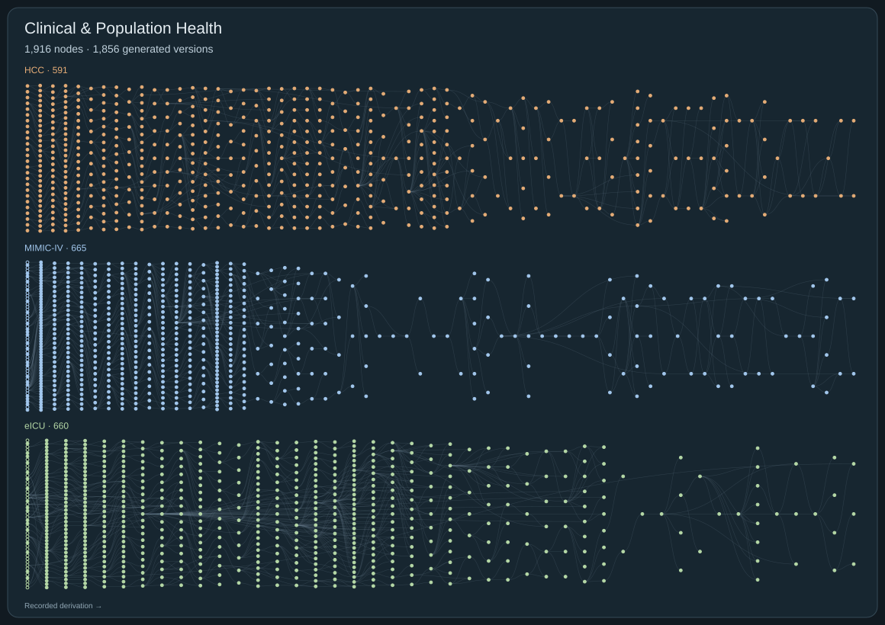

# Clinical & Population Health Research

[← All domains](../README.md) · [Expert review guide](../REVIEW.md)

**1,916 nodes · 1,856 generated versions · 2,223 recorded parent links.**

[Open the complete tree with node IDs](../figures/01-clinical-population.svg). Download and open the SVG at native scale for readable, clickable IDs. On GitHub, use the catalogs below to open proposals and search by ID or scientific term. Hollow nodes are starting questions; filled nodes are generated versions. Every recorded parent edge is retained, including multi-parent derivations. Separate roots are not artificially joined.

## Dataset catalogs

- [HCC: 591 hypotheses and starting questions](01-clinical-population-hcc.md)

- [MIMIC-IV: 665 hypotheses and starting questions](01-clinical-population-mimic.md)

- [eICU: 660 hypotheses and starting questions](01-clinical-population-eicu.md)

