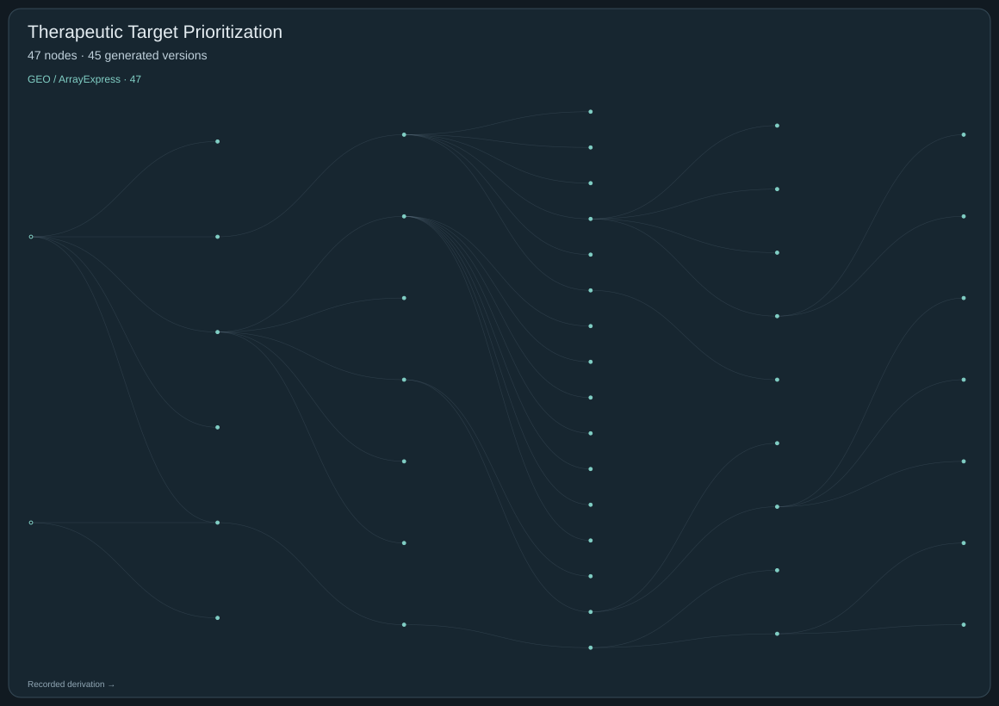

# Therapeutic Target Prioritization

[← All domains](../README.md) · [Expert review guide](../REVIEW.md)

**47 nodes · 45 generated versions · 46 recorded parent links.**

[Open the complete tree with node IDs](../figures/02-therapeutic-targets.svg). Download and open the SVG at native scale for readable, clickable IDs. On GitHub, use the catalogs below to open proposals and search by ID or scientific term. Hollow nodes are starting questions; filled nodes are generated versions. Every recorded parent edge is retained, including multi-parent derivations. Separate roots are not artificially joined.

## GEO / ArrayExpress

47 nodes

### D2-0293C6731F · Provisional hypothesis: macrophage–fibroblast context modifies the intervention-associated fibroblast transcript response

**Full scientific proposal:** [Read the public review copy](../proposals/D2-0293C6731F.md)

**Derived from:** [D2-89AB1AC190](#d2-89ab1ac190)

**Type:** Generated hypothesis version

### D2-066138D885 · Provisional hypothesis: macrophage context modifies the intervention-associated FLS transcript response

**Full scientific proposal:** [Read the public review copy](../proposals/D2-066138D885.md)

**Derived from:** [D2-0293C6731F](#d2-0293c6731f)

**Type:** Generated hypothesis version

### D2-078DEE7AD8 · Provisional hypothesis: macrophage context modifies the intervention-associated FLS transcript response

**Full scientific proposal:** [Read the public review copy](../proposals/D2-078DEE7AD8.md)

**Derived from:** [D2-913D8DC610](#d2-913d8dc610)

**Type:** Generated hypothesis version

### D2-097F881166 · Provisional hypothesis: macrophage context modifies the intervention-associated FLS transcript response

**Full scientific proposal:** [Read the public review copy](../proposals/D2-097F881166.md)

**Derived from:** [D2-913D8DC610](#d2-913d8dc610)

**Type:** Generated hypothesis version

### D2-145A4673E7 · MerTK remission signal: cell state or macrophage-state composition?

**Full scientific proposal:** [Read the public review copy](../proposals/D2-145A4673E7.md)

**Derived from:** [D2-E38C911CE3](#d2-e38c911ce3)

**Type:** Generated hypothesis version

### D2-1724BBCD62 · MerTK remission signal: cell state or macrophage-state composition?

**Full scientific proposal:** [Read the public review copy](../proposals/D2-1724BBCD62.md)

**Derived from:** [D2-E38C911CE3](#d2-e38c911ce3)

**Type:** Generated hypothesis version

### D2-1927BBAC60 · Context-specific intervention response

**Full scientific proposal:** [Read the public review copy](../proposals/D2-1927BBAC60.md)

**Derived from:** — (recorded root)

**Type:** Starting question

### D2-195C7DE527 · Protective versus pathogenic states

**Full scientific proposal:** [Read the public review copy](../proposals/D2-195C7DE527.md)

**Derived from:** — (recorded root)

**Type:** Starting question

### D2-1A6DC0D38A · Provisional hypothesis: macrophage–fibroblast context modifies the intervention-associated fibroblast transcript response

**Full scientific proposal:** [Read the public review copy](../proposals/D2-1A6DC0D38A.md)

**Derived from:** [D2-89AB1AC190](#d2-89ab1ac190)

**Type:** Generated hypothesis version

### D2-1D26FF197C · Provisional rival-focused hypothesis (D2-T1)

**Full scientific proposal:** [Read the public review copy](../proposals/D2-1D26FF197C.md)

**Derived from:** [D2-0293C6731F](#d2-0293c6731f)

**Type:** Generated hypothesis version

### D2-1F9C29FC6E · Provisional hypothesis: macrophage–fibroblast context modifies the intervention-associated FLS transcript response

**Full scientific proposal:** [Read the public review copy](../proposals/D2-1F9C29FC6E.md)

**Derived from:** [D2-4A197D80D9](#d2-4a197d80d9)

**Type:** Generated hypothesis version

### D2-25E7802EA2 · Provisional hypothesis: macrophage context modifies the intervention-associated FLS transcript response

**Full scientific proposal:** [Read the public review copy](../proposals/D2-25E7802EA2.md)

**Derived from:** [D2-0293C6731F](#d2-0293c6731f)

**Type:** Generated hypothesis version

### D2-28C2BC3620 · Cell-selective MerTK perturbation in rheumatoid synovium

**Full scientific proposal:** [Read the public review copy](../proposals/D2-28C2BC3620.md)

**Derived from:** [D2-1927BBAC60](#d2-1927bbac60)

**Type:** Generated hypothesis version

### D2-2F6E9698AB · MerTK inhibitor response: target-specific signal or assay-compatible alternatives?

**Full scientific proposal:** [Read the public review copy](../proposals/D2-2F6E9698AB.md)

**Derived from:** [D2-E38C911CE3](#d2-e38c911ce3)

**Type:** Generated hypothesis version

### D2-3655D2EA30 · MerTK cell-context therapeutic-window hypothesis — episode 6 method refinement

**Full scientific proposal:** [Read the public review copy](../proposals/D2-3655D2EA30.md)

**Derived from:** [D2-41580D9269](#d2-41580d9269)

**Type:** Generated hypothesis version

### D2-370247F262 · MERTK archival evidence integrity and target-development gate

**Full scientific proposal:** [Read the public review copy](../proposals/D2-370247F262.md)

**Derived from:** [D2-E2882432BA](#d2-e2882432ba)

**Type:** Generated hypothesis version

### D2-3CF12384D2 · Donor-aware identifiability of context-selective MerTK harm in RA synovial coculture

**Full scientific proposal:** [Read the public review copy](../proposals/D2-3CF12384D2.md)

**Derived from:** [D2-4ADC9FDA91](#d2-4adc9fda91)

**Type:** Generated hypothesis version

### D2-3F76467BEA · Provisional successor: donor-aware intervention-by-macrophage-context interaction in E-MTAB-8316

**Full scientific proposal:** [Read the public review copy](../proposals/D2-3F76467BEA.md)

**Derived from:** [D2-4A197D80D9](#d2-4a197d80d9)

**Type:** Generated hypothesis version

### D2-41580D9269 · MerTK cell-context therapeutic-window hypothesis

**Full scientific proposal:** [Read the public review copy](../proposals/D2-41580D9269.md)

**Derived from:** [D2-E38C911CE3](#d2-e38c911ce3)

**Type:** Generated hypothesis version

### D2-438CF334BE · Cell-compartment-specific MERTK target value in rheumatoid synovium

**Full scientific proposal:** [Read the public review copy](../proposals/D2-438CF334BE.md)

**Derived from:** [D2-195C7DE527](#d2-195c7de527)

**Type:** Generated hypothesis version

### D2-4A197D80D9 · Provisional hypothesis: macrophage–fibroblast context modifies the intervention-associated fibroblast transcript response

**Full scientific proposal:** [Read the public review copy](../proposals/D2-4A197D80D9.md)

**Derived from:** [D2-89AB1AC190](#d2-89ab1ac190)

**Type:** Generated hypothesis version

### D2-4ADC9FDA91 · Context-specific MerTK target prioritization in rheumatoid-arthritis synovial coculture

**Full scientific proposal:** [Read the public review copy](../proposals/D2-4ADC9FDA91.md)

**Derived from:** [D2-1927BBAC60](#d2-1927bbac60), [D2-195C7DE527](#d2-195c7de527)

**Type:** Generated hypothesis version

### D2-4E7E400F14 · MerTK cell-context therapeutic-window experiment

**Full scientific proposal:** [Read the public review copy](../proposals/D2-4E7E400F14.md)

**Derived from:** [D2-E38C911CE3](#d2-e38c911ce3)

**Type:** Generated hypothesis version

### D2-5300D67F55 · Independent, source-specific triangulation of context-selective MerTK harm

**Full scientific proposal:** [Read the public review copy](../proposals/D2-5300D67F55.md)

**Derived from:** [D2-8F30DB23A7](#d2-8f30db23a7)

**Type:** Generated hypothesis version

### D2-566CA781C4 · Provisional successor: donor-aware MerTK-inhibitor interaction in E-MTAB-8873

**Full scientific proposal:** [Read the public review copy](../proposals/D2-566CA781C4.md)

**Derived from:** [D2-0293C6731F](#d2-0293c6731f)

**Type:** Generated hypothesis version

### D2-6CD0A26615 · MerTK remission signal: cell state or macrophage-state composition?

**Full scientific proposal:** [Read the public review copy](../proposals/D2-6CD0A26615.md)

**Derived from:** [D2-E38C911CE3](#d2-e38c911ce3)

**Type:** Generated hypothesis version

### D2-760E0CAB49 · Provisional hypothesis: macrophage–fibroblast context modifies the intervention-associated fibroblast transcript response

**Full scientific proposal:** [Read the public review copy](../proposals/D2-760E0CAB49.md)

**Derived from:** [D2-0293C6731F](#d2-0293c6731f)

**Type:** Generated hypothesis version

### D2-766FDF0EA7 · Cell-selective MerTK perturbation in rheumatoid synovium

**Full scientific proposal:** [Read the public review copy](../proposals/D2-766FDF0EA7.md)

**Derived from:** [D2-1927BBAC60](#d2-1927bbac60)

**Type:** Generated hypothesis version

### D2-88E25FA5B9 · Episode 9 provisional hypothesis

**Full scientific proposal:** [Read the public review copy](../proposals/D2-88E25FA5B9.md)

**Derived from:** [D2-3F76467BEA](#d2-3f76467bea)

**Type:** Generated hypothesis version

### D2-89AB1AC190 · Provisional hypothesis: macrophage–fibroblast context modifies the intervention-associated fibroblast transcript response

**Full scientific proposal:** [Read the public review copy](../proposals/D2-89AB1AC190.md)

**Derived from:** [D2-1927BBAC60](#d2-1927bbac60)

**Type:** Generated hypothesis version

### D2-8F30DB23A7 · Donor-aware identifiability of context-selective MerTK harm in RA synovial coculture

**Full scientific proposal:** [Read the public review copy](../proposals/D2-8F30DB23A7.md)

**Derived from:** [D2-3CF12384D2](#d2-3cf12384d2)

**Type:** Generated hypothesis version

### D2-913D8DC610 · Episode 9 repaired hypothesis: donor-aware intervention-by-macrophage-context interaction in E-MTAB-8316

**Full scientific proposal:** [Read the public review copy](../proposals/D2-913D8DC610.md)

**Derived from:** [D2-3F76467BEA](#d2-3f76467bea)

**Type:** Generated hypothesis version

### D2-9DCA8B1817 · Provisional hypothesis: macrophage–fibroblast context modifies the intervention-associated fibroblast transcript response

**Full scientific proposal:** [Read the public review copy](../proposals/D2-9DCA8B1817.md)

**Derived from:** [D2-0293C6731F](#d2-0293c6731f)

**Type:** Generated hypothesis version

### D2-A2044D850B · MerTK cell-context therapeutic-window hypothesis — episode 7 donor-aware revision

**Full scientific proposal:** [Read the public review copy](../proposals/D2-A2044D850B.md)

**Derived from:** [D2-41580D9269](#d2-41580d9269)

**Type:** Generated hypothesis version

### D2-A6210CD5E9 · MERTK archival evidence integrity: a target-development gate

**Full scientific proposal:** [Read the public review copy](../proposals/D2-A6210CD5E9.md)

**Derived from:** [D2-E2882432BA](#d2-e2882432ba)

**Type:** Generated hypothesis version

### D2-AF14627657 · Independent transferability of context-selective MerTK perturbation

**Full scientific proposal:** [Read the public review copy](../proposals/D2-AF14627657.md)

**Derived from:** [D2-8F30DB23A7](#d2-8f30db23a7)

**Type:** Generated hypothesis version

### D2-B9B2FF38EF · Is remission-associated MERTK mostly a macrophage-state mixture signal?

**Full scientific proposal:** [Read the public review copy](../proposals/D2-B9B2FF38EF.md)

**Derived from:** [D2-6CD0A26615](#d2-6cd0a26615)

**Type:** Generated hypothesis version

### D2-BD06531C2E · Source-local benefit–harm gate for context-selective MerTK prioritization

**Full scientific proposal:** [Read the public review copy](../proposals/D2-BD06531C2E.md)

**Derived from:** [D2-AF14627657](#d2-af14627657)

**Type:** Generated hypothesis version

### D2-BDF122FD8A · MerTK cell-context therapeutic-window hypothesis — episode 7 donor-aware revision

**Full scientific proposal:** [Read the public review copy](../proposals/D2-BDF122FD8A.md)

**Derived from:** [D2-41580D9269](#d2-41580d9269)

**Type:** Generated hypothesis version

### D2-C4EA5E1713 · Provisional hypothesis: macrophage context modifies the intervention-associated FLS transcript response

**Full scientific proposal:** [Read the public review copy](../proposals/D2-C4EA5E1713.md)

**Derived from:** [D2-913D8DC610](#d2-913d8dc610)

**Type:** Generated hypothesis version

### D2-D942E8688A · Provisional hypothesis: macrophage–fibroblast context modifies the intervention-associated fibroblast transcript response

**Full scientific proposal:** [Read the public review copy](../proposals/D2-D942E8688A.md)

**Derived from:** [D2-1927BBAC60](#d2-1927bbac60)

**Type:** Generated hypothesis version

### D2-DD1E2594AA · Provisional successor hypothesis: macrophage-context-dependent intervention response in RA FLS

**Full scientific proposal:** [Read the public review copy](../proposals/D2-DD1E2594AA.md)

**Derived from:** [D2-0293C6731F](#d2-0293c6731f)

**Type:** Generated hypothesis version

### D2-E003E17F36 · Provisional hypothesis: macrophage–fibroblast context modifies the intervention-associated fibroblast transcript response

**Full scientific proposal:** [Read the public review copy](../proposals/D2-E003E17F36.md)

**Derived from:** [D2-89AB1AC190](#d2-89ab1ac190)

**Type:** Generated hypothesis version

### D2-E22FBC2FE8 · A benefit-axis identifiability gate for context-selective MerTK perturbation

**Full scientific proposal:** [Read the public review copy](../proposals/D2-E22FBC2FE8.md)

**Derived from:** [D2-AF14627657](#d2-af14627657)

**Type:** Generated hypothesis version

### D2-E2882432BA · MERTK cell-context therapeutic-window hypothesis: archival RNA update

**Full scientific proposal:** [Read the public review copy](../proposals/D2-E2882432BA.md)

**Derived from:** [D2-41580D9269](#d2-41580d9269)

**Type:** Generated hypothesis version

### D2-E38C911CE3 · Cell-selective MerTK perturbation in rheumatoid synovium

**Full scientific proposal:** [Read the public review copy](../proposals/D2-E38C911CE3.md)

**Derived from:** [D2-766FDF0EA7](#d2-766fdf0ea7)

**Type:** Generated hypothesis version

### D2-FAC00B7C0F · Provisional hypothesis: macrophage–fibroblast context modifies the intervention-associated fibroblast transcript response

**Full scientific proposal:** [Read the public review copy](../proposals/D2-FAC00B7C0F.md)

**Derived from:** [D2-89AB1AC190](#d2-89ab1ac190)

**Type:** Generated hypothesis version

