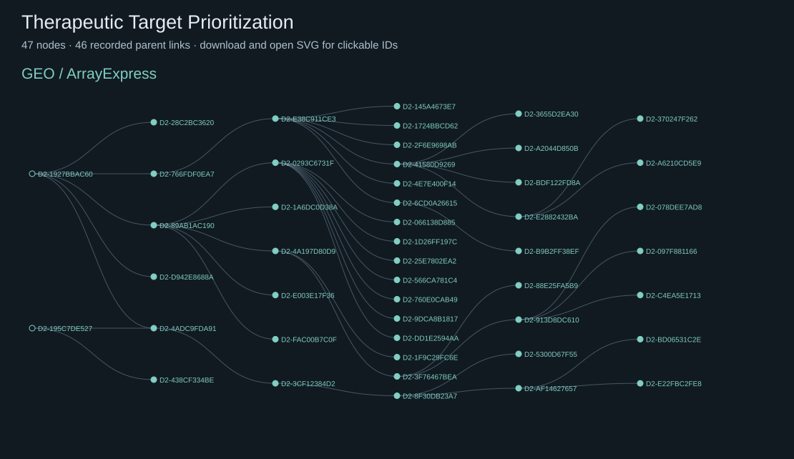

# Therapeutic Target Prioritization

16 nodes in this frozen domain forest. A node is one recorded hypothesis version or starting question; arrows show recorded derivation. Distinct roots remain distinct.

## E-MTAB-8316 + E-MTAB-8873 + E-MTAB-8322

1 nodes

### D2-195C7DE527 · Protective versus pathogenic states

**Full scientific proposal:** [Read the public review copy](../proposals/D2-195C7DE527.md)

**Derived from:** —

**Scientific question:** Which candidate intervention may reduce a harmful fibroblast program while preserving a protective macrophage-linked state?

## GSE95588 + E-MTAB-8316

8 nodes

### D2-145A4673E7 · MerTK remission signal: cell state or macrophage-state composition?

**Full scientific proposal:** [Read the public review copy](../proposals/D2-145A4673E7.md)

**Derived from:** D2-E38C911CE3

### D2-1724BBCD62 · MerTK remission signal: cell state or macrophage-state composition?

**Full scientific proposal:** [Read the public review copy](../proposals/D2-1724BBCD62.md)

**Derived from:** D2-E38C911CE3

### D2-1927BBAC60 · Context-specific intervention response

**Full scientific proposal:** [Read the public review copy](../proposals/D2-1927BBAC60.md)

**Derived from:** —

**Scientific question:** Does the intervention-associated transcript response depend on macrophage–fibroblast context?

### D2-28C2BC3620 · Cell-selective MerTK perturbation in rheumatoid synovium

**Full scientific proposal:** [Read the public review copy](../proposals/D2-28C2BC3620.md)

**Derived from:** D2-1927BBAC60

### D2-2F6E9698AB · MerTK inhibitor response: target-specific signal or assay-compatible alternatives?

**Full scientific proposal:** [Read the public review copy](../proposals/D2-2F6E9698AB.md)

**Derived from:** D2-E38C911CE3

### D2-6CD0A26615 · MerTK remission signal: cell state or macrophage-state composition?

**Full scientific proposal:** [Read the public review copy](../proposals/D2-6CD0A26615.md)

**Derived from:** D2-E38C911CE3

### D2-766FDF0EA7 · Cell-selective MerTK perturbation in rheumatoid synovium

**Full scientific proposal:** [Read the public review copy](../proposals/D2-766FDF0EA7.md)

**Derived from:** D2-1927BBAC60

### D2-E38C911CE3 · Cell-selective MerTK perturbation in rheumatoid synovium

**Full scientific proposal:** [Read the public review copy](../proposals/D2-E38C911CE3.md)

**Derived from:** D2-766FDF0EA7

## Multi-study: E-MTAB-8316, E-MTAB-8322, E-MTAB-8873, GSE95588

7 nodes

### D2-3CF12384D2 · Donor-aware identifiability of context-selective MerTK harm in RA synovial coculture

**Full scientific proposal:** [Read the public review copy](../proposals/D2-3CF12384D2.md)

**Derived from:** D2-4ADC9FDA91

### D2-4ADC9FDA91 · Context-specific MerTK target prioritization in rheumatoid-arthritis synovial coculture

**Full scientific proposal:** [Read the public review copy](../proposals/D2-4ADC9FDA91.md)

**Derived from:** D2-1927BBAC60, D2-195C7DE527

### D2-5300D67F55 · Independent, source-specific triangulation of context-selective MerTK harm

**Full scientific proposal:** [Read the public review copy](../proposals/D2-5300D67F55.md)

**Derived from:** D2-8F30DB23A7

### D2-8F30DB23A7 · Donor-aware identifiability of context-selective MerTK harm in RA synovial coculture

**Full scientific proposal:** [Read the public review copy](../proposals/D2-8F30DB23A7.md)

**Derived from:** D2-3CF12384D2

### D2-AF14627657 · Independent transferability of context-selective MerTK perturbation

**Full scientific proposal:** [Read the public review copy](../proposals/D2-AF14627657.md)

**Derived from:** D2-8F30DB23A7

### D2-BD06531C2E · Source-local benefit–harm gate for context-selective MerTK prioritization

**Full scientific proposal:** [Read the public review copy](../proposals/D2-BD06531C2E.md)

**Derived from:** D2-AF14627657

### D2-E22FBC2FE8 · A benefit-axis identifiability gate for context-selective MerTK perturbation

**Full scientific proposal:** [Read the public review copy](../proposals/D2-E22FBC2FE8.md)

**Derived from:** D2-AF14627657

