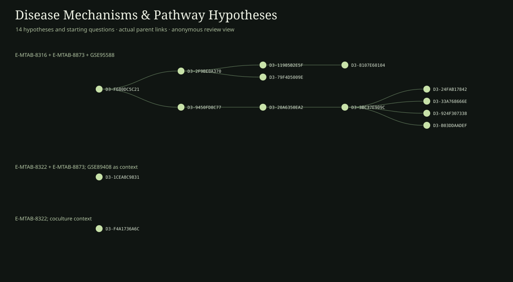

# Disease Mechanisms & Pathway Hypotheses

14 nodes in this frozen domain forest. A node is one recorded hypothesis version or starting question; arrows show recorded derivation. Distinct roots remain distinct.

## E-MTAB-8316 + E-MTAB-8873 + GSE95588

12 nodes

### D3-11985B2E5F · MerTK specificity repair: a donor-blocked macrophage–FLS interaction test

**Full scientific proposal:** [Read the public review copy](../proposals/D3-11985B2E5F.md)

**Derived from:** D3-2F9BE0A370

### D3-20A6350EA2 · Synovial macrophage remission signal: composition or within-state regulation?

**Full scientific proposal:** [Read the public review copy](../proposals/D3-20A6350EA2.md)

**Derived from:** D3-9450FD8C77

### D3-24FAB17842 · Does the remission–resistance macrophage signal travel across donors?

**Full scientific proposal:** [Read the public review copy](../proposals/D3-24FAB17842.md)

**Derived from:** D3-3BC37E909C

### D3-2F9BE0A370 · MerTK-conditioned macrophage–fibroblast communication in rheumatoid arthritis

**Full scientific proposal:** [Read the public review copy](../proposals/D3-2F9BE0A370.md)

**Derived from:** D3-F680DC5C21

### D3-33A768666E · Do remission-associated macrophage averages reflect captured state representation?

**Full scientific proposal:** [Read the public review copy](../proposals/D3-33A768666E.md)

**Derived from:** D3-3BC37E909C

### D3-3BC37E909C · Synovial macrophage remission signal: composition or within-state regulation?

**Full scientific proposal:** [Read the public review copy](../proposals/D3-3BC37E909C.md)

**Derived from:** D3-20A6350EA2

### D3-79F4D5009E · MerTK specificity repair: a donor-blocked macrophage–FLS interaction test

**Full scientific proposal:** [Read the public review copy](../proposals/D3-79F4D5009E.md)

**Derived from:** D3-2F9BE0A370

### D3-8107E60104 · MerTK state versus composition: a source-separated macrophage–FLS test

**Full scientific proposal:** [Read the public review copy](../proposals/D3-8107E60104.md)

**Derived from:** D3-11985B2E5F

### D3-924F307338 · Do remission-associated macrophage averages reflect captured state representation?

**Full scientific proposal:** [Read the public review copy](../proposals/D3-924F307338.md)

**Derived from:** D3-3BC37E909C

### D3-9450FD8C77 · MERTK-state dependence of synovial fibroblast responses

**Full scientific proposal:** [Read the public review copy](../proposals/D3-9450FD8C77.md)

**Derived from:** D3-F680DC5C21

### D3-B03DDAADEF · Do remission-associated macrophage averages reflect captured state representation?

**Full scientific proposal:** [Read the public review copy](../proposals/D3-B03DDAADEF.md)

**Derived from:** D3-3BC37E909C

### D3-F680DC5C21 · Directional cell communication

**Full scientific proposal:** [Read the public review copy](../proposals/D3-F680DC5C21.md)

**Derived from:** —

**Scientific question:** Which competing macrophage–fibroblast or endothelial–fibroblast mechanism is distinguishable by perturbation?

## E-MTAB-8322 + E-MTAB-8873; GSE89408 as context

1 nodes

### D3-1CEA8C9831 · Composition versus within-cell regulation

**Full scientific proposal:** [Read the public review copy](../proposals/D3-1CEA8C9831.md)

**Derived from:** —

**Scientific question:** Is a signal better explained by measured cell abundance, within-cell state, or both?

## E-MTAB-8322; coculture context

1 nodes

### D3-F4A1736A6C · Persistence versus remission

**Full scientific proposal:** [Read the public review copy](../proposals/D3-F4A1736A6C.md)

**Derived from:** —

**Scientific question:** Which mechanisms could explain persistent versus resolving cell states, and what test separates them?

