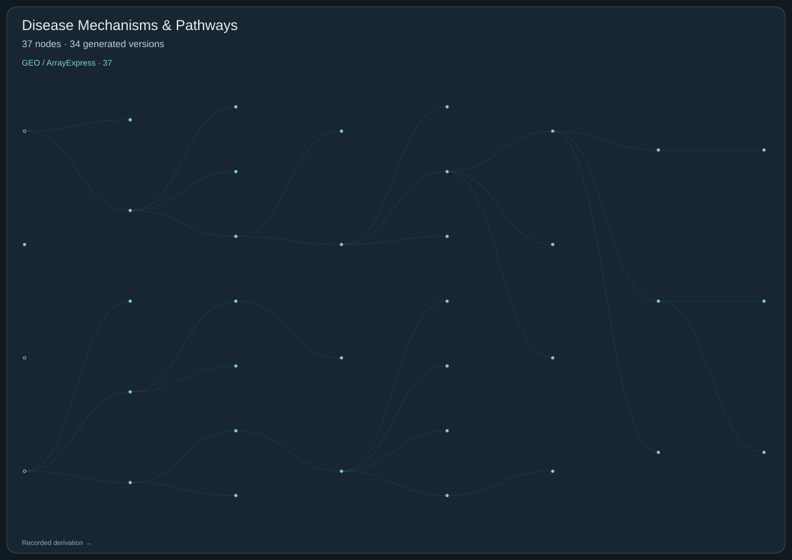

# Disease Mechanisms & Pathway Hypotheses

[← Blinded review index](../REVIEW.md)

**37 nodes · 34 generated versions · 33 recorded parent links.**

[Open the complete tree with node IDs](../figures/03-disease-mechanisms.svg). Download and open the SVG at native scale for readable, clickable IDs. On GitHub, use the catalogs below to open proposals and search by ID or scientific term. Hollow nodes are starting questions; filled nodes are generated versions. Every recorded parent edge is retained, including multi-parent derivations. Separate roots are not artificially joined.

## GEO / ArrayExpress

37 nodes

### D3-04DC5CBC3D · Do remission-associated macrophage averages reflect captured state representation?

**Full scientific proposal:** [Read the public review copy](../proposals/D3-04DC5CBC3D.md)

**Derived from:** [D3-B03DDAADEF](#d3-b03ddaadef)

**Type:** Generated hypothesis version

### D3-11985B2E5F · MerTK specificity repair: a donor-blocked macrophage–FLS interaction test

**Full scientific proposal:** [Read the public review copy](../proposals/D3-11985B2E5F.md)

**Derived from:** [D3-2F9BE0A370](#d3-2f9be0a370)

**Type:** Generated hypothesis version

### D3-1C823B983C · E-MTAB-8873 pair-reconciliation evidence note

**Full scientific proposal:** [Read the public review copy](../proposals/D3-1C823B983C.md)

**Derived from:** [D3-961283A90E](#d3-961283a90e)

**Type:** Generated hypothesis version

### D3-1CEA8C9831 · Composition versus within-cell regulation

**Full scientific proposal:** [Read the public review copy](../proposals/D3-1CEA8C9831.md)

**Derived from:** — (recorded root)

**Type:** Starting question

### D3-20A6350EA2 · Synovial macrophage remission signal: composition or within-state regulation?

**Full scientific proposal:** [Read the public review copy](../proposals/D3-20A6350EA2.md)

**Derived from:** [D3-9450FD8C77](#d3-9450fd8c77)

**Type:** Generated hypothesis version

### D3-232F6A22BB · Provisional repair: E-MTAB-8873 macrophage-context response in FLS

**Full scientific proposal:** [Read the public review copy](../proposals/D3-232F6A22BB.md)

**Derived from:** [D3-C9EE145938](#d3-c9ee145938)

**Type:** Generated hypothesis version

### D3-24FAB17842 · Does the remission–resistance macrophage signal travel across donors?

**Full scientific proposal:** [Read the public review copy](../proposals/D3-24FAB17842.md)

**Derived from:** [D3-3BC37E909C](#d3-3bc37e909c)

**Type:** Generated hypothesis version

### D3-2603ED214B · Provisional hypothesis: donor-aware macrophage context in E-MTAB-8873

**Full scientific proposal:** [Read the public review copy](../proposals/D3-2603ED214B.md)

**Derived from:** [D3-1C823B983C](#d3-1c823b983c)

**Type:** Generated hypothesis version

### D3-2C1BD669D1 · Does UNC1062-associated FLS response depend on the macrophage subset?

**Full scientific proposal:** [Read the public review copy](../proposals/D3-2C1BD669D1.md)

**Derived from:** [D3-F680DC5C21](#d3-f680dc5c21)

**Type:** Generated hypothesis version

### D3-2F9BE0A370 · MerTK-conditioned macrophage–fibroblast communication in rheumatoid arthritis

**Full scientific proposal:** [Read the public review copy](../proposals/D3-2F9BE0A370.md)

**Derived from:** [D3-F680DC5C21](#d3-f680dc5c21)

**Type:** Generated hypothesis version

### D3-33A768666E · Do remission-associated macrophage averages reflect captured state representation?

**Full scientific proposal:** [Read the public review copy](../proposals/D3-33A768666E.md)

**Derived from:** [D3-3BC37E909C](#d3-3bc37e909c)

**Type:** Generated hypothesis version

### D3-3BC37E909C · Synovial macrophage remission signal: composition or within-state regulation?

**Full scientific proposal:** [Read the public review copy](../proposals/D3-3BC37E909C.md)

**Derived from:** [D3-20A6350EA2](#d3-20a6350ea2)

**Type:** Generated hypothesis version

### D3-3CC34063E0 · Provisional hypothesis: E-MTAB-8873 macrophage context and donor composition

**Full scientific proposal:** [Read the public review copy](../proposals/D3-3CC34063E0.md)

**Derived from:** [D3-7615B13362](#d3-7615b13362)

**Type:** Generated hypothesis version

### D3-5B3B33BF2B · Provisional hypothesis: macrophage context induces a reproducible within-FLS state response

**Full scientific proposal:** [Read the public review copy](../proposals/D3-5B3B33BF2B.md)

**Derived from:** [D3-C9EE145938](#d3-c9ee145938)

**Type:** Generated hypothesis version

### D3-65615B2082 · Provisional hypothesis: macrophage context changes FLS transcript state beyond donor composition

**Full scientific proposal:** [Read the public review copy](../proposals/D3-65615B2082.md)

**Derived from:** [D3-8E76453165](#d3-8e76453165)

**Type:** Generated hypothesis version

### D3-6CA9BC10D1 · Provisional hypothesis: macrophage context changes FLS state beyond composition

**Full scientific proposal:** [Read the public review copy](../proposals/D3-6CA9BC10D1.md)

**Derived from:** [D3-FC9EC56539](#d3-fc9ec56539)

**Type:** Generated hypothesis version

### D3-7615B13362 · Provisional hypothesis: macrophage context changes FLS state beyond donor composition

**Full scientific proposal:** [Read the public review copy](../proposals/D3-7615B13362.md)

**Derived from:** [D3-961283A90E](#d3-961283a90e)

**Type:** Generated hypothesis version

### D3-79F4D5009E · MerTK specificity repair: a donor-blocked macrophage–FLS interaction test

**Full scientific proposal:** [Read the public review copy](../proposals/D3-79F4D5009E.md)

**Derived from:** [D3-2F9BE0A370](#d3-2f9be0a370)

**Type:** Generated hypothesis version

### D3-8107E60104 · MerTK state versus composition: a source-separated macrophage–FLS test

**Full scientific proposal:** [Read the public review copy](../proposals/D3-8107E60104.md)

**Derived from:** [D3-11985B2E5F](#d3-11985b2e5f)

**Type:** Generated hypothesis version

### D3-88E2158EF6 · Provisional hypothesis: macrophage context changes FLS state beyond donor composition

**Full scientific proposal:** [Read the public review copy](../proposals/D3-88E2158EF6.md)

**Derived from:** [D3-961283A90E](#d3-961283a90e)

**Type:** Generated hypothesis version

### D3-8E76453165 · E-MTAB-8873 donor-aware repair (provisional hypothesis)

**Full scientific proposal:** [Read the public review copy](../proposals/D3-8E76453165.md)

**Derived from:** [D3-FC9EC56539](#d3-fc9ec56539)

**Type:** Generated hypothesis version

### D3-924F307338 · Do remission-associated macrophage averages reflect captured state representation?

**Full scientific proposal:** [Read the public review copy](../proposals/D3-924F307338.md)

**Derived from:** [D3-3BC37E909C](#d3-3bc37e909c)

**Type:** Generated hypothesis version

### D3-9450FD8C77 · MERTK-state dependence of synovial fibroblast responses

**Full scientific proposal:** [Read the public review copy](../proposals/D3-9450FD8C77.md)

**Derived from:** [D3-F680DC5C21](#d3-f680dc5c21)

**Type:** Generated hypothesis version

### D3-961283A90E · Provisional repair: E-MTAB-8873 macrophage-context hypothesis

**Full scientific proposal:** [Read the public review copy](../proposals/D3-961283A90E.md)

**Derived from:** [D3-B19F7433BD](#d3-b19f7433bd)

**Type:** Generated hypothesis version

### D3-9AE56E0256 · Can the E-MTAB-8873 inhibitor contrast be interpreted?

**Full scientific proposal:** [Read the public review copy](../proposals/D3-9AE56E0256.md)

**Derived from:** [D3-9450FD8C77](#d3-9450fd8c77)

**Type:** Generated hypothesis version

### D3-A1126788C7 · Provisional hypothesis: macrophage context changes FLS transcript state beyond composition

**Full scientific proposal:** [Read the public review copy](../proposals/D3-A1126788C7.md)

**Derived from:** — (recorded root)

**Type:** Generated hypothesis version

### D3-ADFB961354 · Provisional hypothesis: tissue signal is driven by cell composition rather than within-cell state

**Full scientific proposal:** [Read the public review copy](../proposals/D3-ADFB961354.md)

**Derived from:** [D3-1CEA8C9831](#d3-1cea8c9831)

**Type:** Generated hypothesis version

### D3-B03DDAADEF · Do remission-associated macrophage averages reflect captured state representation?

**Full scientific proposal:** [Read the public review copy](../proposals/D3-B03DDAADEF.md)

**Derived from:** [D3-3BC37E909C](#d3-3bc37e909c)

**Type:** Generated hypothesis version

### D3-B19F7433BD · Provisional E-MTAB-8873 macrophage-context hypothesis

**Full scientific proposal:** [Read the public review copy](../proposals/D3-B19F7433BD.md)

**Derived from:** [D3-8E76453165](#d3-8e76453165)

**Type:** Generated hypothesis version

### D3-B53B94EBF7 · Episode 9 provisional hypothesis: macrophage context changes FLS state beyond donor composition

**Full scientific proposal:** [Read the public review copy](../proposals/D3-B53B94EBF7.md)

**Derived from:** [D3-7615B13362](#d3-7615b13362)

**Type:** Generated hypothesis version

### D3-B80B0A8E91 · Provisional hypothesis: macrophage context leaves a reproducible FLS transcript signature

**Full scientific proposal:** [Read the public review copy](../proposals/D3-B80B0A8E91.md)

**Derived from:** [D3-B19F7433BD](#d3-b19f7433bd)

**Type:** Generated hypothesis version

### D3-BDF25BA739 · Provisional repair: E-MTAB-8873 macrophage context

**Full scientific proposal:** [Read the public review copy](../proposals/D3-BDF25BA739.md)

**Derived from:** [D3-8E76453165](#d3-8e76453165)

**Type:** Generated hypothesis version

### D3-BECBB4B8D2 · Provisional successor hypothesis: macrophage context changes FLS state beyond donor composition

**Full scientific proposal:** [Read the public review copy](../proposals/D3-BECBB4B8D2.md)

**Derived from:** [D3-B19F7433BD](#d3-b19f7433bd)

**Type:** Generated hypothesis version

### D3-C9EE145938 · Provisional hypothesis: macrophage context changes FLS state through a cell-intrinsic response, not merely composition

**Full scientific proposal:** [Read the public review copy](../proposals/D3-C9EE145938.md)

**Derived from:** [D3-1CEA8C9831](#d3-1cea8c9831)

**Type:** Generated hypothesis version

### D3-F4A1736A6C · Persistence versus remission

**Full scientific proposal:** [Read the public review copy](../proposals/D3-F4A1736A6C.md)

**Derived from:** — (recorded root)

**Type:** Starting question

### D3-F680DC5C21 · Directional cell communication

**Full scientific proposal:** [Read the public review copy](../proposals/D3-F680DC5C21.md)

**Derived from:** — (recorded root)

**Type:** Starting question

### D3-FC9EC56539 · E-MTAB-8873 repair note and provisional hypothesis

**Full scientific proposal:** [Read the public review copy](../proposals/D3-FC9EC56539.md)

**Derived from:** [D3-C9EE145938](#d3-c9ee145938)

**Type:** Generated hypothesis version

