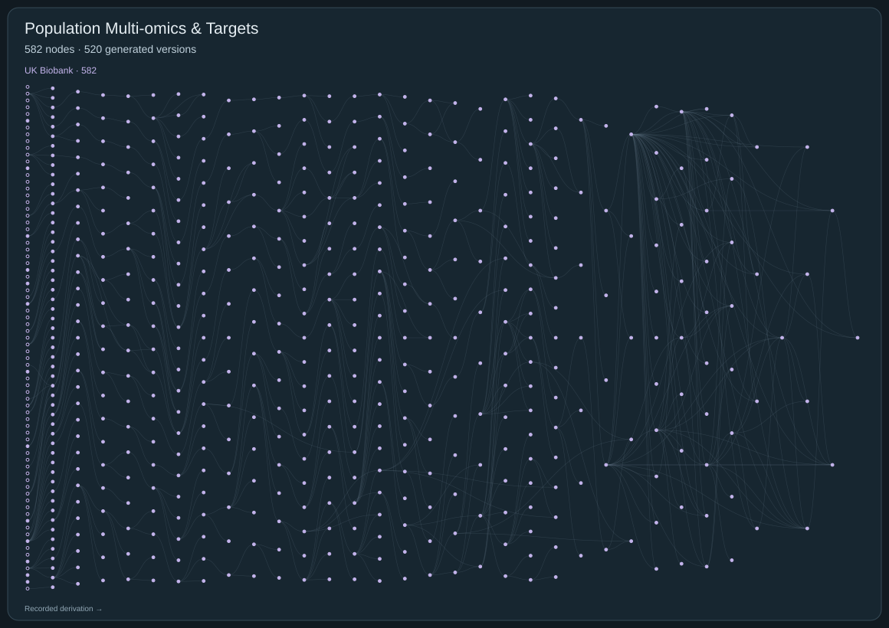

# Population Multi-omics & Disease Targets

[← All domains](../README.md) · [Expert review guide](../REVIEW.md)

**582 nodes · 520 generated versions · 630 recorded parent links.**

[Open the complete tree with node IDs](../figures/04-population-multiomics.svg). Download and open the SVG at native scale for readable, clickable IDs. On GitHub, use the catalogs below to open proposals and search by ID or scientific term. Hollow nodes are starting questions; filled nodes are generated versions. Every recorded parent edge is retained, including multi-parent derivations. Separate roots are not artificially joined.

## UK Biobank

582 nodes

### D4-00F97864E9 · Full-array recorded circulatory-event transport after paired UKB biomarker assessments

**Full scientific proposal:** [Read the public review copy](../proposals/D4-00F97864E9.md)

**Derived from:** [D4-7C6468172F](#d4-7c6468172f)

**Type:** Generated hypothesis version

### D4-025EC048FC · Certified-field protocol with an assumption-conditioned fallback for baseline-only kidney-status prioritization

**Full scientific proposal:** [Read the public review copy](../proposals/D4-025EC048FC.md)

**Derived from:** [D4-9DEB9806ED](#d4-9deb9806ed), [D4-DB30594929](#d4-db30594929)

**Type:** Generated hypothesis version

### D4-036D46A359 · Episode 13 proposal — UKB17 posterior-thigh MFI and later falls report

**Full scientific proposal:** [Read the public review copy](../proposals/D4-036D46A359.md)

**Derived from:** [D4-5650D9E4C1](#d4-5650d9e4c1)

**Type:** Generated hypothesis version

### D4-03BF389136 · UKB-03 repair: creatinine–cystatin C discordance and grip-defined reserve

**Full scientific proposal:** [Read the public review copy](../proposals/D4-03BF389136.md)

**Derived from:** [D4-07A9061E90](#d4-07a9061e90)

**Type:** Generated hypothesis version

### D4-03FD7F92FA · Provisional UK Biobank hypothesis: discordant glycemia and weight trajectory

**Full scientific proposal:** [Read the public review copy](../proposals/D4-03FD7F92FA.md)

**Derived from:** [D4-F130F44A72](#d4-f130f44a72)

**Type:** Generated hypothesis version

### D4-0492735356 · Fixed-combined-eGFR profiles with audited K-th first-code falsification and weighted opportunity

**Full scientific proposal:** [Read the public review copy](../proposals/D4-0492735356.md)

**Derived from:** [D4-A0FEAB387D](#d4-a0feab387d)

**Type:** Generated hypothesis version

### D4-054410A590 · Age-standardized and temporally transported incremental value of prior UKB biomarkers

**Full scientific proposal:** [Read the public review copy](../proposals/D4-054410A590.md)

**Derived from:** [D4-9EC0DCD959](#d4-9ec0dcd959)

**Type:** Generated hypothesis version

### D4-0572561156 · UK Biobank metabolic progression: support-aware confirmation of assessment-linked change

**Full scientific proposal:** [Read the public review copy](../proposals/D4-0572561156.md)

**Derived from:** [D4-E442202007](#d4-e442202007)

**Type:** Generated hypothesis version

### D4-062A12A39E · Pathway-specific value of longitudinal biomarker movement in UK Biobank

**Full scientific proposal:** [Read the public review copy](../proposals/D4-062A12A39E.md)

**Derived from:** [D4-8D38F5756F](#d4-8d38f5756f)

**Type:** Generated hypothesis version

### D4-06330C8C89 · Baseline cystatin-C/creatinine discordance, repeat biomarker reclassification, and subsequent mortality: certificate-gated UKB experiment

**Full scientific proposal:** [Read the public review copy](../proposals/D4-06330C8C89.md)

**Derived from:** [D4-DB2D573B26](#d4-db2d573b26)

**Type:** Generated hypothesis version

### D4-0672331980 · Episode 27: incremental grip value over the frozen UACR-informed visit-1 policy

**Full scientific proposal:** [Read the public review copy](../proposals/D4-0672331980.md)

**Derived from:** [D4-693D58626D](#d4-693d58626d)

**Type:** Generated hypothesis version

### D4-0747ABFE3A · 绝经相关脂蛋白变化是否超出体重变化

**Full scientific proposal:** [Read the public review copy](../proposals/D4-0747ABFE3A.md)

**Derived from:** — (recorded root)

**Type:** Starting question

### D4-07A9061E90 · Discordant kidney-function estimates and pre-illness reserve

**Full scientific proposal:** [Read the public review copy](../proposals/D4-07A9061E90.md)

**Derived from:** — (recorded root)

**Type:** Starting question

### D4-07BF4BF8B4 · Episode 24: mortality qualification of the frozen low-UACR cystatin allocation experiment

**Full scientific proposal:** [Read the public review copy](../proposals/D4-07BF4BF8B4.md)

**Derived from:** [D4-693D58626D](#d4-693d58626d)

**Type:** Generated hypothesis version

### D4-07D0456796 · One-budget multi-domain value of prior biomarker history for UKB review

**Full scientific proposal:** [Read the public review copy](../proposals/D4-07D0456796.md)

**Derived from:** [D4-E9F9656A30](#d4-e9f9656a30)

**Type:** Generated hypothesis version

### D4-08394FA826 · 长端粒相关的肿瘤与血管风险权衡

**Full scientific proposal:** [Read the public review copy](../proposals/D4-08394FA826.md)

**Derived from:** — (recorded root)

**Type:** Starting question

### D4-0847AC1163 · 低睾酮与低SHBG是否代表不同男性代谢状态

**Full scientific proposal:** [Read the public review copy](../proposals/D4-0847AC1163.md)

**Derived from:** — (recorded root)

**Type:** Starting question

### D4-08FEB79CCE · UKB metabolic change after established single-domain disease and route to a second domain

**Full scientific proposal:** [Read the public review copy](../proposals/D4-08FEB79CCE.md)

**Derived from:** [D4-B8599ECD78](#d4-b8599ecd78), [D4-66DD554B93](#d4-66dd554b93)

**Type:** Generated hypothesis version

### D4-09CD9DEAF4 · Episode 67: baseline-eGFR qualification of the frozen AG1-versus-AF1 kidney allocation contrast

**Full scientific proposal:** [Read the public review copy](../proposals/D4-09CD9DEAF4.md)

**Derived from:** [D4-4E947B0D42](#d4-4e947b0d42), [D4-4038BC909E](#d4-4038bc909e)

**Type:** Generated hypothesis version

### D4-0A9AC46BDC · Source-concordant absolute CBC cancer-type contrast

**Full scientific proposal:** [Read the public review copy](../proposals/D4-0A9AC46BDC.md)

**Derived from:** [D4-CD25D7EDFD](#d4-cd25d7edfd)

**Type:** Generated hypothesis version

### D4-0AE8F1E3ED · Absolute-risk CBC cancer-type contrast under generic burden and source ascertainment

**Full scientific proposal:** [Read the public review copy](../proposals/D4-0AE8F1E3ED.md)

**Derived from:** [D4-A63BF8F2BB](#d4-a63bf8f2bb)

**Type:** Generated hypothesis version

### D4-0B0EFFE417 · Certified baseline cystatin-C incremental information with an explicit surrogate prioritization-loss surface

**Full scientific proposal:** [Read the public review copy](../proposals/D4-0B0EFFE417.md)

**Derived from:** [D4-65C9EF87DC](#d4-65c9ef87dc), [D4-1CC562D6F8](#d4-1cc562d6f8)

**Type:** Generated hypothesis version

### D4-0B8732FF49 · Provisional repaired hypothesis: discordant HbA1c and weight trajectories before incident diabetes

**Full scientific proposal:** [Read the public review copy](../proposals/D4-0B8732FF49.md)

**Derived from:** [D4-F130F44A72](#d4-f130f44a72)

**Type:** Generated hypothesis version

### D4-0C0BCA56D5 · Episode 15 proposal — UKB17 posterior-thigh MFI and later falls report

**Full scientific proposal:** [Read the public review copy](../proposals/D4-0C0BCA56D5.md)

**Derived from:** [D4-E926919168](#d4-e926919168)

**Type:** Generated hypothesis version

### D4-0C96B9B593 · incident colorectal-cancer competing-risk reserve study — delivery repair

**Full scientific proposal:** [Read the public review copy](../proposals/D4-0C96B9B593.md)

**Derived from:** [D4-C77EBFA8CF](#d4-c77ebfa8cf)

**Type:** Generated hypothesis version

### D4-0CC67A027B · CBC cancer-type contrast after generic burden and observation selection

**Full scientific proposal:** [Read the public review copy](../proposals/D4-0CC67A027B.md)

**Derived from:** [D4-A63BF8F2BB](#d4-a63bf8f2bb)

**Type:** Generated hypothesis version

### D4-0D32EB06E7 · Repeated biomarker history: prospective value when certified, record-triage value when it is not

**Full scientific proposal:** [Read the public review copy](../proposals/D4-0D32EB06E7.md)

**Derived from:** [D4-C1EF47ED2F](#d4-c1ef47ed2f)

**Type:** Generated hypothesis version

### D4-0D46E0C06B · Self-contained executable closure of the timing-aware cystatin-C allocation experiment

**Full scientific proposal:** [Read the public review copy](../proposals/D4-0D46E0C06B.md)

**Derived from:** [D4-7AE59120BE](#d4-7ae59120be), [D4-B710F0FCC5](#d4-b710f0fcc5)

**Type:** Generated hypothesis version

### D4-0D4B9275D0 · Grip-triggered cystatin C testing: a policy-specific clinical-yield experiment

**Full scientific proposal:** [Read the public review copy](../proposals/D4-0D4B9275D0.md)

**Derived from:** [D4-4BAA1A28C0](#d4-4baa1a28c0)

**Type:** Generated hypothesis version

### D4-0D8A330F16 · Fixed-combined-eGFR renal selectivity with an outcome-masked precision gate and support-aware hurdle/shared frailty

**Full scientific proposal:** [Read the public review copy](../proposals/D4-0D8A330F16.md)

**Derived from:** [D4-C28336A5DC](#d4-c28336a5dc)

**Type:** Generated hypothesis version

### D4-0E1ED9DDE3 · Episode 63: outcome-blind incremental handgrip value for fixed-capacity cystatin-C testing

**Full scientific proposal:** [Read the public review copy](../proposals/D4-0E1ED9DDE3.md)

**Derived from:** [D4-31BE94703B](#d4-31be94703b)

**Type:** Generated hypothesis version

### D4-0E6C368DB4 · CHIP, infection, and hematologic malignancy

**Full scientific proposal:** [Read the public review copy](../proposals/D4-0E6C368DB4.md)

**Derived from:** — (recorded root)

**Type:** Starting question

### D4-0E87C144E1 · UKB two-panel metabolic change and first transition to a second cardiometabolic domain

**Full scientific proposal:** [Read the public review copy](../proposals/D4-0E87C144E1.md)

**Derived from:** [D4-1610E0FCB5](#d4-1610e0fcb5), [D4-13B42D2F85](#d4-13b42d2f85)

**Type:** Generated hypothesis version

### D4-0E91D0A62C · UKB CBC cancer-type contrast: first-CBC estimand with explicit timing and ascertainment falsification

**Full scientific proposal:** [Read the public review copy](../proposals/D4-0E91D0A62C.md)

**Derived from:** [D4-25C0150498](#d4-25c0150498)

**Type:** Generated hypothesis version

### D4-0EC3C1EEE2 · Corrected UKB cancer-type hypothesis with metabolic/liver restart audit

**Full scientific proposal:** [Read the public review copy](../proposals/D4-0EC3C1EEE2.md)

**Derived from:** [D4-F94FB6B46C](#d4-f94fb6b46c)

**Type:** Generated hypothesis version

### D4-0ED1A614CA · Episode 83: ascertainment-standardized temporal kidney qualification of the frozen grip-versus-FFM allocation

**Full scientific proposal:** [Read the public review copy](../proposals/D4-0ED1A614CA.md)

**Derived from:** [D4-AF7CB2C580](#d4-af7cb2c580), [D4-9DE202CF69](#d4-9de202cf69)

**Type:** Generated hypothesis version

### D4-0EE2825DB1 · Executed and independently audited continuous cystatin-C rescue after the adverse binary result

**Full scientific proposal:** [Read the public review copy](../proposals/D4-0EE2825DB1.md)

**Derived from:** [D4-A93E1D9D89](#d4-a93e1d9d89)

**Type:** Generated hypothesis version

### D4-0F4419C634 · title: "Do colorectal-cancer CBC trends transport to protocolized testing, or depend on clinically triggered blood tests?"

**Full scientific proposal:** [Read the public review copy](../proposals/D4-0F4419C634.md)

**Derived from:** [D4-6BF1038AFE](#d4-6bf1038afe)

**Type:** Generated hypothesis version

### D4-1023A7F008 · Assumption-indexed cross-marker persistence experiment for protocol renal biomarkers in UK Biobank repeat attenders

**Full scientific proposal:** [Read the public review copy](../proposals/D4-1023A7F008.md)

**Derived from:** [D4-CD331CAE4B](#d4-cd331cae4b)

**Type:** Generated hypothesis version

### D4-1077DEDB67 · Organ-specific first recorded transition after repeat biomarker assessment in UK Biobank

**Full scientific proposal:** [Read the public review copy](../proposals/D4-1077DEDB67.md)

**Derived from:** [D4-8D38F5756F](#d4-8d38f5756f)

**Type:** Generated hypothesis version

### D4-11506E2EF0 · Baseline cystatin-C/creatinine discordance and protocol-measured renal decline at repeat assessment

**Full scientific proposal:** [Read the public review copy](../proposals/D4-11506E2EF0.md)

**Derived from:** — (recorded root)

**Type:** Generated hypothesis version

### D4-127F05EEF8 · Episode 69: observed-low-UACR kidney-event qualification of the frozen nested grip policy

**Full scientific proposal:** [Read the public review copy](../proposals/D4-127F05EEF8.md)

**Derived from:** [D4-230F11180A](#d4-230f11180a)

**Type:** Generated hypothesis version

### D4-12A6EDC05E · Baseline-only decision value of continuous cystatin-C discordance after a borderline log-loss signal

**Full scientific proposal:** [Read the public review copy](../proposals/D4-12A6EDC05E.md)

**Derived from:** [D4-C947551CCA](#d4-c947551cca)

**Type:** Generated hypothesis version

### D4-12FCC0DA3D · Episode 27 targeted executable freeze: incremental grip value after UACR

**Full scientific proposal:** [Read the public review copy](../proposals/D4-12FCC0DA3D.md)

**Derived from:** [D4-5AFCAA29B3](#d4-5afcaa29b3)

**Type:** Generated hypothesis version

### D4-132E0EA15B · Paired biomarker history as a triage-information test: a decision-relevant UK Biobank repair

**Full scientific proposal:** [Read the public review copy](../proposals/D4-132E0EA15B.md)

**Derived from:** [D4-8F1579EB97](#d4-8f1579eb97)

**Type:** Generated hypothesis version

### D4-135E58C0A0 · Episode 26: prespecified sex-by-age consistency of the frozen low-UACR allocation rule

**Full scientific proposal:** [Read the public review copy](../proposals/D4-135E58C0A0.md)

**Derived from:** [D4-693D58626D](#d4-693d58626d)

**Type:** Generated hypothesis version

### D4-136640C0AD · Episode 68: nested grip-after-FFM allocation with prespecified kidney-specificity falsification

**Full scientific proposal:** [Read the public review copy](../proposals/D4-136640C0AD.md)

**Derived from:** [D4-230F11180A](#d4-230f11180a)

**Type:** Generated hypothesis version

### D4-13B42D2F85 · UKB two-panel metabolic change and transition to a second cardiometabolic domain

**Full scientific proposal:** [Read the public review copy](../proposals/D4-13B42D2F85.md)

**Derived from:** [D4-1610E0FCB5](#d4-1610e0fcb5), [D4-772E40C174](#d4-772e40c174)

**Type:** Generated hypothesis version

### D4-1447727C4D · Creatinine–cystatin C discordance and low muscle reserve as a missed-risk signal for kidney events

**Full scientific proposal:** [Read the public review copy](../proposals/D4-1447727C4D.md)

**Derived from:** [D4-4FB9436836](#d4-4fb9436836)

**Type:** Generated hypothesis version

### D4-157E6BF069 · Provisional hypothesis: discordant HbA1c rise and weight trajectory predict incident diabetes

**Full scientific proposal:** [Read the public review copy](../proposals/D4-157E6BF069.md)

**Derived from:** [D4-A3884E0365](#d4-a3884e0365)

**Type:** Generated hypothesis version

### D4-15BCC826AC · Baseline-deployable incremental information with explicit repeat-attendance selection diagnostics

**Full scientific proposal:** [Read the public review copy](../proposals/D4-15BCC826AC.md)

**Derived from:** [D4-916978BCB6](#d4-916978bcb6)

**Type:** Generated hypothesis version

### D4-15EB28D8ED · Assay-certified, selection-aware baseline prioritization for repeat kidney-function assessment

**Full scientific proposal:** [Read the public review copy](../proposals/D4-15EB28D8ED.md)

**Derived from:** [D4-BBF4AFB2CA](#d4-bbf4afb2ca), [D4-8DAA02FFFC](#d4-8daa02fffc)

**Type:** Generated hypothesis version

### D4-1610E0FCB5 · Dated two-panel metabolic change and transition to cardiometabolic multimorbidity

**Full scientific proposal:** [Read the public review copy](../proposals/D4-1610E0FCB5.md)

**Derived from:** [D4-FF60B2A698](#d4-ff60b2a698)

**Type:** Generated hypothesis version

### D4-16728EF36D · Prospective repair: directly identified CRC-versus-other-GI and CRC-versus-non-GI CBC estimands

**Full scientific proposal:** [Read the public review copy](../proposals/D4-16728EF36D.md)

**Derived from:** [D4-CE2CC3DDB7](#d4-ce2cc3ddb7)

**Type:** Generated hypothesis version

### D4-16AD8A1A2A · Prospective thigh muscle fat infiltration and falls-report risk in UK Biobank

**Full scientific proposal:** [Read the public review copy](../proposals/D4-16AD8A1A2A.md)

**Derived from:** [D4-5195309D49](#d4-5195309d49)

**Type:** Generated hypothesis version

### D4-16D206BA50 · 空气污染与肺功能遗传易感性的交互

**Full scientific proposal:** [Read the public review copy](../proposals/D4-16D206BA50.md)

**Derived from:** — (recorded root)

**Type:** Starting question

### D4-17464BAC1A · Repeat metabolic change beyond current levels: a UK Biobank prospective cardiorenal trajectory experiment

**Full scientific proposal:** [Read the public review copy](../proposals/D4-17464BAC1A.md)

**Derived from:** [D4-837B251437](#d4-837b251437)

**Type:** Generated hypothesis version

### D4-17A499D058 · 夜间噪声与睡眠脆弱性共同指向房颤

**Full scientific proposal:** [Read the public review copy](../proposals/D4-17A499D058.md)

**Derived from:** — (recorded root)

**Type:** Starting question

### D4-1902E47B59 · Episode-19 low-UACR kidney-prognosis complementarity on the frozen visit-1 lists

**Full scientific proposal:** [Read the public review copy](../proposals/D4-1902E47B59.md)

**Derived from:** [D4-2ED7D39517](#d4-2ed7d39517)

**Type:** Generated hypothesis version

### D4-1A186FD2A1 · Prespecified localization of continuous cystatin-C discordance information

**Full scientific proposal:** [Read the public review copy](../proposals/D4-1A186FD2A1.md)

**Derived from:** [D4-0EE2825DB1](#d4-0ee2825db1)

**Type:** Generated hypothesis version

### D4-1A465A7555 · Incremental decision information from creatinine–cystatin C discordance in UKB

**Full scientific proposal:** [Read the public review copy](../proposals/D4-1A465A7555.md)

**Derived from:** [D4-BC9B6ADF83](#d4-bc9b6adf83)

**Type:** Generated hypothesis version

### D4-1C09903B2E · UKB-03 repair: creatinine–cystatin C discordance and grip-defined reserve

**Full scientific proposal:** [Read the public review copy](../proposals/D4-1C09903B2E.md)

**Derived from:** [D4-07A9061E90](#d4-07a9061e90)

**Type:** Generated hypothesis version

### D4-1C0AFBCB1A · Episode 68: non-rescuing H1-to-N18 clinical-validity qualification of the frozen AG1-versus-AF1 experiment

**Full scientific proposal:** [Read the public review copy](../proposals/D4-1C0AFBCB1A.md)

**Derived from:** [D4-4038BC909E](#d4-4038bc909e), [D4-4E947B0D42](#d4-4e947b0d42)

**Type:** Generated hypothesis version

### D4-1CC562D6F8 · Baseline cystatin-C/creatinine discordance as a protocol for confirmatory repeat kidney-function assessment

**Full scientific proposal:** [Read the public review copy](../proposals/D4-1CC562D6F8.md)

**Derived from:** [D4-DB2D573B26](#d4-db2d573b26)

**Type:** Generated hypothesis version

### D4-1D685F4704 · Selected-first-repeat-attender incident threshold crossing: a computable direction-specific repair

**Full scientific proposal:** [Read the public review copy](../proposals/D4-1D685F4704.md)

**Derived from:** [D4-C6F80FAFA9](#d4-c6f80fafa9)

**Type:** Generated hypothesis version

### D4-1DAD096A9E · Kidney-marker discordance at fixed combined eGFR and first hospitalized renal transition

**Full scientific proposal:** [Read the public review copy](../proposals/D4-1DAD096A9E.md)

**Derived from:** [D4-6F3B230750](#d4-6f3b230750)

**Type:** Generated hypothesis version

### D4-1DB7E7678D · Provisional hypothesis: discordant HbA1c rise and weight trajectory predict incident diabetes

**Full scientific proposal:** [Read the public review copy](../proposals/D4-1DB7E7678D.md)

**Derived from:** [D4-E107622D90](#d4-e107622d90)

**Type:** Generated hypothesis version

### D4-1E471250FB · 骨与肌肉衰退不同步的骨折路径

**Full scientific proposal:** [Read the public review copy](../proposals/D4-1E471250FB.md)

**Derived from:** — (recorded root)

**Type:** Starting question

### D4-1EAD2D482F · 肺功能下降与右心改变的先后关系

**Full scientific proposal:** [Read the public review copy](../proposals/D4-1EAD2D482F.md)

**Derived from:** — (recorded root)

**Type:** Starting question

### D4-1EF74C7A05 · Baseline-only decision value of continuous cystatin-C discordance after a borderline log-loss signal

**Full scientific proposal:** [Read the public review copy](../proposals/D4-1EF74C7A05.md)

**Derived from:** [D4-C947551CCA](#d4-c947551cca)

**Type:** Generated hypothesis version

### D4-1F11C24E00 · 内脏脂肪与肌肉浸润对应的两种风险

**Full scientific proposal:** [Read the public review copy](../proposals/D4-1F11C24E00.md)

**Derived from:** — (recorded root)

**Type:** Starting question

### D4-1F174E85D1 · All-offered intention-to-obtain-UACR-first versus immediate UACR-free cystatin-C allocation at identical capacity

**Full scientific proposal:** [Read the public review copy](../proposals/D4-1F174E85D1.md)

**Derived from:** [D4-FBB3C863A3](#d4-fbb3c863a3), [D4-0D46E0C06B](#d4-0d46e0c06b)

**Type:** Generated hypothesis version

### D4-1F7F051199 · Same-current HbA1c history and transition to cardiometabolic multimorbidity

**Full scientific proposal:** [Read the public review copy](../proposals/D4-1F7F051199.md)

**Derived from:** [D4-FFDDF206FA](#d4-ffddf206fa)

**Type:** Generated hypothesis version

### D4-1FEB9B6C12 · Executed orthogonal residual-moment test: concordant non-rejection but prespecified gates require an inconclusive result

**Full scientific proposal:** [Read the public review copy](../proposals/D4-1FEB9B6C12.md)

**Derived from:** [D4-4822941212](#d4-4822941212)

**Type:** Generated hypothesis version

### D4-201830C5F8 · Fail-closed field/equation-certified Direction-A incremental-information experiment

**Full scientific proposal:** [Read the public review copy](../proposals/D4-201830C5F8.md)

**Derived from:** [D4-FC49CF679D](#d4-fc49cf679d)

**Type:** Generated hypothesis version

### D4-203A60B610 · CRP与GlycA不一致的炎症状态

**Full scientific proposal:** [Read the public review copy](../proposals/D4-203A60B610.md)

**Derived from:** — (recorded root)

**Type:** Starting question

### D4-2077226FE7 · Execution-ready repair of the Direction-A incremental-information experiment

**Full scientific proposal:** [Read the public review copy](../proposals/D4-2077226FE7.md)

**Derived from:** [D4-8D32F7BD3D](#d4-8d32f7bd3d)

**Type:** Generated hypothesis version

### D4-212F8363B5 · Renal specificity of creatinine–cystatin C discordance at low grip strength

**Full scientific proposal:** [Read the public review copy](../proposals/D4-212F8363B5.md)

**Derived from:** [D4-607B29FABC](#d4-607b29fabc)

**Type:** Generated hypothesis version

### D4-2162126654 · Baseline-only incremental information for repeat kidney-function prioritization

**Full scientific proposal:** [Read the public review copy](../proposals/D4-2162126654.md)

**Derived from:** [D4-916978BCB6](#d4-916978bcb6)

**Type:** Generated hypothesis version

### D4-21944E725E · UKB17 repair: posterior-thigh MFI and later falls report

**Full scientific proposal:** [Read the public review copy](../proposals/D4-21944E725E.md)

**Derived from:** [D4-60C332A1B8](#d4-60c332a1b8)

**Type:** Generated hypothesis version

### D4-21A7C3FA70 · Benchmarked grip-triggered cystatin C allocation: testing policy value beyond known UK Biobank discordance

**Full scientific proposal:** [Read the public review copy](../proposals/D4-21A7C3FA70.md)

**Derived from:** [D4-FEEE0E4246](#d4-feee0e4246)

**Type:** Generated hypothesis version

### D4-21B760FD06 · Smoking cessation between dated assessments and near-term cardiovascular hospitalization

**Full scientific proposal:** [Read the public review copy](../proposals/D4-21B760FD06.md)

**Derived from:** — (recorded root)

**Type:** Generated hypothesis version

### D4-230F11180A · Episode 67: nested grip-after-FFM allocation and five-year kidney-event synthesis

**Full scientific proposal:** [Read the public review copy](../proposals/D4-230F11180A.md)

**Derived from:** [D4-3022C353B9](#d4-3022c353b9), [D4-4038BC909E](#d4-4038bc909e), [D4-4E947B0D42](#d4-4e947b0d42), [D4-FEE7B1ED1D](#d4-fee7b1ed1d)

**Type:** Generated hypothesis version

### D4-238A0BCEA0 · Executed UKB baseline-only decision-value experiment

**Full scientific proposal:** [Read the public review copy](../proposals/D4-238A0BCEA0.md)

**Derived from:** [D4-27764EDBF4](#d4-27764edbf4)

**Type:** Generated hypothesis version

### D4-23C9FAC6A7 · Timing-identifiability repair for the fixed-capacity observed-UACR cystatin-C allocation experiment

**Full scientific proposal:** [Read the public review copy](../proposals/D4-23C9FAC6A7.md)

**Derived from:** [D4-824B6459FD](#d4-824b6459fd)

**Type:** Generated hypothesis version

### D4-23D8C240C8 · Age-standardized and temporally transported incremental value of prior UKB biomarkers

**Full scientific proposal:** [Read the public review copy](../proposals/D4-23D8C240C8.md)

**Derived from:** [D4-9EC0DCD959](#d4-9ec0dcd959)

**Type:** Generated hypothesis version

### D4-24313D46CA · 脂肪分布与绝经后激素相关癌症的差异

**Full scientific proposal:** [Read the public review copy](../proposals/D4-24313D46CA.md)

**Derived from:** — (recorded root)

**Type:** Starting question

### D4-24999529A3 · Cross-marker persistence of renal biomarker discordance in UK Biobank repeat attenders: identified association with assumption-indexed sensitivity only

**Full scientific proposal:** [Read the public review copy](../proposals/D4-24999529A3.md)

**Derived from:** [D4-DDCE2096FA](#d4-ddce2096fa)

**Type:** Generated hypothesis version

### D4-24A6840CD7 · 正常血糖下胰腺体积与脂肪的不同预警信息

**Full scientific proposal:** [Read the public review copy](../proposals/D4-24A6840CD7.md)

**Derived from:** — (recorded root)

**Type:** Starting question

### D4-25A58D713A · Episode-20 sex-consistency falsification of low-UACR kidney-event enrichment

**Full scientific proposal:** [Read the public review copy](../proposals/D4-25A58D713A.md)

**Derived from:** [D4-1902E47B59](#d4-1902e47b59)

**Type:** Generated hypothesis version

### D4-25C0150498 · first-CBC cancer-type signal versus repeat-measurement selection

**Full scientific proposal:** [Read the public review copy](../proposals/D4-25C0150498.md)

**Derived from:** [D4-D43D38E7CE](#d4-d43d38e7ce)

**Type:** Generated hypothesis version

### D4-269012459E · Does posterior-thigh MFI add to thigh-muscle distribution for later falls?

**Full scientific proposal:** [Read the public review copy](../proposals/D4-269012459E.md)

**Derived from:** [D4-8B19BCA548](#d4-8b19bca548)

**Type:** Generated hypothesis version

### D4-27617712AD · Fail-closed certified baseline-only UKB renal-marker discordance experiment

**Full scientific proposal:** [Read the public review copy](../proposals/D4-27617712AD.md)

**Derived from:** [D4-A22A04EF2A](#d4-a22a04ef2a)

**Type:** Generated hypothesis version

### D4-27764EDBF4 · Baseline-only decision-value experiment for continuous cystatin-C discordance

**Full scientific proposal:** [Read the public review copy](../proposals/D4-27764EDBF4.md)

**Derived from:** [D4-C947551CCA](#d4-c947551cca)

**Type:** Generated hypothesis version

### D4-2842BE1A45 · Authoritatively dated and fully bootstrapped repeat-attendance sensitivity for reciprocal creatinine/cystatin-C persistence

**Full scientific proposal:** [Read the public review copy](../proposals/D4-2842BE1A45.md)

**Derived from:** [D4-8280080213](#d4-8280080213)

**Type:** Generated hypothesis version

### D4-28F8BC746F · Does cystatin-C discordance identify a clinically actionable kidney-surveillance group?

**Full scientific proposal:** [Read the public review copy](../proposals/D4-28F8BC746F.md)

**Derived from:** [D4-D009A2CE90](#d4-d009a2ce90)

**Type:** Generated hypothesis version

### D4-2A2A66309A · Baseline creatinine–cystatin-C discordance for fixed-horizon treated kidney failure: a coverage-gated experiment

**Full scientific proposal:** [Read the public review copy](../proposals/D4-2A2A66309A.md)

**Derived from:** [D4-0EE2825DB1](#d4-0ee2825db1)

**Type:** Generated hypothesis version

### D4-2A330A1799 · Longitudinal HbA1c deterioration and incident cardiorenal-metabolic multimorbidity

**Full scientific proposal:** [Read the public review copy](../proposals/D4-2A330A1799.md)

**Derived from:** [D4-AA669B8A42](#d4-aa669b8a42)

**Type:** Generated hypothesis version

### D4-2A46E67EB1 · Sparse CBC trajectories and colorectal cancer prognosis after a coverage-certified day-366 landmark

**Full scientific proposal:** [Read the public review copy](../proposals/D4-2A46E67EB1.md)

**Derived from:** [D4-EAD3147552](#d4-ead3147552)

**Type:** Generated hypothesis version

### D4-2AA9F49DAF · CBC discordance, timing, and repeat-measurement selection

**Full scientific proposal:** [Read the public review copy](../proposals/D4-2AA9F49DAF.md)

**Derived from:** [D4-D43D38E7CE](#d4-d43d38e7ce)

**Type:** Generated hypothesis version

### D4-2ABAA46E84 · UKB kidney-function discordance as a test-value question

**Full scientific proposal:** [Read the public review copy](../proposals/D4-2ABAA46E84.md)

**Derived from:** [D4-7C6468172F](#d4-7c6468172f)

**Type:** Generated hypothesis version

### D4-2B6205F553 · Coverage-gated sparse CBC trajectories with a full joined audit and recorded-case CRC fallback

**Full scientific proposal:** [Read the public review copy](../proposals/D4-2B6205F553.md)

**Derived from:** [D4-AE2EF53C58](#d4-ae2ef53c58), [D4-CC1A317CFD](#d4-cc1a317cfd)

**Type:** Generated hypothesis version

### D4-2C383BD006 · Certified renal-marker discordance beyond repeat and attendance artifacts

**Full scientific proposal:** [Read the public review copy](../proposals/D4-2C383BD006.md)

**Derived from:** [D4-8B4340AA50](#d4-8b4340aa50)

**Type:** Generated hypothesis version

### D4-2C9B624B89 · Episode 60: exact-path closure and aggregate-seal repair for nested AFG1 versus AF1

**Full scientific proposal:** [Read the public review copy](../proposals/D4-2C9B624B89.md)

**Derived from:** [D4-DFC3979CF4](#d4-dfc3979cf4), [D4-71134633EF](#d4-71134633ef), [D4-4E947B0D42](#d4-4e947b0d42), [D4-FEE7B1ED1D](#d4-fee7b1ed1d)

**Type:** Generated hypothesis version

### D4-2CD445A307 · UKB muscle quantity versus quality/function: critical alternative

**Full scientific proposal:** [Read the public review copy](../proposals/D4-2CD445A307.md)

**Derived from:** [D4-854234041C](#d4-854234041c)

**Type:** Generated hypothesis version

### D4-2D54912631 · Independently audited selected-first-repeat-attender q=60 cross-marker threshold experiment

**Full scientific proposal:** [Read the public review copy](../proposals/D4-2D54912631.md)

**Derived from:** [D4-1D685F4704](#d4-1d685f4704)

**Type:** Generated hypothesis version

### D4-2D8A5704C7 · Assay-certified baseline cystatin-C/creatinine discordance and repeat kidney status

**Full scientific proposal:** [Read the public review copy](../proposals/D4-2D8A5704C7.md)

**Derived from:** [D4-4CC1313935](#d4-4cc1313935)

**Type:** Generated hypothesis version

### D4-2DEB626BAE · Baseline cystatin-C/creatinine discordance and repeat biomarker status: a fail-closed actionability-boundary successor

**Full scientific proposal:** [Read the public review copy](../proposals/D4-2DEB626BAE.md)

**Derived from:** [D4-DB2D573B26](#d4-db2d573b26)

**Type:** Generated hypothesis version

### D4-2E65F4DD80 · Temporal transport of decision-relevant prior-panel information in UKB

**Full scientific proposal:** [Read the public review copy](../proposals/D4-2E65F4DD80.md)

**Derived from:** [D4-8F1579EB97](#d4-8f1579eb97), [D4-4F4C0A0036](#d4-4f4c0a0036)

**Type:** Generated hypothesis version

### D4-2ED7D39517 · Episode-18 prognosis-horizon child: nine-year recorded N18 enrichment on the frozen visit-1 lists

**Full scientific proposal:** [Read the public review copy](../proposals/D4-2ED7D39517.md)

**Derived from:** [D4-36C5A0AA21](#d4-36c5a0aa21)

**Type:** Generated hypothesis version

### D4-2F1C7B3CF1 · Temporal transport of an auditable two-domain transition endpoint in UKB

**Full scientific proposal:** [Read the public review copy](../proposals/D4-2F1C7B3CF1.md)

**Derived from:** [D4-7C6468172F](#d4-7c6468172f)

**Type:** Generated hypothesis version

### D4-3022C353B9 · Episode 35: outcome-blind nested grip-after-FFM allocation challenge

**Full scientific proposal:** [Read the public review copy](../proposals/D4-3022C353B9.md)

**Derived from:** [D4-FEE7B1ED1D](#d4-fee7b1ed1d), [D4-4E947B0D42](#d4-4e947b0d42)

**Type:** Generated hypothesis version

### D4-302E7E13E3 · Trajectory information beyond current metabolic and renal levels

**Full scientific proposal:** [Read the public review copy](../proposals/D4-302E7E13E3.md)

**Derived from:** [D4-D9DA414CBE](#d4-d9da414cbe)

**Type:** Generated hypothesis version

### D4-3086D3FC1C · Executed frozen three-group CBC residual-moment experiment

**Full scientific proposal:** [Read the public review copy](../proposals/D4-3086D3FC1C.md)

**Derived from:** [D4-5ACE678538](#d4-5ace678538)

**Type:** Generated hypothesis version

### D4-317180CEFE · 高糖尿病遗传风险下的异位脂肪差异

**Full scientific proposal:** [Read the public review copy](../proposals/D4-317180CEFE.md)

**Derived from:** — (recorded root)

**Type:** Starting question

### D4-31B652A53E · Cohort-level fixed-capacity value of prior biomarker history in UK Biobank

**Full scientific proposal:** [Read the public review copy](../proposals/D4-31B652A53E.md)

**Derived from:** [D4-E8C8A003FF](#d4-e8c8a003ff)

**Type:** Generated hypothesis version

### D4-31BE94703B · Episode 61: executable nine-year maturation of the frozen five-year N18 experiment

**Full scientific proposal:** [Read the public review copy](../proposals/D4-31BE94703B.md)

**Derived from:** [D4-36C5A0AA21](#d4-36c5a0aa21), [D4-2ED7D39517](#d4-2ed7d39517), [D4-693D58626D](#d4-693d58626d)

**Type:** Generated hypothesis version

### D4-323E3290D3 · UKB two-panel metabolic progression: provenance-triangulated current-versus-change estimand

**Full scientific proposal:** [Read the public review copy](../proposals/D4-323E3290D3.md)

**Derived from:** [D4-E442202007](#d4-e442202007)

**Type:** Generated hypothesis version

### D4-32E517AD82 · Episode 69 successor: nested grip-after-FFM allocation and five-year kidney-hospitalization composite

**Full scientific proposal:** [Read the public review copy](../proposals/D4-32E517AD82.md)

**Derived from:** [D4-230F11180A](#d4-230f11180a)

**Type:** Generated hypothesis version

### D4-33B28EE8E8 · Does creatinine–cystatin-C discordance distinguish acute-coded from chronic-coded renal risk when primary-diagnosis confirmation is unavailable?

**Full scientific proposal:** [Read the public review copy](../proposals/D4-33B28EE8E8.md)

**Derived from:** [D4-77DB90D546](#d4-77db90d546)

**Type:** Generated hypothesis version

### D4-343DB01075 · Cystatin-capacity frontier for all-offered UACR-first versus immediate UACR-free allocation

**Full scientific proposal:** [Read the public review copy](../proposals/D4-343DB01075.md)

**Derived from:** [D4-A7DEFAA730](#d4-a7defaa730)

**Type:** Generated hypothesis version

### D4-34C056D03F · Continuous baseline cystatin-C rescue test after adverse binary discordance result

**Full scientific proposal:** [Read the public review copy](../proposals/D4-34C056D03F.md)

**Derived from:** [D4-673535FB98](#d4-673535fb98)

**Type:** Generated hypothesis version

### D4-34C1EBF01F · repaired hypothesis: CRP-discordant GlycA and delayed infection admissions

**Full scientific proposal:** [Read the public review copy](../proposals/D4-34C1EBF01F.md)

**Derived from:** [D4-A2660746EC](#d4-a2660746ec)

**Type:** Generated hypothesis version

### D4-34DE473193 · Direction-A incremental information with fail-closed certification and timing/selection stress tests

**Full scientific proposal:** [Read the public review copy](../proposals/D4-34DE473193.md)

**Derived from:** [D4-916978BCB6](#d4-916978bcb6)

**Type:** Generated hypothesis version

### D4-350907854D · repaired proposal: prediagnostic host reserve and competing mortality after colorectal-cancer diagnosis

**Full scientific proposal:** [Read the public review copy](../proposals/D4-350907854D.md)

**Derived from:** [D4-A571401DF7](#d4-a571401df7)

**Type:** Generated hypothesis version

### D4-352580B5E4 · repair — prospective thigh MFI and falls/function

**Full scientific proposal:** [Read the public review copy](../proposals/D4-352580B5E4.md)

**Derived from:** [D4-1F11C24E00](#d4-1f11c24e00)

**Type:** Generated hypothesis version

### D4-35A2D0A6D0 · Same-current-level HbA1c trajectory history and transition to cardiometabolic multimorbidity

**Full scientific proposal:** [Read the public review copy](../proposals/D4-35A2D0A6D0.md)

**Derived from:** [D4-2A330A1799](#d4-2a330a1799)

**Type:** Generated hypothesis version

### D4-367905761F · Does posterior-thigh MFI track later falls-report burden beyond muscle distribution?

**Full scientific proposal:** [Read the public review copy](../proposals/D4-367905761F.md)

**Derived from:** [D4-44A49120FC](#d4-44a49120fc)

**Type:** Generated hypothesis version

### D4-36903F8F4D · Episode 91: durability qualification of the frozen AG1-versus-AF1 N18 experiment

**Full scientific proposal:** [Read the public review copy](../proposals/D4-36903F8F4D.md)

**Derived from:** [D4-CDF077F4B7](#d4-cdf077f4b7), [D4-4E947B0D42](#d4-4e947b0d42), [D4-4038BC909E](#d4-4038bc909e)

**Type:** Generated hypothesis version

### D4-36A267F1E3 · Fixed-combined-eGFR renal selectivity with an outcome-masked precision gate and support-aware hurdle/shared frailty

**Full scientific proposal:** [Read the public review copy](../proposals/D4-36A267F1E3.md)

**Derived from:** [D4-51EF2DB0E6](#d4-51ef2db0e6), [D4-DD667110A6](#d4-dd667110a6)

**Type:** Generated hypothesis version

### D4-36C5A0AA21 · Episode-17 controlling extension: five-year recorded N18 yield after the frozen visit-1 transport experiment

**Full scientific proposal:** [Read the public review copy](../proposals/D4-36C5A0AA21.md)

**Derived from:** [D4-BAE9D6C1A6](#d4-bae9d6c1a6)

**Type:** Generated hypothesis version

### D4-37258AE911 · title: "Do sparse protocolized CBC changes add 1–5-year colorectal-cancer risk information beyond current values?"

**Full scientific proposal:** [Read the public review copy](../proposals/D4-37258AE911.md)

**Derived from:** [D4-6BF1038AFE](#d4-6bf1038afe)

**Type:** Generated hypothesis version

### D4-375C067094 · Episode 76: persistence-qualified kidney validation of the frozen grip-versus-FFM allocation

**Full scientific proposal:** [Read the public review copy](../proposals/D4-375C067094.md)

**Derived from:** [D4-D812F5BB57](#d4-d812f5bb57), [D4-230F11180A](#d4-230f11180a), [D4-E5F95A5048](#d4-e5f95a5048), [D4-3022C353B9](#d4-3022c353b9), [D4-4E947B0D42](#d4-4e947b0d42), [D4-FEE7B1ED1D](#d4-fee7b1ed1d), [D4-4038BC909E](#d4-4038bc909e)

**Type:** Generated hypothesis version

### D4-392864B35F · Episode 22 audit: route-tie and administrative-boundary repair

**Full scientific proposal:** [Read the public review copy](../proposals/D4-392864B35F.md)

**Derived from:** [D4-FC0FF5FCCE](#d4-fc0ff5fcce)

**Type:** Generated hypothesis version

### D4-3A1350504B · Fixed-combined-eGFR profiles with support-aware recording-process falsification

**Full scientific proposal:** [Read the public review copy](../proposals/D4-3A1350504B.md)

**Derived from:** [D4-8D131FC290](#d4-8d131fc290)

**Type:** Generated hypothesis version

### D4-3AAB6D8038 · Do waist and grip add risk information after biochemical testing?

**Full scientific proposal:** [Read the public review copy](../proposals/D4-3AAB6D8038.md)

**Derived from:** [D4-875A499FBB](#d4-875a499fbb)

**Type:** Generated hypothesis version

### D4-3AC6B6A020 · Certified Direction-A kidney-function experiment with an executable outcome-state verifier

**Full scientific proposal:** [Read the public review copy](../proposals/D4-3AC6B6A020.md)

**Derived from:** [D4-916978BCB6](#d4-916978bcb6)

**Type:** Generated hypothesis version

### D4-3ADA8A5868 · Assay-certified baseline cystatin-C/creatinine discordance and observed-schedule repeat kidney-function status

**Full scientific proposal:** [Read the public review copy](../proposals/D4-3ADA8A5868.md)

**Derived from:** [D4-4CC1313935](#d4-4cc1313935)

**Type:** Generated hypothesis version

### D4-3B98A85D93 · 低血脂伴低白蛋白是否提示隐匿肝病

**Full scientific proposal:** [Read the public review copy](../proposals/D4-3B98A85D93.md)

**Derived from:** — (recorded root)

**Type:** Starting question

### D4-3C38E36D5D · Episode 91: competing-death and temporal durability qualification of the frozen AG1-versus-AF1 experiment

**Full scientific proposal:** [Read the public review copy](../proposals/D4-3C38E36D5D.md)

**Derived from:** [D4-CDF077F4B7](#d4-cdf077f4b7), [D4-4E947B0D42](#d4-4e947b0d42), [D4-4038BC909E](#d4-4038bc909e)

**Type:** Generated hypothesis version

### D4-3C78485EF5 · UKB metabolic deterioration and first observed multimorbidity transition

**Full scientific proposal:** [Read the public review copy](../proposals/D4-3C78485EF5.md)

**Derived from:** [D4-CD73C3F453](#d4-cd73c3f453)

**Type:** Generated hypothesis version

### D4-3D6915CE03 · Infection onset versus progression to severe disease

**Full scientific proposal:** [Read the public review copy](../proposals/D4-3D6915CE03.md)

**Derived from:** — (recorded root)

**Type:** Starting question

### D4-3D75951A3A · Fixed-combined-eGFR profiles with incidence-matched K30 and a recording-process stress test

**Full scientific proposal:** [Read the public review copy](../proposals/D4-3D75951A3A.md)

**Derived from:** [D4-A0FEAB387D](#d4-a0feab387d)

**Type:** Generated hypothesis version

### D4-3D79C46556 · 早绝经与心脏重构是否独立于血压负荷

**Full scientific proposal:** [Read the public review copy](../proposals/D4-3D79C46556.md)

**Derived from:** — (recorded root)

**Type:** Starting question

### D4-3E8D11CABA · UKB two-panel metabolic change and cardiometabolic multimorbidity: source-binding repair

**Full scientific proposal:** [Read the public review copy](../proposals/D4-3E8D11CABA.md)

**Derived from:** [D4-5158780BE2](#d4-5158780be2)

**Type:** Generated hypothesis version

### D4-3F64FCCD02 · Gross-burden strategy challenge for fixed-capacity cystatin-C allocation

**Full scientific proposal:** [Read the public review copy](../proposals/D4-3F64FCCD02.md)

**Derived from:** [D4-23C9FAC6A7](#d4-23c9fac6a7)

**Type:** Generated hypothesis version

### D4-3F83F0909C · Baseline cystatin-C/creatinine discordance and repeat kidney-function status

**Full scientific proposal:** [Read the public review copy](../proposals/D4-3F83F0909C.md)

**Derived from:** [D4-7AFB4BCA8D](#d4-7afb4bca8d)

**Type:** Generated hypothesis version

### D4-4038BC909E · Episode 66: kidney-specific repair of the AG1-versus-AF1 downstream-validity experiment

**Full scientific proposal:** [Read the public review copy](../proposals/D4-4038BC909E.md)

**Derived from:** [D4-5F87837E61](#d4-5f87837e61), [D4-4E947B0D42](#d4-4e947b0d42)

**Type:** Generated hypothesis version

### D4-4062A76654 · UK Biobank metabolic progression: executable confirmation opportunity and source-canonical change

**Full scientific proposal:** [Read the public review copy](../proposals/D4-4062A76654.md)

**Derived from:** [D4-CD73C3F453](#d4-cd73c3f453)

**Type:** Generated hypothesis version

### D4-40C1DECC42 · Certified Direction-A kidney-function experiment with an executable outcome-state verifier

**Full scientific proposal:** [Read the public review copy](../proposals/D4-40C1DECC42.md)

**Derived from:** [D4-916978BCB6](#d4-916978bcb6)

**Type:** Generated hypothesis version

### D4-413DCD993C · Baseline cystatin-C/creatinine discordance and repeat kidney-function status

**Full scientific proposal:** [Read the public review copy](../proposals/D4-413DCD993C.md)

**Derived from:** [D4-E315267B2E](#d4-e315267b2e)

**Type:** Generated hypothesis version

### D4-415498F3C7 · Episode-22 recorded-sex noninferiority qualification of frozen low-UACR kidney prognosis

**Full scientific proposal:** [Read the public review copy](../proposals/D4-415498F3C7.md)

**Derived from:** [D4-1902E47B59](#d4-1902e47b59)

**Type:** Generated hypothesis version

### D4-41A15B031F · 癌症确诊前储备与确诊后的非癌死亡

**Full scientific proposal:** [Read the public review copy](../proposals/D4-41A15B031F.md)

**Derived from:** — (recorded root)

**Type:** Starting question

### D4-41DF3571FD · Episode 86 successor: certified cystatin-C discordance and renal repeat status

**Full scientific proposal:** [Read the public review copy](../proposals/D4-41DF3571FD.md)

**Derived from:** [D4-4CC1313935](#d4-4cc1313935), [D4-65C9EF87DC](#d4-65c9ef87dc)

**Type:** Generated hypothesis version

### D4-42B929CF6F · either direction has an adjusted upper bound at or below zero; P1 and P2 have conflicting signs; a correctly implemented permutation test contradicts nominal inference; the association reverses under

**Full scientific proposal:** [Read the public review copy](../proposals/D4-42B929CF6F.md)

**Derived from:** [D4-DDCE2096FA](#d4-ddce2096fa)

**Type:** Generated hypothesis version

### D4-42CAAC83F9 · Cross-marker CKD-EPI threshold reclassification at the first repeat UK Biobank assessment

**Full scientific proposal:** [Read the public review copy](../proposals/D4-42CAAC83F9.md)

**Derived from:** [D4-2842BE1A45](#d4-2842be1a45)

**Type:** Generated hypothesis version

### D4-42F1C98C43 · UKB metabolic change after established disease: selection-process repair

**Full scientific proposal:** [Read the public review copy](../proposals/D4-42F1C98C43.md)

**Derived from:** [D4-08FEB79CCE](#d4-08feb79cce)

**Type:** Generated hypothesis version

### D4-434DBBB275 · Dated two-panel metabolic change and transition to cardiometabolic multimorbidity

**Full scientific proposal:** [Read the public review copy](../proposals/D4-434DBBB275.md)

**Derived from:** [D4-1610E0FCB5](#d4-1610e0fcb5), [D4-13B42D2F85](#d4-13b42d2f85)

**Type:** Generated hypothesis version

### D4-43F734170D · Baseline cystatin-C/creatinine discordance and repeat biomarker status: exact-binding, certificate-gated schedule-marginal experiment

**Full scientific proposal:** [Read the public review copy](../proposals/D4-43F734170D.md)

**Derived from:** [D4-DB2D573B26](#d4-db2d573b26)

**Type:** Generated hypothesis version

### D4-44878BB84B · CBC cancer-type contrast under source-dependent ascertainment

**Full scientific proposal:** [Read the public review copy](../proposals/D4-44878BB84B.md)

**Derived from:** [D4-F94FB6B46C](#d4-f94fb6b46c)

**Type:** Generated hypothesis version

### D4-44A49120FC · prespecified falls-burden secondary analysis

**Full scientific proposal:** [Read the public review copy](../proposals/D4-44A49120FC.md)

**Derived from:** [D4-8B19BCA548](#d4-8b19bca548)

**Type:** Generated hypothesis version

### D4-44C83D9986 · Prespecified cancer-site heterogeneity of adverse CBC trajectories in recorded malignancy cases

**Full scientific proposal:** [Read the public review copy](../proposals/D4-44C83D9986.md)

**Derived from:** [D4-1FEB9B6C12](#d4-1feb9b6c12)

**Type:** Generated hypothesis version

### D4-455ED6F65D · Episode 25: fixed-denominator competing-risk persistence of the frozen low-UACR N18 contrast

**Full scientific proposal:** [Read the public review copy](../proposals/D4-455ED6F65D.md)

**Derived from:** [D4-693D58626D](#d4-693d58626d), [D4-07BF4BF8B4](#d4-07bf4bf8b4)

**Type:** Generated hypothesis version

### D4-464274E5CF · Repeated UKB biomarker history: a conditional prospective test with a bounded recorded-event estimand

**Full scientific proposal:** [Read the public review copy](../proposals/D4-464274E5CF.md)

**Derived from:** [D4-C1EF47ED2F](#d4-c1ef47ed2f)

**Type:** Generated hypothesis version

### D4-4652613B90 · Fail-closed field certification for baseline-only repeat kidney-status prioritization

**Full scientific proposal:** [Read the public review copy](../proposals/D4-4652613B90.md)

**Derived from:** [D4-8B4340AA50](#d4-8b4340aa50)

**Type:** Generated hypothesis version

### D4-46E0373E64 · Kidney-function discordance as a fixed-capacity AKI surveillance signal

**Full scientific proposal:** [Read the public review copy](../proposals/D4-46E0373E64.md)

**Derived from:** [D4-7C94E3556B](#d4-7c94e3556b)

**Type:** Generated hypothesis version

### D4-46EC732E9C · Repeated discordance and physical reserve: is the baseline kidney signal durable and clinically informative?

**Full scientific proposal:** [Read the public review copy](../proposals/D4-46EC732E9C.md)

**Derived from:** [D4-D009A2CE90](#d4-d009a2ce90)

**Type:** Generated hypothesis version

### D4-47080DB65A · Certified baseline discordance with an explicit capacity-to-target assessment policy

**Full scientific proposal:** [Read the public review copy](../proposals/D4-47080DB65A.md)

**Derived from:** [D4-65C9EF87DC](#d4-65c9ef87dc), [D4-1CC562D6F8](#d4-1cc562d6f8)

**Type:** Generated hypothesis version

### D4-478AE6EAA8 · UKB metabolic change and persistent cardiometabolic domain transition: confirmation-aware successor

**Full scientific proposal:** [Read the public review copy](../proposals/D4-478AE6EAA8.md)

**Derived from:** [D4-E442202007](#d4-e442202007)

**Type:** Generated hypothesis version

### D4-4822941212 · Cross-fitted adjusted incremental inference for repeat-attender CBC trajectories

**Full scientific proposal:** [Read the public review copy](../proposals/D4-4822941212.md)

**Derived from:** [D4-E41FBB62B1](#d4-e41fbb62b1)

**Type:** Generated hypothesis version

### D4-492D27A059 · 绝经后骨量与脂肪增加不同步

**Full scientific proposal:** [Read the public review copy](../proposals/D4-492D27A059.md)

**Derived from:** — (recorded root)

**Type:** Starting question

### D4-49BC34CB7F · Kidney-marker discordance at fixed combined eGFR in an outcome-blind supported population

**Full scientific proposal:** [Read the public review copy](../proposals/D4-49BC34CB7F.md)

**Derived from:** [D4-6760A9A03B](#d4-6760a9a03b)

**Type:** Generated hypothesis version

### D4-4A4621E4FF · Waist and grip beyond a repeated biochemical panel: complementary information and temporal transport in UK Biobank

**Full scientific proposal:** [Read the public review copy](../proposals/D4-4A4621E4FF.md)

**Derived from:** [D4-7C6468172F](#d4-7c6468172f), [D4-3AAB6D8038](#d4-3aab6d8038)

**Type:** Generated hypothesis version

### D4-4A56A724D6 · pre-illness creatinine–cystatin C discordance, grip strength, and hospitalized AKI

**Full scientific proposal:** [Read the public review copy](../proposals/D4-4A56A724D6.md)

**Derived from:** [D4-A46313517D](#d4-a46313517d)

**Type:** Generated hypothesis version

### D4-4A97E43953 · 脂肪分布与绝经后激素相关癌症的差异

**Full scientific proposal:** [Read the public review copy](../proposals/D4-4A97E43953.md)

**Derived from:** — (recorded root)

**Type:** Starting question

### D4-4AF194FF2A · Prediagnostic reserve and competing mortality after colorectal cancer

**Full scientific proposal:** [Read the public review copy](../proposals/D4-4AF194FF2A.md)

**Derived from:** [D4-0C96B9B593](#d4-0c96b9b593)

**Type:** Generated hypothesis version

### D4-4BAA1A28C0 · Grip-triggered cystatin C testing to uncover clinically consequential creatinine–cystatin discordance

**Full scientific proposal:** [Read the public review copy](../proposals/D4-4BAA1A28C0.md)

**Derived from:** — (recorded root)

**Type:** Generated hypothesis version

### D4-4C122875E5 · Is creatinine-cystatin-C discordance an acute-injury phenotype or only a nonspecific renal-risk marker?

**Full scientific proposal:** [Read the public review copy](../proposals/D4-4C122875E5.md)

**Derived from:** [D4-AAD7E0970A](#d4-aad7e0970a)

**Type:** Generated hypothesis version

### D4-4CA0A97498 · Executed direct pairwise subtype experiment: CRC versus other-GI and CRC versus non-GI

**Full scientific proposal:** [Read the public review copy](../proposals/D4-4CA0A97498.md)

**Derived from:** [D4-CC0E640C90](#d4-cc0e640c90)

**Type:** Generated hypothesis version

### D4-4CC1313935 · Baseline cystatin-C/creatinine discordance and repeat kidney status: assay-certified, selection-aware prioritization

**Full scientific proposal:** [Read the public review copy](../proposals/D4-4CC1313935.md)

**Derived from:** [D4-BBF4AFB2CA](#d4-bbf4afb2ca), [D4-8DAA02FFFC](#d4-8daa02fffc)

**Type:** Generated hypothesis version

### D4-4D5AC3B4D2 · Capacity-constrained cardio-oncology review after incident cancer

**Full scientific proposal:** [Read the public review copy](../proposals/D4-4D5AC3B4D2.md)

**Derived from:** [D4-C555BCF6BF](#d4-c555bcf6bf)

**Type:** Generated hypothesis version

### D4-4DCFF0E729 · Certificate-bound, baseline-only repeat-attender kidney-function prioritization

**Full scientific proposal:** [Read the public review copy](../proposals/D4-4DCFF0E729.md)

**Derived from:** [D4-2162126654](#d4-2162126654)

**Type:** Generated hypothesis version

### D4-4E0EB8A87F · Same-current HbA1c history and second cardiometabolic/renal disease: a UK Biobank landmark experiment

**Full scientific proposal:** [Read the public review copy](../proposals/D4-4E0EB8A87F.md)

**Derived from:** [D4-6569AC8A4C](#d4-6569ac8a4c)

**Type:** Generated hypothesis version

### D4-4E1896CCC7 · BMI-independent body shape and physical reserve for distinct recorded disease trajectories in UK Biobank

**Full scientific proposal:** [Read the public review copy](../proposals/D4-4E1896CCC7.md)

**Derived from:** [D4-4F4C0A0036](#d4-4f4c0a0036)

**Type:** Generated hypothesis version

### D4-4E6298F5B2 · Fixed-combined-eGFR marker profiles and recorded renal transition with baseline-only observation-process repair

**Full scientific proposal:** [Read the public review copy](../proposals/D4-4E6298F5B2.md)

**Derived from:** [D4-DC23A9D9B3](#d4-dc23a9d9b3)

**Type:** Generated hypothesis version

### D4-4E684892F0 · UKB metabolic mismatch and pancreatic-cancer timing

**Full scientific proposal:** [Read the public review copy](../proposals/D4-4E684892F0.md)

**Derived from:** [D4-25C0150498](#d4-25c0150498)

**Type:** Generated hypothesis version

### D4-4E6F607EEC · 低血脂伴低白蛋白是否提示隐匿肝病

**Full scientific proposal:** [Read the public review copy](../proposals/D4-4E6F607EEC.md)

**Derived from:** — (recorded root)

**Type:** Starting question

### D4-4E7478ABEC · incident colorectal-cancer competing-risk reserve study

**Full scientific proposal:** [Read the public review copy](../proposals/D4-4E7478ABEC.md)

**Derived from:** [D4-0C96B9B593](#d4-0c96b9b593)

**Type:** Generated hypothesis version

### D4-4E947B0D42 · Episode 33: outcome-blind authentication of a whole-body-FFM challenger to the frozen low-UACR grip hierarchy

**Full scientific proposal:** [Read the public review copy](../proposals/D4-4E947B0D42.md)

**Derived from:** [D4-FEE7B1ED1D](#d4-fee7b1ed1d), [D4-63C9F675AE](#d4-63c9f675ae)

**Type:** Generated hypothesis version

### D4-4EF0CF0AE8 · Observed-UACR deployment test of grip-augmented cystatin-C allocation

**Full scientific proposal:** [Read the public review copy](../proposals/D4-4EF0CF0AE8.md)

**Derived from:** [D4-ED0C70AA62](#d4-ed0c70aa62), [D4-FF5BCE9440](#d4-ff5bce9440)

**Type:** Generated hypothesis version

### D4-4F4C0A0036 · Calendar-era transport of age-aligned prior-panel value in UKB

**Full scientific proposal:** [Read the public review copy](../proposals/D4-4F4C0A0036.md)

**Derived from:** [D4-DC773E2D0A](#d4-dc773e2d0a)

**Type:** Generated hypothesis version

### D4-4FB9436836 · Pre-illness biomarker heterogeneity in cardiovascular risk after infection

**Full scientific proposal:** [Read the public review copy](../proposals/D4-4FB9436836.md)

**Derived from:** [D4-D37DED539B](#d4-d37ded539b)

**Type:** Generated hypothesis version

### D4-4FD08251A0 · Direction-free observed profile movement beyond current levels and repeat spacing in UKB

**Full scientific proposal:** [Read the public review copy](../proposals/D4-4FD08251A0.md)

**Derived from:** [D4-A0816EC8BE](#d4-a0816ec8be)

**Type:** Generated hypothesis version

### D4-5158780BE2 · UKB assessment-linked metabolic change and route-specific second-domain progression: participation-aware successor

**Full scientific proposal:** [Read the public review copy](../proposals/D4-5158780BE2.md)

**Derived from:** [D4-FC0FF5FCCE](#d4-fc0ff5fcce)

**Type:** Generated hypothesis version

### D4-5170DA0390 · 相同炎症水平下的白细胞组成与感染结局

**Full scientific proposal:** [Read the public review copy](../proposals/D4-5170DA0390.md)

**Derived from:** — (recorded root)

**Type:** Starting question

### D4-5195309D49 · Prospective muscle-fat signal and falls in UK Biobank

**Full scientific proposal:** [Read the public review copy](../proposals/D4-5195309D49.md)

**Derived from:** [D4-1F11C24E00](#d4-1f11c24e00)

**Type:** Generated hypothesis version

### D4-51EF2DB0E6 · Fixed-combined-eGFR renal selectivity with an outcome-masked precision gate and partially pooled shared recording frailty

**Full scientific proposal:** [Read the public review copy](../proposals/D4-51EF2DB0E6.md)

**Derived from:** [D4-703A6C9F8E](#d4-703a6c9f8e)

**Type:** Generated hypothesis version

### D4-524B2CC5D4 · Baseline-deployable renal successor: endpoint-certification gate and no-go rule

**Full scientific proposal:** [Read the public review copy](../proposals/D4-524B2CC5D4.md)

**Derived from:** [D4-0EE2825DB1](#d4-0ee2825db1)

**Type:** Generated hypothesis version

### D4-52B45B0C6A · Episode 47: sex-stratified safety qualification of the frozen grip-after-FFM policy

**Full scientific proposal:** [Read the public review copy](../proposals/D4-52B45B0C6A.md)

**Derived from:** [D4-3022C353B9](#d4-3022c353b9)

**Type:** Generated hypothesis version

### D4-53A4A90ECB · Domain-specific heterogeneity of prior-panel information for first recorded circulatory events in UK Biobank

**Full scientific proposal:** [Read the public review copy](../proposals/D4-53A4A90ECB.md)

**Derived from:** [D4-00F97864E9](#d4-00f97864e9)

**Type:** Generated hypothesis version

### D4-5472767FC5 · 绝经后骨量与脂肪增加不同步

**Full scientific proposal:** [Read the public review copy](../proposals/D4-5472767FC5.md)

**Derived from:** — (recorded root)

**Type:** Starting question

### D4-557B47E225 · 支链氨基酸变化是否早于糖代谢恶化

**Full scientific proposal:** [Read the public review copy](../proposals/D4-557B47E225.md)

**Derived from:** — (recorded root)

**Type:** Starting question

### D4-559EE8D8EB · Plasma Lp(a) as a modifier of aspirin's benefit-harm balance in primary prevention

**Full scientific proposal:** [Read the public review copy](../proposals/D4-559EE8D8EB.md)

**Derived from:** — (recorded root)

**Type:** Generated hypothesis version

### D4-55D0FA173F · Certificate-gated baseline cystatin-C/creatinine discordance and repeat kidney status

**Full scientific proposal:** [Read the public review copy](../proposals/D4-55D0FA173F.md)

**Derived from:** [D4-DB2D573B26](#d4-db2d573b26)

**Type:** Generated hypothesis version

### D4-5650D9E4C1 · UKB17 repair: posterior-thigh MFI and later falls report

**Full scientific proposal:** [Read the public review copy](../proposals/D4-5650D9E4C1.md)

**Derived from:** [D4-60C332A1B8](#d4-60c332a1b8)

**Type:** Generated hypothesis version

### D4-5861BA40E6 · Fail-closed certified UKB renal-marker discordance and observed-repeat capacity experiment

**Full scientific proposal:** [Read the public review copy](../proposals/D4-5861BA40E6.md)

**Derived from:** [D4-A22A04EF2A](#d4-a22a04ef2a)

**Type:** Generated hypothesis version

### D4-589A984BC1 · Grip-triggered cystatin C allocation: fair-capacity and frailty-control replication in UK Biobank

**Full scientific proposal:** [Read the public review copy](../proposals/D4-589A984BC1.md)

**Derived from:** [D4-FEEE0E4246](#d4-feee0e4246)

**Type:** Generated hypothesis version

### D4-590AFB2B20 · Same-current HbA1c history and transition to cardiometabolic multimorbidity

**Full scientific proposal:** [Read the public review copy](../proposals/D4-590AFB2B20.md)

**Derived from:** [D4-FFDDF206FA](#d4-ffddf206fa)

**Type:** Generated hypothesis version

### D4-59AD06AE54 · Evidence-aware semantic repair of sparse CBC trajectories for CRC

**Full scientific proposal:** [Read the public review copy](../proposals/D4-59AD06AE54.md)

**Derived from:** [D4-60BE35A132](#d4-60be35a132)

**Type:** Generated hypothesis version

### D4-59D29708C2 · Baseline-only cystatin-C/creatinine discordance and first-repeat eGFRcr status: certified-field, fail-closed executable successor

**Full scientific proposal:** [Read the public review copy](../proposals/D4-59D29708C2.md)

**Derived from:** [D4-7AFB4BCA8D](#d4-7afb4bca8d)

**Type:** Generated hypothesis version

### D4-59D746F9F3 · Certified, compilation-ready baseline renal-marker discordance experiment

**Full scientific proposal:** [Read the public review copy](../proposals/D4-59D746F9F3.md)

**Derived from:** [D4-2C383BD006](#d4-2c383bd006)

**Type:** Generated hypothesis version

### D4-5ACE678538 · Case-only cancer-mechanism decomposition: CRC, other gastrointestinal, and non-GI malignancy

**Full scientific proposal:** [Read the public review copy](../proposals/D4-5ACE678538.md)

**Derived from:** [D4-1FEB9B6C12](#d4-1feb9b6c12)

**Type:** Generated hypothesis version

### D4-5AE7841857 · repaired direction: MRI muscle fat infiltration and same-visit functional discordance

**Full scientific proposal:** [Read the public review copy](../proposals/D4-5AE7841857.md)

**Derived from:** [D4-80DF022525](#d4-80df022525)

**Type:** Generated hypothesis version

### D4-5AE9041F5C · Event-anchored case-only branch for the sparse-CBC/CRC experiment

**Full scientific proposal:** [Read the public review copy](../proposals/D4-5AE9041F5C.md)

**Derived from:** [D4-2A46E67EB1](#d4-2a46e67eb1)

**Type:** Generated hypothesis version

### D4-5AFCAA29B3 · Episode 27 targeted executable freeze: incremental grip value after UACR

**Full scientific proposal:** [Read the public review copy](../proposals/D4-5AFCAA29B3.md)

**Derived from:** [D4-0672331980](#d4-0672331980)

**Type:** Generated hypothesis version

### D4-5B6AAE9355 · Pre-illness creatinine–cystatin C discordance, grip strength, and hospitalized AKI: specificity and measurement stress test

**Full scientific proposal:** [Read the public review copy](../proposals/D4-5B6AAE9355.md)

**Derived from:** [D4-4A56A724D6](#d4-4a56a724d6)

**Type:** Generated hypothesis version

### D4-5B70E1474D · Threshold-nearest, N18-specific test of raw-grip cystatin-C allocation

**Full scientific proposal:** [Read the public review copy](../proposals/D4-5B70E1474D.md)

**Derived from:** [D4-7DFFE1EF1B](#d4-7dffe1ef1b), [D4-B2D25D97A9](#d4-b2d25d97a9)

**Type:** Generated hypothesis version

### D4-5BC7784A18 · Executed fixed-core cross-lag associations of cystatin-C/creatinine discordance in UK Biobank repeat attenders

**Full scientific proposal:** [Read the public review copy](../proposals/D4-5BC7784A18.md)

**Derived from:** [D4-24999529A3](#d4-24999529a3)

**Type:** Generated hypothesis version

### D4-5C93B9BA75 · 正常血糖下胰腺体积与脂肪的不同预警信息

**Full scientific proposal:** [Read the public review copy](../proposals/D4-5C93B9BA75.md)

**Derived from:** — (recorded root)

**Type:** Starting question

### D4-5CA1C046A1 · Is repeat Lp(a) testing clinically redundant after a valid baseline measurement?

**Full scientific proposal:** [Read the public review copy](../proposals/D4-5CA1C046A1.md)

**Derived from:** — (recorded root)

**Type:** Generated hypothesis version

### D4-5D642C16D2 · Skeptical methodologist audit: retain the record-density-standardized kidney-specificity design

**Full scientific proposal:** [Read the public review copy](../proposals/D4-5D642C16D2.md)

**Derived from:** [D4-E5F95A5048](#d4-e5f95a5048), [D4-136640C0AD](#d4-136640c0ad)

**Type:** Generated hypothesis version

### D4-5D65A3BAB1 · Does age modify the decision value of a prior UKB biomarker panel?

**Full scientific proposal:** [Read the public review copy](../proposals/D4-5D65A3BAB1.md)

**Derived from:** [D4-132E0EA15B](#d4-132e0ea15b)

**Type:** Generated hypothesis version

### D4-5E59DC91AE · repaired proposal: MRI thigh fat infiltration and same-visit functional limitation

**Full scientific proposal:** [Read the public review copy](../proposals/D4-5E59DC91AE.md)

**Derived from:** [D4-80DF022525](#d4-80df022525)

**Type:** Generated hypothesis version

### D4-5EE17D3308 · Corrected sparse CBC trajectories and colorectal-cancer outcomes: coverage-certified population experiment with a recorded-case evidence branch

**Full scientific proposal:** [Read the public review copy](../proposals/D4-5EE17D3308.md)

**Derived from:** [D4-60BE35A132](#d4-60be35a132)

**Type:** Generated hypothesis version

### D4-5F083FDDD9 · UKB seed-39 comparison branch: does a low-ApoB/low-albumin pattern mark near-term liver cancer rather than generic illness?

**Full scientific proposal:** [Read the public review copy](../proposals/D4-5F083FDDD9.md)

**Derived from:** [D4-0E91D0A62C](#d4-0e91d0a62c)

**Type:** Generated hypothesis version

### D4-5F157C75C5 · UKB successor: landmarked metabolic change and route-specific transition to a second cardiometabolic domain

**Full scientific proposal:** [Read the public review copy](../proposals/D4-5F157C75C5.md)

**Derived from:** [D4-08FEB79CCE](#d4-08feb79cce)

**Type:** Generated hypothesis version

### D4-5F87837E61 · Episode 65: clinical-outcome validity of the frozen AG1-versus-AF1 allocation contrast

**Full scientific proposal:** [Read the public review copy](../proposals/D4-5F87837E61.md)

**Derived from:** [D4-4E947B0D42](#d4-4e947b0d42)

**Type:** Generated hypothesis version

### D4-600C5C25CA · Provisional hypothesis (episode 1)

**Full scientific proposal:** [Read the public review copy](../proposals/D4-600C5C25CA.md)

**Derived from:** [D4-698B8EFD92](#d4-698b8efd92)

**Type:** Generated hypothesis version

### D4-607B29FABC · Creatinine–cystatin C discordance, low muscle reserve, and prospectively recorded kidney events

**Full scientific proposal:** [Read the public review copy](../proposals/D4-607B29FABC.md)

**Derived from:** [D4-649988250A](#d4-649988250a)

**Type:** Generated hypothesis version

### D4-60BE35A132 · Sparse CBC trajectories with an ascertainment-safe CRC specificity fallback

**Full scientific proposal:** [Read the public review copy](../proposals/D4-60BE35A132.md)

**Derived from:** [D4-2A46E67EB1](#d4-2a46e67eb1)

**Type:** Generated hypothesis version

### D4-60C332A1B8 · UKB17 repair: posterior-thigh MFI and later falls report

**Full scientific proposal:** [Read the public review copy](../proposals/D4-60C332A1B8.md)

**Derived from:** [D4-AC3694849F](#d4-ac3694849f)

**Type:** Generated hypothesis version

### D4-617186B164 · Benchmarked grip-triggered cystatin C allocation: testing policy value beyond known UK Biobank discordance

**Full scientific proposal:** [Read the public review copy](../proposals/D4-617186B164.md)

**Derived from:** [D4-21A7C3FA70](#d4-21a7c3fa70)

**Type:** Generated hypothesis version

### D4-6181101A26 · Same-current HbA1c history and second cardiometabolic disease: an auditable UK Biobank landmark experiment

**Full scientific proposal:** [Read the public review copy](../proposals/D4-6181101A26.md)

**Derived from:** [D4-FFDDF206FA](#d4-ffddf206fa), [D4-590AFB2B20](#d4-590afb2b20)

**Type:** Generated hypothesis version

### D4-61EC9CFC95 · Dated metabolic change and the transition to cardiometabolic multimorbidity

**Full scientific proposal:** [Read the public review copy](../proposals/D4-61EC9CFC95.md)

**Derived from:** [D4-1610E0FCB5](#d4-1610e0fcb5), [D4-772E40C174](#d4-772e40c174)

**Type:** Generated hypothesis version

### D4-63C9F675AE · Episode 29: a muscle-mass challenger for the frozen incremental-grip experiment

**Full scientific proposal:** [Read the public review copy](../proposals/D4-63C9F675AE.md)

**Derived from:** [D4-5AFCAA29B3](#d4-5afcaa29b3)

**Type:** Generated hypothesis version

### D4-64645CAD39 · Differences in organ aging and multimorbidity

**Full scientific proposal:** [Read the public review copy](../proposals/D4-64645CAD39.md)

**Derived from:** — (recorded root)

**Type:** Starting question

### D4-649988250A · Creatinine–cystatin C discordance, low muscle reserve, and prospectively recorded kidney events

**Full scientific proposal:** [Read the public review copy](../proposals/D4-649988250A.md)

**Derived from:** [D4-1447727C4D](#d4-1447727c4d)

**Type:** Generated hypothesis version

### D4-6511B082A6 · Fixed-capacity value of prior biomarker panels in ambiguous UKB circulatory-risk triage

**Full scientific proposal:** [Read the public review copy](../proposals/D4-6511B082A6.md)

**Derived from:** [D4-00F97864E9](#d4-00f97864e9)

**Type:** Generated hypothesis version

### D4-6569AC8A4C · Same-current HbA1c history versus fixed-baseline deterioration: a UK Biobank landmark experiment

**Full scientific proposal:** [Read the public review copy](../proposals/D4-6569AC8A4C.md)

**Derived from:** [D4-FFDDF206FA](#d4-ffddf206fa)

**Type:** Generated hypothesis version

### D4-65973EE68F · Calendar-stable CBC cancer-type contrast: a competing-burden and ascertainment stress test

**Full scientific proposal:** [Read the public review copy](../proposals/D4-65973EE68F.md)

**Derived from:** [D4-C2D64E3816](#d4-c2d64e3816)

**Type:** Generated hypothesis version

### D4-65C9EF87DC · Evidence-audited, fail-closed baseline cystatin-C incremental-information experiment

**Full scientific proposal:** [Read the public review copy](../proposals/D4-65C9EF87DC.md)

**Derived from:** [D4-201830C5F8](#d4-201830c5f8), [D4-4DCFF0E729](#d4-4dcff0e729)

**Type:** Generated hypothesis version

### D4-65E3A15B85 · Episode 8: Does creatinine–cystatin C discordance change kidney-risk decisions beyond creatinine-only assessment?

**Full scientific proposal:** [Read the public review copy](../proposals/D4-65E3A15B85.md)

**Derived from:** [D4-BC9B6ADF83](#d4-bc9b6adf83)

**Type:** Generated hypothesis version

### D4-669AF36839 · Prespecified localization of continuous cystatin-C discordance information

**Full scientific proposal:** [Read the public review copy](../proposals/D4-669AF36839.md)

**Derived from:** [D4-A3F4D7A370](#d4-a3f4d7a370)

**Type:** Generated hypothesis version

### D4-66A5A2ECEF · UKB17 repair: posterior-thigh MFI and later falls report

**Full scientific proposal:** [Read the public review copy](../proposals/D4-66A5A2ECEF.md)

**Derived from:** [D4-60C332A1B8](#d4-60c332a1b8)

**Type:** Generated hypothesis version

### D4-66DD554B93 · UKB two-panel metabolic change and route-specific transition to a second cardiometabolic domain

**Full scientific proposal:** [Read the public review copy](../proposals/D4-66DD554B93.md)

**Derived from:** [D4-0E87C144E1](#d4-0e87c144e1), [D4-434DBBB275](#d4-434dbbb275)

**Type:** Generated hypothesis version

### D4-66EC74DB01 · repair — prospective thigh MFI and falls/function

**Full scientific proposal:** [Read the public review copy](../proposals/D4-66EC74DB01.md)

**Derived from:** [D4-1F11C24E00](#d4-1f11c24e00)

**Type:** Generated hypothesis version

### D4-673535FB98 · Executed Direction-A cystatin-C discordance incremental-information experiment

**Full scientific proposal:** [Read the public review copy](../proposals/D4-673535FB98.md)

**Derived from:** [D4-8D32F7BD3D](#d4-8d32f7bd3d)

**Type:** Generated hypothesis version

### D4-6760A9A03B · Kidney-marker discordance at fixed combined eGFR in an outcome-blind supported population

**Full scientific proposal:** [Read the public review copy](../proposals/D4-6760A9A03B.md)

**Derived from:** [D4-1DAD096A9E](#d4-1dad096a9e)

**Type:** Generated hypothesis version

### D4-68A860889B · Repeat metabolic change beyond current levels: a UK Biobank prospective cardiorenal trajectory experiment

**Full scientific proposal:** [Read the public review copy](../proposals/D4-68A860889B.md)

**Derived from:** [D4-7B52253FDA](#d4-7b52253fda)

**Type:** Generated hypothesis version

### D4-693D58626D · Episode 23: self-contained executable freeze of the low-UACR cystatin-allocation experiment

**Full scientific proposal:** [Read the public review copy](../proposals/D4-693D58626D.md)

**Derived from:** [D4-1902E47B59](#d4-1902e47b59)

**Type:** Generated hypothesis version

### D4-698B8EFD92 · 血糖升高伴体重下降的胰腺癌线索

**Full scientific proposal:** [Read the public review copy](../proposals/D4-698B8EFD92.md)

**Derived from:** — (recorded root)

**Type:** Starting question

### D4-6A996F8D3A · Certificate-bound, baseline-only repeat-attender kidney-function prioritization

**Full scientific proposal:** [Read the public review copy](../proposals/D4-6A996F8D3A.md)

**Derived from:** [D4-4DCFF0E729](#d4-4dcff0e729)

**Type:** Generated hypothesis version

### D4-6B2FE81650 · UKB CBC discordance

**Full scientific proposal:** [Read the public review copy](../proposals/D4-6B2FE81650.md)

**Derived from:** [D4-D43D38E7CE](#d4-d43d38e7ce)

**Type:** Generated hypothesis version

### D4-6BA8E42D55 · Lineage-aware CBC cancer-type contrast beyond ascertainment

**Full scientific proposal:** [Read the public review copy](../proposals/D4-6BA8E42D55.md)

**Derived from:** [D4-C2D64E3816](#d4-c2d64e3816)

**Type:** Generated hypothesis version

### D4-6BF1038AFE · title: "Does worsening complete-blood-count trajectory identify colorectal cancer early enough to change diagnostic testing?"

**Full scientific proposal:** [Read the public review copy](../proposals/D4-6BF1038AFE.md)

**Derived from:** — (recorded root)

**Type:** Generated hypothesis version

### D4-6CDE279C2E · Episode 29: a muscle-mass challenger for the frozen incremental-grip experiment

**Full scientific proposal:** [Read the public review copy](../proposals/D4-6CDE279C2E.md)

**Derived from:** [D4-5AFCAA29B3](#d4-5afcaa29b3)

**Type:** Generated hypothesis version

### D4-6DBFF21701 · Substantive successor: record-density-standardized kidney specificity of the frozen AG1-versus-AF1 N18 contrast

**Full scientific proposal:** [Read the public review copy](../proposals/D4-6DBFF21701.md)

**Derived from:** [D4-4E947B0D42](#d4-4e947b0d42), [D4-4038BC909E](#d4-4038bc909e)

**Type:** Generated hypothesis version

### D4-6E56019D0E · Selection-transported and endpoint-specific value of cystatin C beyond creatinine in UK Biobank

**Full scientific proposal:** [Read the public review copy](../proposals/D4-6E56019D0E.md)

**Derived from:** [D4-BD5006AAB1](#d4-bd5006aab1)

**Type:** Generated hypothesis version

### D4-6F3B230750 · Baseline creatinine–cystatin C discordance and first hospitalized kidney transition: acute coded AKI versus chronic coded CKD

**Full scientific proposal:** [Read the public review copy](../proposals/D4-6F3B230750.md)

**Derived from:** [D4-5B6AAE9355](#d4-5b6aae9355)

**Type:** Generated hypothesis version

### D4-6F403D0C8B · All-offered intention-to-obtain-UACR versus immediate cystatin-C allocation

**Full scientific proposal:** [Read the public review copy](../proposals/D4-6F403D0C8B.md)

**Derived from:** [D4-FBB3C863A3](#d4-fbb3c863a3), [D4-0D46E0C06B](#d4-0d46e0c06b)

**Type:** Generated hypothesis version

### D4-6F84750121 · Five-year renal-vulnerability interaction from creatinine–cystatin C discordance and grip

**Full scientific proposal:** [Read the public review copy](../proposals/D4-6F84750121.md)

**Derived from:** [D4-B67F5A8DEB](#d4-b67f5a8deb)

**Type:** Generated hypothesis version

### D4-6FF0B3F1B9 · Baseline kidney-function discordance and future inpatient AKI in UK Biobank

**Full scientific proposal:** [Read the public review copy](../proposals/D4-6FF0B3F1B9.md)

**Derived from:** [D4-07A9061E90](#d4-07a9061e90)

**Type:** Generated hypothesis version

### D4-7012B20C34 · CRP-discordant GlycA, persistent inflammation and future infection

**Full scientific proposal:** [Read the public review copy](../proposals/D4-7012B20C34.md)

**Derived from:** [D4-A2660746EC](#d4-a2660746ec)

**Type:** Generated hypothesis version

### D4-702751B5EB · Episode 67: recorded-sex consistency of the frozen AG1-versus-AF1 kidney-outcome contrast

**Full scientific proposal:** [Read the public review copy](../proposals/D4-702751B5EB.md)

**Derived from:** [D4-4038BC909E](#d4-4038bc909e), [D4-4E947B0D42](#d4-4e947b0d42)

**Type:** Generated hypothesis version

### D4-703A6C9F8E · Fixed-combined-eGFR renal selectivity after the profile-cell gate: full-cohort N17 versus N18 with cross-fitted recording factors

**Full scientific proposal:** [Read the public review copy](../proposals/D4-703A6C9F8E.md)

**Derived from:** [D4-8D131FC290](#d4-8d131fc290)

**Type:** Generated hypothesis version

### D4-704DA8A5D8 · Capacity-frontier test of all-offered UACR-first versus immediate cystatin-C allocation

**Full scientific proposal:** [Read the public review copy](../proposals/D4-704DA8A5D8.md)

**Derived from:** [D4-A7DEFAA730](#d4-a7defaa730)

**Type:** Generated hypothesis version

### D4-710D6B140C · Episode 71: durability of the nested grip-after-FFM kidney-allocation signal

**Full scientific proposal:** [Read the public review copy](../proposals/D4-710D6B140C.md)

**Derived from:** [D4-230F11180A](#d4-230f11180a)

**Type:** Generated hypothesis version

### D4-71134633EF · Episode 48: compiler-only UKB binding and self-containment repair

**Full scientific proposal:** [Read the public review copy](../proposals/D4-71134633EF.md)

**Derived from:** [D4-3022C353B9](#d4-3022c353b9), [D4-4E947B0D42](#d4-4e947b0d42), [D4-FEE7B1ED1D](#d4-fee7b1ed1d)

**Type:** Generated hypothesis version

### D4-7125D74B5E · Raw maximum-grip cystatin C allocation: equal-capacity, frailty-controlled locked replication in UK Biobank

**Full scientific proposal:** [Read the public review copy](../proposals/D4-7125D74B5E.md)

**Derived from:** [D4-D9CB9EFB97](#d4-d9cb9efb97)

**Type:** Generated hypothesis version

### D4-716A28F338 · 支链氨基酸变化是否早于糖代谢恶化

**Full scientific proposal:** [Read the public review copy](../proposals/D4-716A28F338.md)

**Derived from:** — (recorded root)

**Type:** Starting question

### D4-740B305BE9 · Method comparison for UKB seed 23

**Full scientific proposal:** [Read the public review copy](../proposals/D4-740B305BE9.md)

**Derived from:** [D4-F78069665A](#d4-f78069665a)

**Type:** Generated hypothesis version

### D4-7449809135 · Episode-21 low-UACR N18-first trajectory qualification

**Full scientific proposal:** [Read the public review copy](../proposals/D4-7449809135.md)

**Derived from:** [D4-1902E47B59](#d4-1902e47b59)

**Type:** Generated hypothesis version

### D4-747E7E28EA · Direction-A schedule-marginal prediction with an explicit repeat-testing decision-value stop

**Full scientific proposal:** [Read the public review copy](../proposals/D4-747E7E28EA.md)

**Derived from:** [D4-FC49CF679D](#d4-fc49cf679d)

**Type:** Generated hypothesis version

### D4-748CE8E723 · UKB metabolic deterioration and first observed multimorbidity transition

**Full scientific proposal:** [Read the public review copy](../proposals/D4-748CE8E723.md)

**Derived from:** [D4-3C78485EF5](#d4-3c78485ef5), [D4-CD73C3F453](#d4-cd73c3f453)

**Type:** Generated hypothesis version

### D4-75091CD2F3 · Five-year recorded-N18 enrichment after the frozen visit-1 transport test

**Full scientific proposal:** [Read the public review copy](../proposals/D4-75091CD2F3.md)

**Derived from:** [D4-BAE9D6C1A6](#d4-bae9d6c1a6)

**Type:** Generated hypothesis version

### D4-75861EB174 · Muscle quantity versus muscle quality for later mobility decline

**Full scientific proposal:** [Read the public review copy](../proposals/D4-75861EB174.md)

**Derived from:** [D4-854234041C](#d4-854234041c)

**Type:** Generated hypothesis version

### D4-759C92605D · Episode 45: does the observed-low-UACR grip increment survive an authenticated fat-free-mass challenge?

**Full scientific proposal:** [Read the public review copy](../proposals/D4-759C92605D.md)

**Derived from:** [D4-FEE7B1ED1D](#d4-fee7b1ed1d), [D4-4E947B0D42](#d4-4e947b0d42)

**Type:** Generated hypothesis version

### D4-75EADFFB3D · 房颤遗传风险与左房结构的不同组合

**Full scientific proposal:** [Read the public review copy](../proposals/D4-75EADFFB3D.md)

**Derived from:** — (recorded root)

**Type:** Starting question

### D4-772E40C174 · UK Biobank successor: dated two-panel metabolic change and incident cardiometabolic multimorbidity

**Full scientific proposal:** [Read the public review copy](../proposals/D4-772E40C174.md)

**Derived from:** [D4-FF60B2A698](#d4-ff60b2a698)

**Type:** Generated hypothesis version

### D4-779B27922D · Executed CRC/other-GI/non-GI residual-moment experiment: stable global non-rejection remains inconclusive

**Full scientific proposal:** [Read the public review copy](../proposals/D4-779B27922D.md)

**Derived from:** [D4-5ACE678538](#d4-5ace678538)

**Type:** Generated hypothesis version

### D4-77CF54B5C1 · Creatinine–cystatin C discordance, low muscle reserve, and recorded kidney events: an executable UK Biobank successor

**Full scientific proposal:** [Read the public review copy](../proposals/D4-77CF54B5C1.md)

**Derived from:** [D4-649988250A](#d4-649988250a)

**Type:** Generated hypothesis version

### D4-77DB90D546 · When creatinine-cystatin-C discordance predicts a coded acute rather than chronic renal phenotype

**Full scientific proposal:** [Read the public review copy](../proposals/D4-77DB90D546.md)

**Derived from:** [D4-4C122875E5](#d4-4c122875e5)

**Type:** Generated hypothesis version

### D4-784F190656 · Execution-certified, estimand-frozen observable cross-marker persistence of cystatin-C/creatinine discordance in UK Biobank repeat attenders

**Full scientific proposal:** [Read the public review copy](../proposals/D4-784F190656.md)

**Derived from:** [D4-42B929CF6F](#d4-42b929cf6f)

**Type:** Generated hypothesis version

### D4-78C230B0E5 · Executed class-support, diagnosis-lag, covariate, and cancer-composition diagnostic for the recorded-case CRC fallback

**Full scientific proposal:** [Read the public review copy](../proposals/D4-78C230B0E5.md)

**Derived from:** [D4-2B6205F553](#d4-2b6205f553)

**Type:** Generated hypothesis version

### D4-7A079419C0 · Episode 17 — posterior-thigh MFI and later falls reports

**Full scientific proposal:** [Read the public review copy](../proposals/D4-7A079419C0.md)

**Derived from:** [D4-89624DB73D](#d4-89624db73d)

**Type:** Generated hypothesis version

### D4-7AAA9EF3C6 · Fixed-combined-eGFR profiles: separating stable first-recording propensity, discovery-day frequency, and same-day coding density

**Full scientific proposal:** [Read the public review copy](../proposals/D4-7AAA9EF3C6.md)

**Derived from:** [D4-3D75951A3A](#d4-3d75951a3a)

**Type:** Generated hypothesis version

### D4-7AE59120BE · Self-contained executable closure of the timing-aware cystatin-C allocation experiment

**Full scientific proposal:** [Read the public review copy](../proposals/D4-7AE59120BE.md)

**Derived from:** [D4-23C9FAC6A7](#d4-23c9fac6a7)

**Type:** Generated hypothesis version

### D4-7AFB4BCA8D · Baseline cystatin-C/creatinine discordance and repeat kidney-function status

**Full scientific proposal:** [Read the public review copy](../proposals/D4-7AFB4BCA8D.md)

**Derived from:** [D4-E315267B2E](#d4-e315267b2e)

**Type:** Generated hypothesis version

### D4-7AFCE30C4B · Certificate-bound, baseline-only repeat-attender kidney-function prioritization

**Full scientific proposal:** [Read the public review copy](../proposals/D4-7AFCE30C4B.md)

**Derived from:** [D4-4DCFF0E729](#d4-4dcff0e729)

**Type:** Generated hypothesis version

### D4-7B52253FDA · Within-person metabolic deterioration and prospective cardiorenal multimorbidity

**Full scientific proposal:** [Read the public review copy](../proposals/D4-7B52253FDA.md)

**Derived from:** [D4-D9DA414CBE](#d4-d9da414cbe)

**Type:** Generated hypothesis version

### D4-7C6468172F · Temporal transport of decision-relevant prior-panel information in UKB

**Full scientific proposal:** [Read the public review copy](../proposals/D4-7C6468172F.md)

**Derived from:** [D4-2E65F4DD80](#d4-2e65f4dd80)

**Type:** Generated hypothesis version

### D4-7C93EACFDE · 肺功能下降与右心改变的先后关系

**Full scientific proposal:** [Read the public review copy](../proposals/D4-7C93EACFDE.md)

**Derived from:** — (recorded root)

**Type:** Starting question

### D4-7C94E3556B · One shared review budget for prior-panel value across recorded disease domains

**Full scientific proposal:** [Read the public review copy](../proposals/D4-7C94E3556B.md)

**Derived from:** [D4-E9F9656A30](#d4-e9f9656a30)

**Type:** Generated hypothesis version

### D4-7DFFE1EF1B · Threshold-nearest challenge to raw-grip cystatin C allocation: Episode-6 actionability repair

**Full scientific proposal:** [Read the public review copy](../proposals/D4-7DFFE1EF1B.md)

**Derived from:** [D4-7125D74B5E](#d4-7125d74b5e)

**Type:** Generated hypothesis version

### D4-7E457B201D · Prediagnosis physiologic reserve and competing mortality after colorectal cancer

**Full scientific proposal:** [Read the public review copy](../proposals/D4-7E457B201D.md)

**Derived from:** [D4-41A15B031F](#d4-41a15b031f)

**Type:** Generated hypothesis version

### D4-7E8A94A96A · Episode-17 controlling extension: five-year recorded N18 prognosis after the frozen visit-1 transport gate

**Full scientific proposal:** [Read the public review copy](../proposals/D4-7E8A94A96A.md)

**Derived from:** [D4-BAE9D6C1A6](#d4-bae9d6c1a6)

**Type:** Generated hypothesis version

### D4-7F26D84CAB · Certified-field and attendance-boundary repair for the baseline-only cystatin-C experiment

**Full scientific proposal:** [Read the public review copy](../proposals/D4-7F26D84CAB.md)

**Derived from:** [D4-DB30594929](#d4-db30594929)

**Type:** Generated hypothesis version

### D4-7F3159E12C · BMI-conditional divergence of body shape and physical reserve in UK Biobank

**Full scientific proposal:** [Read the public review copy](../proposals/D4-7F3159E12C.md)

**Derived from:** [D4-7C6468172F](#d4-7c6468172f)

**Type:** Generated hypothesis version

### D4-7F388766E9 · Direction-specific incident threshold crossing between creatinine- and cystatin-C eGFR at the first repeat UK Biobank assessment

**Full scientific proposal:** [Read the public review copy](../proposals/D4-7F388766E9.md)

**Derived from:** [D4-E02A3DA7B1](#d4-e02a3da7b1)

**Type:** Generated hypothesis version

### D4-7F6A2E59BD · Executed full-support diagnostic of sparse CBC trajectories for recorded CRC versus non-CRC malignancy

**Full scientific proposal:** [Read the public review copy](../proposals/D4-7F6A2E59BD.md)

**Derived from:** [D4-2B6205F553](#d4-2b6205f553)

**Type:** Generated hypothesis version

### D4-8011DD53FB · Domain-specific value of prior biomarker history after a repeat assessment

**Full scientific proposal:** [Read the public review copy](../proposals/D4-8011DD53FB.md)

**Derived from:** [D4-EC3338012D](#d4-ec3338012d)

**Type:** Generated hypothesis version

### D4-80DF022525 · 肌肉量保留但肌力下降的风险来源

**Full scientific proposal:** [Read the public review copy](../proposals/D4-80DF022525.md)

**Derived from:** — (recorded root)

**Type:** Starting question

### D4-80E72B0095 · Does cystatin C identify a creatinine-masked AKI-surveillance group?

**Full scientific proposal:** [Read the public review copy](../proposals/D4-80E72B0095.md)

**Derived from:** [D4-28F8BC746F](#d4-28f8bc746f)

**Type:** Generated hypothesis version

### D4-81A33DC9C7 · UKB metabolic progression: support-aware confirmed transition without immortal time

**Full scientific proposal:** [Read the public review copy](../proposals/D4-81A33DC9C7.md)

**Derived from:** [D4-E442202007](#d4-e442202007)

**Type:** Generated hypothesis version

### D4-824B6459FD · Fixed-capacity observed-UACR test of raw-grip cystatin-C allocation

**Full scientific proposal:** [Read the public review copy](../proposals/D4-824B6459FD.md)

**Derived from:** [D4-ED0C70AA62](#d4-ed0c70aa62), [D4-FF5BCE9440](#d4-ff5bce9440)

**Type:** Generated hypothesis version

### D4-8254F7674B · Episode 16 — posterior-thigh MFI, later falls report, and response selection

**Full scientific proposal:** [Read the public review copy](../proposals/D4-8254F7674B.md)

**Derived from:** [D4-0C0BCA56D5](#d4-0c0bca56d5)

**Type:** Generated hypothesis version

### D4-8280080213 · Executed specificity, temporal, permutation, and repeat-attendance diagnostics for reciprocal creatinine/cystatin-C persistence

**Full scientific proposal:** [Read the public review copy](../proposals/D4-8280080213.md)

**Derived from:** [D4-FA0B219437](#d4-fa0b219437)

**Type:** Generated hypothesis version

### D4-82C88703F5 · UKB metabolic progression: source-canonical change and confirmed second-domain transition

**Full scientific proposal:** [Read the public review copy](../proposals/D4-82C88703F5.md)

**Derived from:** [D4-E442202007](#d4-e442202007)

**Type:** Generated hypothesis version

### D4-8355C8CAA8 · 乳腺癌遗传风险与绝经后激素背景

**Full scientific proposal:** [Read the public review copy](../proposals/D4-8355C8CAA8.md)

**Derived from:** — (recorded root)

**Type:** Starting question

### D4-837B251437 · Does a repeated UKB biomarker panel add information beyond the current panel?

**Full scientific proposal:** [Read the public review copy](../proposals/D4-837B251437.md)

**Derived from:** [D4-7B52253FDA](#d4-7b52253fda)

**Type:** Generated hypothesis version

### D4-854234041C · 肌肉量保留但肌力下降的风险来源

**Full scientific proposal:** [Read the public review copy](../proposals/D4-854234041C.md)

**Derived from:** — (recorded root)

**Type:** Starting question

### D4-8590CC7271 · 肺功能与全身储备不一致时的感染后结局

**Full scientific proposal:** [Read the public review copy](../proposals/D4-8590CC7271.md)

**Derived from:** — (recorded root)

**Type:** Starting question

### D4-8756125972 · Fixed-combined-eGFR renal selectivity with an outcome-masked precision gate and support-aware hurdle/shared frailty

**Full scientific proposal:** [Read the public review copy](../proposals/D4-8756125972.md)

**Derived from:** [D4-C28336A5DC](#d4-c28336a5dc)

**Type:** Generated hypothesis version

### D4-875A499FBB · Sex-specific BMI-conditional value of waist and grip for distinct recorded disease trajectories in UK Biobank

**Full scientific proposal:** [Read the public review copy](../proposals/D4-875A499FBB.md)

**Derived from:** [D4-4E1896CCC7](#d4-4e1896ccc7)

**Type:** Generated hypothesis version

### D4-87ABC18B0D · 冠心病遗传风险在不同脂蛋白背景下的表达

**Full scientific proposal:** [Read the public review copy](../proposals/D4-87ABC18B0D.md)

**Derived from:** — (recorded root)

**Type:** Starting question

### D4-88B3735125 · Provisional UK Biobank hypothesis: discordant HbA1c rise and weight trajectory

**Full scientific proposal:** [Read the public review copy](../proposals/D4-88B3735125.md)

**Derived from:** [D4-F130F44A72](#d4-f130f44a72)

**Type:** Generated hypothesis version

### D4-89624DB73D · Episode 17 — posterior-thigh MFI and temporally separated falls reports

**Full scientific proposal:** [Read the public review copy](../proposals/D4-89624DB73D.md)

**Derived from:** [D4-8254F7674B](#d4-8254f7674b)

**Type:** Generated hypothesis version

### D4-89B8C2F172 · Interval- and decision-stratified value of repeated UKB biomarker history

**Full scientific proposal:** [Read the public review copy](../proposals/D4-89B8C2F172.md)

**Derived from:** [D4-464274E5CF](#d4-464274e5cf)

**Type:** Generated hypothesis version

### D4-8A252B8A9C · Resume note

**Full scientific proposal:** [Read the public review copy](../proposals/D4-8A252B8A9C.md)

**Derived from:** [D4-F130F44A72](#d4-f130f44a72)

**Type:** Generated hypothesis version

### D4-8A31B29A35 · Normal-albuminuria stress test of threshold-nearest, N18-specific grip allocation

**Full scientific proposal:** [Read the public review copy](../proposals/D4-8A31B29A35.md)

**Derived from:** [D4-5B70E1474D](#d4-5b70e1474d)

**Type:** Generated hypothesis version

### D4-8ABC08BC88 · Assay-certified baseline discordance and repeat kidney status: executable UKB protocol

**Full scientific proposal:** [Read the public review copy](../proposals/D4-8ABC08BC88.md)

**Derived from:** [D4-4CC1313935](#d4-4cc1313935), [D4-65C9EF87DC](#d4-65c9ef87dc)

**Type:** Generated hypothesis version

### D4-8B19BCA548 · Does posterior-thigh MFI add to thigh-muscle distribution for later falls?

**Full scientific proposal:** [Read the public review copy](../proposals/D4-8B19BCA548.md)

**Derived from:** [D4-ADA0A35211](#d4-ada0a35211)

**Type:** Generated hypothesis version

### D4-8B4340AA50 · Fail-closed field certification for baseline-only repeat kidney-status prioritization

**Full scientific proposal:** [Read the public review copy](../proposals/D4-8B4340AA50.md)

**Derived from:** [D4-CD30AC39E2](#d4-cd30ac39e2)

**Type:** Generated hypothesis version

### D4-8C09EEFE10 · Protective factors among people at high genetic risk

**Full scientific proposal:** [Read the public review copy](../proposals/D4-8C09EEFE10.md)

**Derived from:** — (recorded root)

**Type:** Starting question

### D4-8C56D458C3 · Source-concordant absolute CBC cancer-type contrast

**Full scientific proposal:** [Read the public review copy](../proposals/D4-8C56D458C3.md)

**Derived from:** [D4-CD25D7EDFD](#d4-cd25d7edfd)

**Type:** Generated hypothesis version

### D4-8D131FC290 · Fixed-combined-eGFR profiles with frozen K30/F15/H10 comparators and a correlated two-part ascertainment model

**Full scientific proposal:** [Read the public review copy](../proposals/D4-8D131FC290.md)

**Derived from:** [D4-7AAA9EF3C6](#d4-7aaa9ef3c6)

**Type:** Generated hypothesis version

### D4-8D32F7BD3D · Direction-A cystatin-C discordance incremental-information experiment

**Full scientific proposal:** [Read the public review copy](../proposals/D4-8D32F7BD3D.md)

**Derived from:** [D4-2D54912631](#d4-2d54912631)

**Type:** Generated hypothesis version

### D4-8D38F5756F · Conditional decision value of longitudinal biomarker movement after repeat-selection adjustment in UK Biobank

**Full scientific proposal:** [Read the public review copy](../proposals/D4-8D38F5756F.md)

**Derived from:** [D4-A96A308516](#d4-a96a308516)

**Type:** Generated hypothesis version

### D4-8DAA02FFFC · Fold-aware null repair for the frozen UKB localization experiment

**Full scientific proposal:** [Read the public review copy](../proposals/D4-8DAA02FFFC.md)

**Derived from:** [D4-A3F4D7A370](#d4-a3f4d7a370)

**Type:** Generated hypothesis version

### D4-8E28EA6774 · Discordance at fixed two-marker filtration and the first hospitalized kidney transition

**Full scientific proposal:** [Read the public review copy](../proposals/D4-8E28EA6774.md)

**Derived from:** [D4-6F3B230750](#d4-6f3b230750)

**Type:** Generated hypothesis version

### D4-8EA21752B0 · Episode 48: compiler-only UKB binding and self-containment repair

**Full scientific proposal:** [Read the public review copy](../proposals/D4-8EA21752B0.md)

**Derived from:** [D4-3022C353B9](#d4-3022c353b9)

**Type:** Generated hypothesis version

### D4-8F1579EB97 · Prior biomarker values beyond current values: a selection-aware UKB landmark experiment

**Full scientific proposal:** [Read the public review copy](../proposals/D4-8F1579EB97.md)

**Derived from:** [D4-89B8C2F172](#d4-89b8c2f172)

**Type:** Generated hypothesis version

### D4-9006E67A0B · Selected-first-repeat-attender cross-marker eGFR incident threshold experiment

**Full scientific proposal:** [Read the public review copy](../proposals/D4-9006E67A0B.md)

**Derived from:** [D4-C6F80FAFA9](#d4-c6f80fafa9)

**Type:** Generated hypothesis version

### D4-902DA2759B · Episode 26: recorded-sex-proportional robustness of the frozen low-UACR cystatin-allocation experiment

**Full scientific proposal:** [Read the public review copy](../proposals/D4-902DA2759B.md)

**Derived from:** [D4-693D58626D](#d4-693d58626d)

**Type:** Generated hypothesis version

### D4-909D0E987E · UKB panel-change after established single-domain disease: selection-aware landmark progression

**Full scientific proposal:** [Read the public review copy](../proposals/D4-909D0E987E.md)

**Derived from:** [D4-08FEB79CCE](#d4-08feb79cce)

**Type:** Generated hypothesis version

### D4-90E8F092C6 · Seed 03 : prospective muscle-quality increment beyond thigh quantity

**Full scientific proposal:** [Read the public review copy](../proposals/D4-90E8F092C6.md)

**Derived from:** [D4-854234041C](#d4-854234041c)

**Type:** Generated hypothesis version

### D4-91221B86C9 · Targeted apoB testing when LDL-C looks reassuring

**Full scientific proposal:** [Read the public review copy](../proposals/D4-91221B86C9.md)

**Derived from:** — (recorded root)

**Type:** Generated hypothesis version

### D4-916978BCB6 · Direction-A incremental information with fail-closed field certification and a non-actionability estimand

**Full scientific proposal:** [Read the public review copy](../proposals/D4-916978BCB6.md)

**Derived from:** [D4-FC49CF679D](#d4-fc49cf679d)

**Type:** Generated hypothesis version

### D4-922F79675B · Site-transportable physiological reserve for fixed-capacity post-cancer heart-failure review

**Full scientific proposal:** [Read the public review copy](../proposals/D4-922F79675B.md)

**Derived from:** [D4-4D5AC3B4D2](#d4-4d5ac3b4d2)

**Type:** Generated hypothesis version

### D4-9308AFCA3B · Delivery-ready UKB MRI muscle-quality

**Full scientific proposal:** [Read the public review copy](../proposals/D4-9308AFCA3B.md)

**Derived from:** [D4-90E8F092C6](#d4-90e8f092c6)

**Type:** Generated hypothesis version

### D4-9355819886 · Fail-closed, selection-audited baseline cystatin-C incremental-information experiment

**Full scientific proposal:** [Read the public review copy](../proposals/D4-9355819886.md)

**Derived from:** [D4-201830C5F8](#d4-201830c5f8), [D4-4DCFF0E729](#d4-4dcff0e729)

**Type:** Generated hypothesis version

### D4-94616745B9 · CBC discordance, timing, and repeat-measurement selection

**Full scientific proposal:** [Read the public review copy](../proposals/D4-94616745B9.md)

**Derived from:** [D4-D43D38E7CE](#d4-d43d38e7ce)

**Type:** Generated hypothesis version

### D4-94CAE2E124 · among incident C18-C20 cases, lower measured reserve at least two years before diagnosis is associated with greater five-year cumulative incidence of non-cancer death than CRC-spec

**Full scientific proposal:** [Read the public review copy](../proposals/D4-94CAE2E124.md)

**Derived from:** [D4-4AF194FF2A](#d4-4af194ff2a)

**Type:** Generated hypothesis version

### D4-966C762253 · Capacity-frontier robustness of all-offered UACR-first versus immediate cystatin-C allocation

**Full scientific proposal:** [Read the public review copy](../proposals/D4-966C762253.md)

**Derived from:** [D4-A7DEFAA730](#d4-a7defaa730)

**Type:** Generated hypothesis version

### D4-97D229BED6 · Episode 74: no-change recommendation after UKB successor audit

**Full scientific proposal:** [Read the public review copy](../proposals/D4-97D229BED6.md)

**Derived from:** [D4-E5F95A5048](#d4-e5f95a5048), [D4-230F11180A](#d4-230f11180a), [D4-4E947B0D42](#d4-4e947b0d42)

**Type:** Generated hypothesis version

### D4-9802C3B742 · Executed bounded-memory audit of selected first-repeat renal threshold crossing

**Full scientific proposal:** [Read the public review copy](../proposals/D4-9802C3B742.md)

**Derived from:** [D4-1D685F4704](#d4-1d685f4704)

**Type:** Generated hypothesis version

### D4-98921D1C72 · Biomarker-specific repeat kidney-status signal versus attendance and repeat-measurement artifacts

**Full scientific proposal:** [Read the public review copy](../proposals/D4-98921D1C72.md)

**Derived from:** [D4-8B4340AA50](#d4-8b4340aa50)

**Type:** Generated hypothesis version

### D4-98C3B58E9D · Creatinine–cystatin C discordance as a prognostic marker of limited kidney reserve in UK Biobank

**Full scientific proposal:** [Read the public review copy](../proposals/D4-98C3B58E9D.md)

**Derived from:** [D4-07A9061E90](#d4-07a9061e90)

**Type:** Generated hypothesis version

### D4-99190039C0 · Episode 65: recorded-sex safety qualification of the frozen AG1-versus-AF1 allocation experiment

**Full scientific proposal:** [Read the public review copy](../proposals/D4-99190039C0.md)

**Derived from:** [D4-4E947B0D42](#d4-4e947b0d42)

**Type:** Generated hypothesis version

### D4-99B8A8C762 · Episode 22: mortality-tradeoff qualification of low-UACR kidney-event enrichment

**Full scientific proposal:** [Read the public review copy](../proposals/D4-99B8A8C762.md)

**Derived from:** [D4-1902E47B59](#d4-1902e47b59)

**Type:** Generated hypothesis version

### D4-99DC272992 · 内脏脂肪与肌肉浸润对应的两种风险

**Full scientific proposal:** [Read the public review copy](../proposals/D4-99DC272992.md)

**Derived from:** — (recorded root)

**Type:** Starting question

### D4-99E4EFF915 · Cystatin-C reclassification of renal vulnerability in people with preserved creatinine eGFR and low grip

**Full scientific proposal:** [Read the public review copy](../proposals/D4-99E4EFF915.md)

**Derived from:** [D4-BC9B6ADF83](#d4-bc9b6adf83)

**Type:** Generated hypothesis version

### D4-9AAA8A763F · Baseline cystatin-C/creatinine discordance and repeat kidney status: fail-closed assay certification and executable race-free equations

**Full scientific proposal:** [Read the public review copy](../proposals/D4-9AAA8A763F.md)

**Derived from:** [D4-4CC1313935](#d4-4cc1313935)

**Type:** Generated hypothesis version

### D4-9B66C5812A · Episode 48: runtime-bound, self-contained repair of the nested grip-after-FFM experiment

**Full scientific proposal:** [Read the public review copy](../proposals/D4-9B66C5812A.md)

**Derived from:** [D4-3022C353B9](#d4-3022c353b9), [D4-4E947B0D42](#d4-4e947b0d42)

**Type:** Generated hypothesis version

### D4-9B80033376 · Episode 87: persistence-qualified validation of the frozen grip-after-FFM allocation

**Full scientific proposal:** [Read the public review copy](../proposals/D4-9B80033376.md)

**Derived from:** [D4-4E947B0D42](#d4-4e947b0d42), [D4-759C92605D](#d4-759c92605d)

**Type:** Generated hypothesis version

### D4-9D5C6E147A · 空气污染与肺功能遗传易感性的交互

**Full scientific proposal:** [Read the public review copy](../proposals/D4-9D5C6E147A.md)

**Derived from:** — (recorded root)

**Type:** Starting question

### D4-9D8198C985 · Fail-closed certification and neutral audit for baseline-only kidney-status prioritization

**Full scientific proposal:** [Read the public review copy](../proposals/D4-9D8198C985.md)

**Derived from:** [D4-CD30AC39E2](#d4-cd30ac39e2)

**Type:** Generated hypothesis version

### D4-9DE202CF69 · Episode 34: outcome-blind cross-instance biological qualification of the frozen AG1-versus-AF1 experiment

**Full scientific proposal:** [Read the public review copy](../proposals/D4-9DE202CF69.md)

**Derived from:** [D4-4E947B0D42](#d4-4e947b0d42)

**Type:** Generated hypothesis version

### D4-9DEB9806ED · Assay-gated and dimension-consistent baseline-only repeat kidney-status prioritization

**Full scientific proposal:** [Read the public review copy](../proposals/D4-9DEB9806ED.md)

**Derived from:** [D4-F63B43A1B3](#d4-f63b43a1b3), [D4-DB30594929](#d4-db30594929)

**Type:** Generated hypothesis version

### D4-9EC0DCD959 · Age-standardized incremental value of prior UKB biomarkers

**Full scientific proposal:** [Read the public review copy](../proposals/D4-9EC0DCD959.md)

**Derived from:** [D4-5D65A3BAB1](#d4-5d65a3bab1)

**Type:** Generated hypothesis version

### D4-9F7529C72F · 房颤遗传风险与左房结构的不同组合

**Full scientific proposal:** [Read the public review copy](../proposals/D4-9F7529C72F.md)

**Derived from:** — (recorded root)

**Type:** Starting question

### D4-9FACB58025 · Assumption-indexed cross-marker persistence experiment for protocol renal biomarkers in UK Biobank repeat attenders

**Full scientific proposal:** [Read the public review copy](../proposals/D4-9FACB58025.md)

**Derived from:** [D4-CD331CAE4B](#d4-cd331cae4b)

**Type:** Generated hypothesis version

### D4-9FE9D57133 · Fat distribution and subsequent disease trajectories

**Full scientific proposal:** [Read the public review copy](../proposals/D4-9FE9D57133.md)

**Derived from:** — (recorded root)

**Type:** Starting question

### D4-A0816EC8BE · Fixed-capacity value of biomarker deterioration beyond current levels in UKB circulatory-risk review

**Full scientific proposal:** [Read the public review copy](../proposals/D4-A0816EC8BE.md)

**Derived from:** [D4-FAA30E168C](#d4-faa30e168c)

**Type:** Generated hypothesis version

### D4-A0FEAB387D · Fixed-combined-eGFR profiles and commensurable broad first-code falsification

**Full scientific proposal:** [Read the public review copy](../proposals/D4-A0FEAB387D.md)

**Derived from:** [D4-4E6298F5B2](#d4-4e6298f5b2)

**Type:** Generated hypothesis version

### D4-A147A61764 · Selected-first-repeat-attender q=60 threshold crossing: executed-audit status successor

**Full scientific proposal:** [Read the public review copy](../proposals/D4-A147A61764.md)

**Derived from:** [D4-1D685F4704](#d4-1d685f4704)

**Type:** Generated hypothesis version

### D4-A22A04EF2A · Certified, reproducible baseline-only UKB renal-marker discordance experiment

**Full scientific proposal:** [Read the public review copy](../proposals/D4-A22A04EF2A.md)

**Derived from:** [D4-B8D4E672DB](#d4-b8d4e672db), [D4-9DEB9806ED](#d4-9deb9806ed)

**Type:** Generated hypothesis version

### D4-A2660746EC · CRP与GlycA不一致的炎症状态

**Full scientific proposal:** [Read the public review copy](../proposals/D4-A2660746EC.md)

**Derived from:** — (recorded root)

**Type:** Starting question

### D4-A3884E0365 · Provisional hypothesis: discordant HbA1c rise and weight trajectory predict incident diabetes

**Full scientific proposal:** [Read the public review copy](../proposals/D4-A3884E0365.md)

**Derived from:** [D4-F130F44A72](#d4-f130f44a72)

**Type:** Generated hypothesis version

### D4-A3DAA74881 · Episode 45: does the observed-low-UACR grip increment survive an authenticated fat-free-mass challenge?

**Full scientific proposal:** [Read the public review copy](../proposals/D4-A3DAA74881.md)

**Derived from:** [D4-FEE7B1ED1D](#d4-fee7b1ed1d), [D4-4E947B0D42](#d4-4e947b0d42)

**Type:** Generated hypothesis version

### D4-A3F4D7A370 · Prespecified localization of continuous cystatin-C discordance information

**Full scientific proposal:** [Read the public review copy](../proposals/D4-A3F4D7A370.md)

**Derived from:** [D4-0EE2825DB1](#d4-0ee2825db1)

**Type:** Generated hypothesis version

### D4-A45B9A37BB · Episode 92: cross-instance qualification of record-density-standardized kidney specificity

**Full scientific proposal:** [Read the public review copy](../proposals/D4-A45B9A37BB.md)

**Derived from:** [D4-CDF077F4B7](#d4-cdf077f4b7), [D4-4E947B0D42](#d4-4e947b0d42), [D4-4038BC909E](#d4-4038bc909e)

**Type:** Generated hypothesis version

### D4-A46313517D · Pre-illness creatinine–cystatin C discordance, grip strength, and hospitalized AKI

**Full scientific proposal:** [Read the public review copy](../proposals/D4-A46313517D.md)

**Derived from:** [D4-B4D9CB9B6A](#d4-b4d9cb9b6a)

**Type:** Generated hypothesis version

### D4-A4CD01819F · Repaired UKB seed 23: repeated CBC discordance and cancer-type-specific prediagnostic risk

**Full scientific proposal:** [Read the public review copy](../proposals/D4-A4CD01819F.md)

**Derived from:** [D4-F78069665A](#d4-f78069665a)

**Type:** Generated hypothesis version

### D4-A4E42A9C7A · Repeat-attender CBC trajectories and an ascertainment-safe recorded-case CRC contrast

**Full scientific proposal:** [Read the public review copy](../proposals/D4-A4E42A9C7A.md)

**Derived from:** [D4-AE2EF53C58](#d4-ae2ef53c58), [D4-CC1A317CFD](#d4-cc1a317cfd)

**Type:** Generated hypothesis version

### D4-A54517DA03 · Method comparison for UKB seed 23

**Full scientific proposal:** [Read the public review copy](../proposals/D4-A54517DA03.md)

**Derived from:** [D4-F78069665A](#d4-f78069665a)

**Type:** Generated hypothesis version

### D4-A571401DF7 · 癌症确诊前储备与确诊后的非癌死亡

**Full scientific proposal:** [Read the public review copy](../proposals/D4-A571401DF7.md)

**Derived from:** — (recorded root)

**Type:** Starting question

### D4-A5E53D6AA2 · Capacity-declared UACR-first cystatin referral rule with uncertainty-backed material yield

**Full scientific proposal:** [Read the public review copy](../proposals/D4-A5E53D6AA2.md)

**Derived from:** [D4-343DB01075](#d4-343db01075)

**Type:** Generated hypothesis version

### D4-A63BF8F2BB · CBC cancer-type contrast under source-dependent ascertainment

**Full scientific proposal:** [Read the public review copy](../proposals/D4-A63BF8F2BB.md)

**Derived from:** [D4-44878BB84B](#d4-44878bb84b)

**Type:** Generated hypothesis version

### D4-A64C884FF2 · Gross-burden strategy challenge for fixed-capacity cystatin-C allocation

**Full scientific proposal:** [Read the public review copy](../proposals/D4-A64C884FF2.md)

**Derived from:** [D4-23C9FAC6A7](#d4-23c9fac6a7)

**Type:** Generated hypothesis version

### D4-A6C9DD6663 · Episode 33: executable fat-free-mass challenge to incremental grip targeting

**Full scientific proposal:** [Read the public review copy](../proposals/D4-A6C9DD6663.md)

**Derived from:** [D4-FEE7B1ED1D](#d4-fee7b1ed1d), [D4-63C9F675AE](#d4-63c9f675ae)

**Type:** Generated hypothesis version

### D4-A714A017F2 · Episode 64: exact direct-parent closure for the provenance-correct nested grip-after-FFM experiment

**Full scientific proposal:** [Read the public review copy](../proposals/D4-A714A017F2.md)

**Derived from:** [D4-DFC3979CF4](#d4-dfc3979cf4), [D4-71134633EF](#d4-71134633ef), [D4-3022C353B9](#d4-3022c353b9), [D4-4E947B0D42](#d4-4e947b0d42), [D4-FEE7B1ED1D](#d4-fee7b1ed1d)

**Type:** Generated hypothesis version

### D4-A7198F1209 · Executed matched-control, temporal/permutation, and repeat-attendance diagnostics for reciprocal creatinine/cystatin-C persistence in 16,546 UK Biobank repeat attenders

**Full scientific proposal:** [Read the public review copy](../proposals/D4-A7198F1209.md)

**Derived from:** [D4-FA0B219437](#d4-fa0b219437)

**Type:** Generated hypothesis version

### D4-A765BEA7B1 · Episode-18 controlling extension: five-year inpatient N17/acute-kidney-code yield on the frozen visit-1 lists

**Full scientific proposal:** [Read the public review copy](../proposals/D4-A765BEA7B1.md)

**Derived from:** [D4-36C5A0AA21](#d4-36c5a0aa21)

**Type:** Generated hypothesis version

### D4-A7DEFAA730 · Direct all-offered comparison of intention-to-obtain-UACR-first versus immediate UACR-free cystatin-C allocation

**Full scientific proposal:** [Read the public review copy](../proposals/D4-A7DEFAA730.md)

**Derived from:** [D4-FBB3C863A3](#d4-fbb3c863a3), [D4-0D46E0C06B](#d4-0d46e0c06b)

**Type:** Generated hypothesis version

### D4-A849CD1AC7 · >

**Full scientific proposal:** [Read the public review copy](../proposals/D4-A849CD1AC7.md)

**Derived from:** [D4-BBE7ABBD87](#d4-bbe7abbd87)

**Type:** Generated hypothesis version

### D4-A93E1D9D89 · Preregistered continuous cystatin-C rescue after the adverse binary Direction-A result

**Full scientific proposal:** [Read the public review copy](../proposals/D4-A93E1D9D89.md)

**Derived from:** [D4-673535FB98](#d4-673535fb98)

**Type:** Generated hypothesis version

### D4-A96A308516 · Direction-free biomarker instability and fixed-capacity circulatory review in UK Biobank

**Full scientific proposal:** [Read the public review copy](../proposals/D4-A96A308516.md)

**Derived from:** [D4-A0816EC8BE](#d4-a0816ec8be)

**Type:** Generated hypothesis version

### D4-AA177147AD · 骨与肌肉衰退不同步的骨折路径

**Full scientific proposal:** [Read the public review copy](../proposals/D4-AA177147AD.md)

**Derived from:** — (recorded root)

**Type:** Starting question

### D4-AA3D8BA64A · 早绝经与心脏重构是否独立于血压负荷

**Full scientific proposal:** [Read the public review copy](../proposals/D4-AA3D8BA64A.md)

**Derived from:** — (recorded root)

**Type:** Starting question

### D4-AA669B8A42 · Repeat cystatin-C/creatinine discordance and subsequent inpatient-coded AKI: a gated landmark study

**Full scientific proposal:** [Read the public review copy](../proposals/D4-AA669B8A42.md)

**Derived from:** [D4-C45F15EACF](#d4-c45f15eacf)

**Type:** Generated hypothesis version

### D4-AAD7E0970A · Does cystatin C identify a creatinine-masked AKI-surveillance group?

**Full scientific proposal:** [Read the public review copy](../proposals/D4-AAD7E0970A.md)

**Derived from:** [D4-80E72B0095](#d4-80e72b0095)

**Type:** Generated hypothesis version

### D4-AC1F5AB493 · Episode 33: whole-body fat-free mass challenger after the frozen low-UACR grip hierarchy

**Full scientific proposal:** [Read the public review copy](../proposals/D4-AC1F5AB493.md)

**Derived from:** [D4-FEE7B1ED1D](#d4-fee7b1ed1d), [D4-63C9F675AE](#d4-63c9f675ae)

**Type:** Generated hypothesis version

### D4-AC3694849F · Does posterior-thigh MFI add to muscle distribution for later falls-report association?

**Full scientific proposal:** [Read the public review copy](../proposals/D4-AC3694849F.md)

**Derived from:** [D4-367905761F](#d4-367905761f)

**Type:** Generated hypothesis version

### D4-ADA0A35211 · does MFI add to thigh-muscle distribution for later falls?

**Full scientific proposal:** [Read the public review copy](../proposals/D4-ADA0A35211.md)

**Derived from:** [D4-C825872785](#d4-c825872785)

**Type:** Generated hypothesis version

### D4-AE2EF53C58 · Corrected CBC semantics and an explicit audit-only outcome for sparse-CBC colorectal-cancer prognosis

**Full scientific proposal:** [Read the public review copy](../proposals/D4-AE2EF53C58.md)

**Derived from:** [D4-2A46E67EB1](#d4-2a46e67eb1)

**Type:** Generated hypothesis version

### D4-AF1602827C · Recorded-transition triage at a repeat UKB assessment: a timing- and ascertainment-bounded successor

**Full scientific proposal:** [Read the public review copy](../proposals/D4-AF1602827C.md)

**Derived from:** [D4-2F1C7B3CF1](#d4-2f1c7b3cf1)

**Type:** Generated hypothesis version

### D4-AF20D48ACF · CRP-discordant GlycA, persistent inflammation and future infection

**Full scientific proposal:** [Read the public review copy](../proposals/D4-AF20D48ACF.md)

**Derived from:** [D4-A2660746EC](#d4-a2660746ec)

**Type:** Generated hypothesis version

### D4-AF7CB2C580 · Episode 82: decision-linked temporal qualification of the frozen grip-versus-FFM allocation

**Full scientific proposal:** [Read the public review copy](../proposals/D4-AF7CB2C580.md)

**Derived from:** [D4-9DE202CF69](#d4-9de202cf69)

**Type:** Generated hypothesis version

### D4-B05406694F · Episode 85: cross-instance qualification of grip added after whole-body FFM

**Full scientific proposal:** [Read the public review copy](../proposals/D4-B05406694F.md)

**Derived from:** [D4-230F11180A](#d4-230f11180a), [D4-9DE202CF69](#d4-9de202cf69)

**Type:** Generated hypothesis version

### D4-B06D9C13F9 · Fail-closed field certification for baseline-only repeat kidney-status prioritization

**Full scientific proposal:** [Read the public review copy](../proposals/D4-B06D9C13F9.md)

**Derived from:** [D4-8B4340AA50](#d4-8b4340aa50)

**Type:** Generated hypothesis version

### D4-B08EC6BC5A · 夜间噪声与睡眠脆弱性共同指向房颤

**Full scientific proposal:** [Read the public review copy](../proposals/D4-B08EC6BC5A.md)

**Derived from:** — (recorded root)

**Type:** Starting question

### D4-B0BD9D1B83 · Episode 65 successor: does grip add allocation information beyond height-normalized impedance lean mass?

**Full scientific proposal:** [Read the public review copy](../proposals/D4-B0BD9D1B83.md)

**Derived from:** [D4-4E947B0D42](#d4-4e947b0d42)

**Type:** Generated hypothesis version

### D4-B145831698 · Episode 95: prespecified sex-by-age transportability qualification of the frozen AFG1-versus-AF1 kidney-event experiment

**Full scientific proposal:** [Read the public review copy](../proposals/D4-B145831698.md)

**Derived from:** [D4-4E947B0D42](#d4-4e947b0d42), [D4-4038BC909E](#d4-4038bc909e), [D4-E2B9113A82](#d4-e2b9113a82)

**Type:** Generated hypothesis version

### D4-B1BE25AA71 · Frozen q=60 selected-first-repeat-attender execution and independent audit

**Full scientific proposal:** [Read the public review copy](../proposals/D4-B1BE25AA71.md)

**Derived from:** [D4-1D685F4704](#d4-1d685f4704)

**Type:** Generated hypothesis version

### D4-B1D3D86DD0 · Method comparison for UKB seed 23

**Full scientific proposal:** [Read the public review copy](../proposals/D4-B1D3D86DD0.md)

**Derived from:** [D4-F78069665A](#d4-f78069665a)

**Type:** Generated hypothesis version

### D4-B2B591BB39 · follow-up/outcome audit

**Full scientific proposal:** [Read the public review copy](../proposals/D4-B2B591BB39.md)

**Derived from:** [D4-4AF194FF2A](#d4-4af194ff2a)

**Type:** Generated hypothesis version

### D4-B2D25D97A9 · N18-specific clinical-validity addendum to equal-budget raw-grip cystatin C allocation

**Full scientific proposal:** [Read the public review copy](../proposals/D4-B2D25D97A9.md)

**Derived from:** [D4-7125D74B5E](#d4-7125d74b5e)

**Type:** Generated hypothesis version

### D4-B2EF9C38CF · Same-current HbA1c history versus fixed-baseline deterioration for a second cardiometabolic/renal disease

**Full scientific proposal:** [Read the public review copy](../proposals/D4-B2EF9C38CF.md)

**Derived from:** [D4-FFDDF206FA](#d4-ffddf206fa)

**Type:** Generated hypothesis version

### D4-B407683053 · Does posterior-thigh MFI add to thigh-muscle distribution for later falls?

**Full scientific proposal:** [Read the public review copy](../proposals/D4-B407683053.md)

**Derived from:** [D4-8B19BCA548](#d4-8b19bca548)

**Type:** Generated hypothesis version

### D4-B4D9CB9B6A · Pre-illness kidney-function discordance, grip strength, and incident hospitalized AKI

**Full scientific proposal:** [Read the public review copy](../proposals/D4-B4D9CB9B6A.md)

**Derived from:** [D4-07A9061E90](#d4-07a9061e90)

**Type:** Generated hypothesis version

### D4-B59D4F9BB0 · Measurement-transported physiological reserve for fixed-capacity post-cancer heart-failure review

**Full scientific proposal:** [Read the public review copy](../proposals/D4-B59D4F9BB0.md)

**Derived from:** [D4-922F79675B](#d4-922f79675b)

**Type:** Generated hypothesis version

### D4-B59F897B98 · Baseline-deployable cystatin-C discordance prioritization at the next observed repeat

**Full scientific proposal:** [Read the public review copy](../proposals/D4-B59F897B98.md)

**Derived from:** [D4-4DCFF0E729](#d4-4dcff0e729)

**Type:** Generated hypothesis version

### D4-B5B0B7F070 · Executed continuous cystatin-C discordance rescue

**Full scientific proposal:** [Read the public review copy](../proposals/D4-B5B0B7F070.md)

**Derived from:** [D4-A93E1D9D89](#d4-a93e1d9d89)

**Type:** Generated hypothesis version

### D4-B67F5A8DEB · Five-year renal-vulnerability interaction from creatinine–cystatin C discordance and grip

**Full scientific proposal:** [Read the public review copy](../proposals/D4-B67F5A8DEB.md)

**Derived from:** [D4-607B29FABC](#d4-607b29fabc)

**Type:** Generated hypothesis version

### D4-B6C592B01D · Baseline creatinine–cystatin-C discordance and five-year consequential renal risk: a feasibility-gated UK Biobank experiment

**Full scientific proposal:** [Read the public review copy](../proposals/D4-B6C592B01D.md)

**Derived from:** [D4-0EE2825DB1](#d4-0ee2825db1)

**Type:** Generated hypothesis version

### D4-B710F0FCC5 · Honest two-resource comparison of UACR-first versus immediate cystatin-C allocation

**Full scientific proposal:** [Read the public review copy](../proposals/D4-B710F0FCC5.md)

**Derived from:** [D4-23C9FAC6A7](#d4-23c9fac6a7)

**Type:** Generated hypothesis version

### D4-B757457340 · Provisional UKB repair: discordant HbA1c and weight trajectories

**Full scientific proposal:** [Read the public review copy](../proposals/D4-B757457340.md)

**Derived from:** [D4-F130F44A72](#d4-f130f44a72)

**Type:** Generated hypothesis version

### D4-B7980DBA10 · Evidence-gated, selection-sensitive baseline-only kidney-status prioritization

**Full scientific proposal:** [Read the public review copy](../proposals/D4-B7980DBA10.md)

**Derived from:** [D4-9DEB9806ED](#d4-9deb9806ed), [D4-DB30594929](#d4-db30594929)

**Type:** Generated hypothesis version

### D4-B8599ECD78 · UKB two-panel metabolic change and route-specific transition to a second cardiometabolic domain

**Full scientific proposal:** [Read the public review copy](../proposals/D4-B8599ECD78.md)

**Derived from:** [D4-0E87C144E1](#d4-0e87c144e1), [D4-434DBBB275](#d4-434dbbb275)

**Type:** Generated hypothesis version

### D4-B889867CF0 · Fail-closed, selection-audited baseline cystatin-C incremental-information experiment: executable compilation successor

**Full scientific proposal:** [Read the public review copy](../proposals/D4-B889867CF0.md)

**Derived from:** [D4-9355819886](#d4-9355819886)

**Type:** Generated hypothesis version

### D4-B8D4E672DB · Certified, baseline-only repeat kidney-status prioritization with equation and field provenance audit

**Full scientific proposal:** [Read the public review copy](../proposals/D4-B8D4E672DB.md)

**Derived from:** [D4-F63B43A1B3](#d4-f63b43a1b3), [D4-DB30594929](#d4-db30594929)

**Type:** Generated hypothesis version

### D4-B9965F3DF7 · Prior biomarker history beyond the later panel: a selection-aware UKB risk-triage experiment

**Full scientific proposal:** [Read the public review copy](../proposals/D4-B9965F3DF7.md)

**Derived from:** [D4-89B8C2F172](#d4-89b8c2f172)

**Type:** Generated hypothesis version

### D4-B9CEE5515F · Executed streaming certification and diagnostic analysis of bidirectional creatinine–cystatin-C discordance persistence in UK Biobank repeat attenders

**Full scientific proposal:** [Read the public review copy](../proposals/D4-B9CEE5515F.md)

**Derived from:** [D4-42B929CF6F](#d4-42b929cf6f)

**Type:** Generated hypothesis version

### D4-BA073B74EC · CBC cancer-type ordering boundary after delayed entry

**Full scientific proposal:** [Read the public review copy](../proposals/D4-BA073B74EC.md)

**Derived from:** [D4-CD25D7EDFD](#d4-cd25d7edfd)

**Type:** Generated hypothesis version

### D4-BA5A8D379B · UACR-first cystatin allocation with non-albuminuric discovery protection

**Full scientific proposal:** [Read the public review copy](../proposals/D4-BA5A8D379B.md)

**Derived from:** [D4-A5E53D6AA2](#d4-a5e53d6aa2)

**Type:** Generated hypothesis version

### D4-BA94FC0912 · UKB CBC specificity versus generic pre-diagnostic observation

**Full scientific proposal:** [Read the public review copy](../proposals/D4-BA94FC0912.md)

**Derived from:** [D4-F94FB6B46C](#d4-f94fb6b46c)

**Type:** Generated hypothesis version

### D4-BA9509B43F · Repeat metabolic change beyond current levels: a UK Biobank prospective cardiorenal trajectory experiment

**Full scientific proposal:** [Read the public review copy](../proposals/D4-BA9509B43F.md)

**Derived from:** [D4-7B52253FDA](#d4-7b52253fda)

**Type:** Generated hypothesis version

### D4-BAE9D6C1A6 · Visit-index transport gate for the capacity-declared UACR-first cystatin referral rule

**Full scientific proposal:** [Read the public review copy](../proposals/D4-BAE9D6C1A6.md)

**Derived from:** [D4-A5E53D6AA2](#d4-a5e53d6aa2)

**Type:** Generated hypothesis version

### D4-BB4EFEE88B · Pre-diagnosis physiologic reserve and competing mortality after colorectal cancer

**Full scientific proposal:** [Read the public review copy](../proposals/D4-BB4EFEE88B.md)

**Derived from:** [D4-41A15B031F](#d4-41a15b031f)

**Type:** Generated hypothesis version

### D4-BBE7ABBD87 · >

**Full scientific proposal:** [Read the public review copy](../proposals/D4-BBE7ABBD87.md)

**Derived from:** [D4-6BF1038AFE](#d4-6bf1038afe)

**Type:** Generated hypothesis version

### D4-BBEC661AB8 · UKB two-panel metabolic change: source-audited coordinated burden versus marker discordance

**Full scientific proposal:** [Read the public review copy](../proposals/D4-BBEC661AB8.md)

**Derived from:** [D4-E442202007](#d4-e442202007)

**Type:** Generated hypothesis version

### D4-BBF4AFB2CA · Baseline-only action estimand for repeat kidney testing: assumption-indexed threshold curves and fixed-capacity ranking

**Full scientific proposal:** [Read the public review copy](../proposals/D4-BBF4AFB2CA.md)

**Derived from:** [D4-C947551CCA](#d4-c947551cca)

**Type:** Generated hypothesis version

### D4-BC51DAFBEA · Field-certified UKB repeat kidney-status prioritization with a fail-closed audit branch

**Full scientific proposal:** [Read the public review copy](../proposals/D4-BC51DAFBEA.md)

**Derived from:** [D4-9DEB9806ED](#d4-9deb9806ed), [D4-DB30594929](#d4-db30594929)

**Type:** Generated hypothesis version

### D4-BC59FF9B56 · Direction-A incremental-information experiment: baseline cystatin-C discordance beyond a flexible creatinine comparator

**Full scientific proposal:** [Read the public review copy](../proposals/D4-BC59FF9B56.md)

**Derived from:** [D4-2D54912631](#d4-2d54912631)

**Type:** Generated hypothesis version

### D4-BC68492AD5 · Episode 18 — posterior-thigh MFI, falls recall timing, and measured response selection

**Full scientific proposal:** [Read the public review copy](../proposals/D4-BC68492AD5.md)

**Derived from:** [D4-C4EEEBF27C](#d4-c4eeebf27c)

**Type:** Generated hypothesis version

### D4-BC9B6ADF83 · Five-year renal-vulnerability interaction after an audited UKB provenance repair

**Full scientific proposal:** [Read the public review copy](../proposals/D4-BC9B6ADF83.md)

**Derived from:** [D4-6F84750121](#d4-6f84750121)

**Type:** Generated hypothesis version

### D4-BCE3C29EF4 · Certificate-bound threshold triage and selection audit for baseline cystatin-C discordance

**Full scientific proposal:** [Read the public review copy](../proposals/D4-BCE3C29EF4.md)

**Derived from:** [D4-201830C5F8](#d4-201830c5f8), [D4-4DCFF0E729](#d4-4dcff0e729)

**Type:** Generated hypothesis version

### D4-BD5006AAB1 · Cystatin C as a confirmatory renal-risk measurement beyond creatinine

**Full scientific proposal:** [Read the public review copy](../proposals/D4-BD5006AAB1.md)

**Derived from:** [D4-46E0373E64](#d4-46e0373e64)

**Type:** Generated hypothesis version

### D4-BD9D32E981 · UKB assessment-linked metabolic change and route-specific second-domain progression

**Full scientific proposal:** [Read the public review copy](../proposals/D4-BD9D32E981.md)

**Derived from:** [D4-909D0E987E](#d4-909d0e987e)

**Type:** Generated hypothesis version

### D4-BE4482745F · Landmark-age validity of prior-panel information in UKB

**Full scientific proposal:** [Read the public review copy](../proposals/D4-BE4482745F.md)

**Derived from:** [D4-9EC0DCD959](#d4-9ec0dcd959)

**Type:** Generated hypothesis version

### D4-BE5432C999 · UACR-first cystatin allocation with complete non-albuminuric discovery protection

**Full scientific proposal:** [Read the public review copy](../proposals/D4-BE5432C999.md)

**Derived from:** [D4-BA5A8D379B](#d4-ba5a8d379b)

**Type:** Generated hypothesis version

### D4-BFFD366875 · Laboratory-adjudication-gated reciprocal eGFR<60 prediction with direct same-marker construction avoided

**Full scientific proposal:** [Read the public review copy](../proposals/D4-BFFD366875.md)

**Derived from:** [D4-2842BE1A45](#d4-2842be1a45)

**Type:** Generated hypothesis version

### D4-C0FA103AFB · repair — prospective thigh MFI and falls/function

**Full scientific proposal:** [Read the public review copy](../proposals/D4-C0FA103AFB.md)

**Derived from:** [D4-1F11C24E00](#d4-1f11c24e00)

**Type:** Generated hypothesis version

### D4-C19BAC8D8D · Baseline cystatin-C/creatinine discordance and repeat kidney status: certified, fail-closed UKB experiment

**Full scientific proposal:** [Read the public review copy](../proposals/D4-C19BAC8D8D.md)

**Derived from:** [D4-4CC1313935](#d4-4cc1313935)

**Type:** Generated hypothesis version

### D4-C19E6A6A50 · Episode 87: persistence-qualified validation of the frozen grip-after-FFM allocation

**Full scientific proposal:** [Read the public review copy](../proposals/D4-C19E6A6A50.md)

**Derived from:** [D4-4E947B0D42](#d4-4e947b0d42), [D4-3022C353B9](#d4-3022c353b9), [D4-FEE7B1ED1D](#d4-fee7b1ed1d), [D4-4038BC909E](#d4-4038bc909e)

**Type:** Generated hypothesis version

### D4-C1C2D71972 · True incident cross-marker eGFR-threshold crossing at first repeat UK Biobank assessment

**Full scientific proposal:** [Read the public review copy](../proposals/D4-C1C2D71972.md)

**Derived from:** [D4-E02A3DA7B1](#d4-e02a3da7b1)

**Type:** Generated hypothesis version

### D4-C1E9D3F47B · Certified and assumption-conditioned baseline-only repeat kidney-status prioritization

**Full scientific proposal:** [Read the public review copy](../proposals/D4-C1E9D3F47B.md)

**Derived from:** [D4-B8D4E672DB](#d4-b8d4e672db), [D4-9DEB9806ED](#d4-9deb9806ed)

**Type:** Generated hypothesis version

### D4-C1EF47ED2F · Repeat-assessment biomarker history beyond the current panel

**Full scientific proposal:** [Read the public review copy](../proposals/D4-C1EF47ED2F.md)

**Derived from:** [D4-E4A15B3FA4](#d4-e4a15b3fa4)

**Type:** Generated hypothesis version

### D4-C221AF0797 · Provisional hypothesis: discordant HbA1c rise and weight trajectory predict incident diabetes

**Full scientific proposal:** [Read the public review copy](../proposals/D4-C221AF0797.md)

**Derived from:** [D4-E107622D90](#d4-e107622d90)

**Type:** Generated hypothesis version

### D4-C28336A5DC · Fixed-combined-eGFR renal selectivity with an outcome-masked precision gate and support-aware hurdle/shared frailty

**Full scientific proposal:** [Read the public review copy](../proposals/D4-C28336A5DC.md)

**Derived from:** [D4-51EF2DB0E6](#d4-51ef2db0e6), [D4-DD667110A6](#d4-dd667110a6)

**Type:** Generated hypothesis version

### D4-C2D64E3816 · CBC discordance: a delayed first-CBC cancer-type contrast, with repeat observation as a selection stress test

**Full scientific proposal:** [Read the public review copy](../proposals/D4-C2D64E3816.md)

**Derived from:** [D4-25C0150498](#d4-25c0150498)

**Type:** Generated hypothesis version

### D4-C371CC9AE1 · UKB seed 03: does muscle function and posterior thigh myosteatosis add information beyond thigh muscle quantity for future mobility decline or falls?

**Full scientific proposal:** [Read the public review copy](../proposals/D4-C371CC9AE1.md)

**Derived from:** [D4-854234041C](#d4-854234041c)

**Type:** Generated hypothesis version

### D4-C45F15EACF · Dynamic cystatin-C/creatinine discordance after repeat assessment and future inpatient AKI

**Full scientific proposal:** [Read the public review copy](../proposals/D4-C45F15EACF.md)

**Derived from:** [D4-6FF0B3F1B9](#d4-6ff0b3f1b9)

**Type:** Generated hypothesis version

### D4-C4EEEBF27C · Episode 18 — posterior-thigh MFI, falls recall timing, and measured response selection

**Full scientific proposal:** [Read the public review copy](../proposals/D4-C4EEEBF27C.md)

**Derived from:** [D4-8254F7674B](#d4-8254f7674b)

**Type:** Generated hypothesis version

### D4-C541CD8E95 · Same-current HbA1c history and second cardiometabolic disease: a UK Biobank landmark experiment

**Full scientific proposal:** [Read the public review copy](../proposals/D4-C541CD8E95.md)

**Derived from:** [D4-FFDDF206FA](#d4-ffddf206fa)

**Type:** Generated hypothesis version

### D4-C555BCF6BF · Physiological reserve before incident cancer and five-year post-cancer heart failure

**Full scientific proposal:** [Read the public review copy](../proposals/D4-C555BCF6BF.md)

**Derived from:** [D4-EF7F2D4E67](#d4-ef7f2d4e67)

**Type:** Generated hypothesis version

### D4-C6F80FAFA9 · The unresolved question is whether discordance of one baseline filtration-marker estimate predicts an observable first-repeat threshold status on the other marker among people whose target marker is a

**Full scientific proposal:** [Read the public review copy](../proposals/D4-C6F80FAFA9.md)

**Derived from:** [D4-E02A3DA7B1](#d4-e02a3da7b1)

**Type:** Generated hypothesis version

### D4-C77EBFA8CF · pre-diagnostic host reserve and competing mortality after incident colorectal cancer

**Full scientific proposal:** [Read the public review copy](../proposals/D4-C77EBFA8CF.md)

**Derived from:** [D4-A571401DF7](#d4-a571401df7)

**Type:** Generated hypothesis version

### D4-C825872785 · does MFI add to thigh-muscle distribution for later falls?

**Full scientific proposal:** [Read the public review copy](../proposals/D4-C825872785.md)

**Derived from:** [D4-16AD8A1A2A](#d4-16ad8a1a2a)

**Type:** Generated hypothesis version

### D4-C8C7F551C6 · Cross-fitted adjusted residual-moment experiment: executed result and independent audit

**Full scientific proposal:** [Read the public review copy](../proposals/D4-C8C7F551C6.md)

**Derived from:** [D4-4822941212](#d4-4822941212)

**Type:** Generated hypothesis version

### D4-C8D9363B7D · Deployment-stability and kidney-information benchmark for the fixed-budget raw-grip cystatin-C policy

**Full scientific proposal:** [Read the public review copy](../proposals/D4-C8D9363B7D.md)

**Derived from:** [D4-5B70E1474D](#d4-5b70e1474d)

**Type:** Generated hypothesis version

### D4-C947551CCA · Executed fold-aware localization of continuous cystatin-C discordance information

**Full scientific proposal:** [Read the public review copy](../proposals/D4-C947551CCA.md)

**Derived from:** [D4-8DAA02FFFC](#d4-8daa02fffc)

**Type:** Generated hypothesis version

### D4-C9AEB0D3D3 · Episode 28 specificity qualification: kidney-code enrichment versus general inpatient coding

**Full scientific proposal:** [Read the public review copy](../proposals/D4-C9AEB0D3D3.md)

**Derived from:** [D4-5AFCAA29B3](#d4-5afcaa29b3)

**Type:** Generated hypothesis version

### D4-C9DB3C1E2F · Provisional hypothesis: discordant HbA1c rise and weight trajectory and incident diabetes

**Full scientific proposal:** [Read the public review copy](../proposals/D4-C9DB3C1E2F.md)

**Derived from:** [D4-F130F44A72](#d4-f130f44a72)

**Type:** Generated hypothesis version

### D4-CB4EA80ACD · Fail-closed, selection-audited baseline cystatin-C incremental-information experiment

**Full scientific proposal:** [Read the public review copy](../proposals/D4-CB4EA80ACD.md)

**Derived from:** [D4-9355819886](#d4-9355819886)

**Type:** Generated hypothesis version

### D4-CC0AF29809 · Sleep regularity and progression to metabolic disease

**Full scientific proposal:** [Read the public review copy](../proposals/D4-CC0AF29809.md)

**Derived from:** — (recorded root)

**Type:** Starting question

### D4-CC0E640C90 · Prospective direct pairwise subtype experiment: CRC versus other-GI and CRC versus non-GI

**Full scientific proposal:** [Read the public review copy](../proposals/D4-CC0E640C90.md)

**Derived from:** [D4-CE2CC3DDB7](#d4-ce2cc3ddb7)

**Type:** Generated hypothesis version

### D4-CC1A317CFD · Sparse CBC trajectories with an ascertainment-safe recorded-case CRC fallback (corrected field semantics)

**Full scientific proposal:** [Read the public review copy](../proposals/D4-CC1A317CFD.md)

**Derived from:** [D4-2A46E67EB1](#d4-2a46e67eb1)

**Type:** Generated hypothesis version

### D4-CCE7BB9681 · Invalid byte range

**Full scientific proposal:** [Read the public review copy](../proposals/D4-CCE7BB9681.md)

**Derived from:** [D4-748CE8E723](#d4-748ce8e723)

**Type:** Generated hypothesis version

### D4-CD25D7EDFD · Repaired UKB seed 23: repeated CBC discordance and cancer-site risk

**Full scientific proposal:** [Read the public review copy](../proposals/D4-CD25D7EDFD.md)

**Derived from:** [D4-F78069665A](#d4-f78069665a)

**Type:** Generated hypothesis version

### D4-CD30AC39E2 · Assay-certified, dimension-locked baseline-only repeat kidney-status prioritization

**Full scientific proposal:** [Read the public review copy](../proposals/D4-CD30AC39E2.md)

**Derived from:** [D4-B8D4E672DB](#d4-b8d4e672db), [D4-9DEB9806ED](#d4-9deb9806ed)

**Type:** Generated hypothesis version

### D4-CD331CAE4B · among UK Biobank participants with protocol measurements at baseline and repeat assessment, a higher baseline cystatin-C residual conditional on creatinine, age, and sex predicts a higher repeat creat

**Full scientific proposal:** [Read the public review copy](../proposals/D4-CD331CAE4B.md)

**Derived from:** — (recorded root)

**Type:** Generated hypothesis version

### D4-CD73C3F453 · UK Biobank metabolic progression with participant-level observation opportunity

**Full scientific proposal:** [Read the public review copy](../proposals/D4-CD73C3F453.md)

**Derived from:** [D4-0572561156](#d4-0572561156)

**Type:** Generated hypothesis version

### D4-CDF077F4B7 · Episode 89: exact-binding repair of kidney-specificity qualification

**Full scientific proposal:** [Read the public review copy](../proposals/D4-CDF077F4B7.md)

**Derived from:** [D4-6DBFF21701](#d4-6dbff21701), [D4-4E947B0D42](#d4-4e947b0d42), [D4-4038BC909E](#d4-4038bc909e)

**Type:** Generated hypothesis version

### D4-CE2CC3DDB7 · Audited frozen three-group CBC experiment: global non-rejection is supported; pairwise branch remains uncertified

**Full scientific proposal:** [Read the public review copy](../proposals/D4-CE2CC3DDB7.md)

**Derived from:** [D4-5ACE678538](#d4-5ace678538)

**Type:** Generated hypothesis version

### D4-CF2C3A64E4 · 低睾酮与低SHBG是否代表不同男性代谢状态

**Full scientific proposal:** [Read the public review copy](../proposals/D4-CF2C3A64E4.md)

**Derived from:** — (recorded root)

**Type:** Starting question

### D4-CF50AB76B2 · Source-robust, calibrated CBC profile contrast for CRC versus other primary cancers

**Full scientific proposal:** [Read the public review copy](../proposals/D4-CF50AB76B2.md)

**Derived from:** [D4-0AE8F1E3ED](#d4-0ae8f1e3ed)

**Type:** Generated hypothesis version

### D4-CF7613E15C · Episode 73: record-density-standardized kidney specificity of the frozen grip-after-FFM allocation

**Full scientific proposal:** [Read the public review copy](../proposals/D4-CF7613E15C.md)

**Derived from:** [D4-136640C0AD](#d4-136640c0ad), [D4-4038BC909E](#d4-4038bc909e)

**Type:** Generated hypothesis version

### D4-D009A2CE90 · Cystatin-C/creatinine discordance and grip strength as a marker of future kidney events

**Full scientific proposal:** [Read the public review copy](../proposals/D4-D009A2CE90.md)

**Derived from:** [D4-07A9061E90](#d4-07a9061e90)

**Type:** Generated hypothesis version

### D4-D1623E7A73 · Episode 96: two-proxy ascertainment robustness of the fixed-capacity kidney contrast

**Full scientific proposal:** [Read the public review copy](../proposals/D4-D1623E7A73.md)

**Derived from:** [D4-4038BC909E](#d4-4038bc909e), [D4-4E947B0D42](#d4-4e947b0d42)

**Type:** Generated hypothesis version

### D4-D249800B11 · 肺功能与全身储备不一致时的感染后结局

**Full scientific proposal:** [Read the public review copy](../proposals/D4-D249800B11.md)

**Derived from:** — (recorded root)

**Type:** Starting question

### D4-D279A79C09 · Episode 85: cross-instance qualification of grip added after whole-body FFM

**Full scientific proposal:** [Read the public review copy](../proposals/D4-D279A79C09.md)

**Derived from:** [D4-B05406694F](#d4-b05406694f), [D4-E5F95A5048](#d4-e5f95a5048), [D4-230F11180A](#d4-230f11180a), [D4-3022C353B9](#d4-3022c353b9), [D4-4E947B0D42](#d4-4e947b0d42), [D4-FEE7B1ED1D](#d4-fee7b1ed1d), [D4-4038BC909E](#d4-4038bc909e), [D4-136640C0AD](#d4-136640c0ad)

**Type:** Generated hypothesis version

### D4-D37DED539B · Cardiovascular risk after infection

**Full scientific proposal:** [Read the public review copy](../proposals/D4-D37DED539B.md)

**Derived from:** — (recorded root)

**Type:** Starting question

### D4-D43D38E7CE · Method comparison for UKB seed 23

**Full scientific proposal:** [Read the public review copy](../proposals/D4-D43D38E7CE.md)

**Derived from:** [D4-A54517DA03](#d4-a54517da03)

**Type:** Generated hypothesis version

### D4-D43FB5A6A9 · One shared review budget for repeated biomarker history and recorded CKM outcomes

**Full scientific proposal:** [Read the public review copy](../proposals/D4-D43FB5A6A9.md)

**Derived from:** [D4-E9F9656A30](#d4-e9f9656a30)

**Type:** Generated hypothesis version

### D4-D4F9C3CA57 · 肝脂肪与胰腺脂肪不一致的糖代谢走向

**Full scientific proposal:** [Read the public review copy](../proposals/D4-D4F9C3CA57.md)

**Derived from:** — (recorded root)

**Type:** Starting question

### D4-D63136C14D · 绝经相关脂蛋白变化是否超出体重变化

**Full scientific proposal:** [Read the public review copy](../proposals/D4-D63136C14D.md)

**Derived from:** — (recorded root)

**Type:** Starting question

### D4-D68A6B8C63 · Fixed-combined-eGFR profiles with incidence-matched K30 and a recording-process stress test

**Full scientific proposal:** [Read the public review copy](../proposals/D4-D68A6B8C63.md)

**Derived from:** [D4-A0FEAB387D](#d4-a0feab387d)

**Type:** Generated hypothesis version

### D4-D6A78EAA0D · CBC cancer-type ordering boundary after delayed entry

**Full scientific proposal:** [Read the public review copy](../proposals/D4-D6A78EAA0D.md)

**Derived from:** [D4-CD25D7EDFD](#d4-cd25d7edfd)

**Type:** Generated hypothesis version

### D4-D812F5BB57 · Episode 76: persistence-qualified kidney validation of the frozen grip-versus-FFM allocation

**Full scientific proposal:** [Read the public review copy](../proposals/D4-D812F5BB57.md)

**Derived from:** [D4-4E947B0D42](#d4-4e947b0d42), [D4-230F11180A](#d4-230f11180a), [D4-E5F95A5048](#d4-e5f95a5048)

**Type:** Generated hypothesis version

### D4-D851F9EA5B · Source-robust delayed CBC cancer-type contrast under ascertainment falsification

**Full scientific proposal:** [Read the public review copy](../proposals/D4-D851F9EA5B.md)

**Derived from:** [D4-0AE8F1E3ED](#d4-0ae8f1e3ed)

**Type:** Generated hypothesis version

### D4-D87F208FC5 · 血细胞变化指向隐匿失血还是造血异常

**Full scientific proposal:** [Read the public review copy](../proposals/D4-D87F208FC5.md)

**Derived from:** — (recorded root)

**Type:** Starting question

### D4-D8C82FBD24 · Fixed-combined-eGFR profiles with support-aware recording-process falsification

**Full scientific proposal:** [Read the public review copy](../proposals/D4-D8C82FBD24.md)

**Derived from:** [D4-8D131FC290](#d4-8d131fc290)

**Type:** Generated hypothesis version

### D4-D921E2EC28 · Episode 86: baseline-to-repeat interval robustness of the frozen AG1-versus-AF1 allocation

**Full scientific proposal:** [Read the public review copy](../proposals/D4-D921E2EC28.md)

**Derived from:** [D4-4E947B0D42](#d4-4e947b0d42)

**Type:** Generated hypothesis version

### D4-D9CB9EFB97 · Relative-grip cystatin C allocation: fair-capacity and frailty-control replication in UK Biobank

**Full scientific proposal:** [Read the public review copy](../proposals/D4-D9CB9EFB97.md)

**Derived from:** [D4-FEEE0E4246](#d4-feee0e4246)

**Type:** Generated hypothesis version

### D4-D9DA414CBE · Metabolic deterioration and multimorbidity

**Full scientific proposal:** [Read the public review copy](../proposals/D4-D9DA414CBE.md)

**Derived from:** — (recorded root)

**Type:** Starting question

### D4-DABB31335C · Baseline-only cystatin-C information with explicit repeat-measurement selection sensitivity

**Full scientific proposal:** [Read the public review copy](../proposals/D4-DABB31335C.md)

**Derived from:** [D4-2162126654](#d4-2162126654)

**Type:** Generated hypothesis version

### D4-DABC332C2F · Episode 47: nonrescuing nine-year prognosis qualification of nested grip after FFM

**Full scientific proposal:** [Read the public review copy](../proposals/D4-DABC332C2F.md)

**Derived from:** [D4-3022C353B9](#d4-3022c353b9)

**Type:** Generated hypothesis version

### D4-DB2D573B26 · Baseline cystatin-C/creatinine discordance and repeat biomarker status: exact-binding, certificate-gated schedule-marginal experiment

**Full scientific proposal:** [Read the public review copy](../proposals/D4-DB2D573B26.md)

**Derived from:** [D4-4CC1313935](#d4-4cc1313935)

**Type:** Generated hypothesis version

### D4-DB30594929 · Targeted executable repair for the baseline-only cystatin-C decision-value experiment

**Full scientific proposal:** [Read the public review copy](../proposals/D4-DB30594929.md)

**Derived from:** [D4-27764EDBF4](#d4-27764edbf4)

**Type:** Generated hypothesis version

### D4-DC23A9D9B3 · Fixed-combined-eGFR marker profiles and first coded renal transition under an explicit UKB observation-process audit

**Full scientific proposal:** [Read the public review copy](../proposals/D4-DC23A9D9B3.md)

**Derived from:** [D4-49BC34CB7F](#d4-49bc34cb7f)

**Type:** Generated hypothesis version

### D4-DC773E2D0A · Landmark-age validity of prior-panel information in UKB

**Full scientific proposal:** [Read the public review copy](../proposals/D4-DC773E2D0A.md)

**Derived from:** [D4-9EC0DCD959](#d4-9ec0dcd959)

**Type:** Generated hypothesis version

### D4-DCB6810CF3 · 肝脂肪与胰腺脂肪不一致的糖代谢走向

**Full scientific proposal:** [Read the public review copy](../proposals/D4-DCB6810CF3.md)

**Derived from:** — (recorded root)

**Type:** Starting question

### D4-DCEF26EFF8 · 乳腺癌遗传风险与绝经后激素背景

**Full scientific proposal:** [Read the public review copy](../proposals/D4-DCEF26EFF8.md)

**Derived from:** — (recorded root)

**Type:** Starting question

### D4-DCF5BD6B00 · 高糖尿病遗传风险下的异位脂肪差异

**Full scientific proposal:** [Read the public review copy](../proposals/D4-DCF5BD6B00.md)

**Derived from:** — (recorded root)

**Type:** Starting question

### D4-DD667110A6 · Fixed-combined-eGFR renal selectivity with a predeclared matched precision gate and support-aware marked recording process

**Full scientific proposal:** [Read the public review copy](../proposals/D4-DD667110A6.md)

**Derived from:** [D4-703A6C9F8E](#d4-703a6c9f8e)

**Type:** Generated hypothesis version

### D4-DDCE2096FA · among UK Biobank participants with protocol measurements at baseline and repeat assessment, a higher baseline cystatin-C residual conditional on creatinine, age, and sex predicts a higher repeat creat

**Full scientific proposal:** [Read the public review copy](../proposals/D4-DDCE2096FA.md)

**Derived from:** — (recorded root)

**Type:** Generated hypothesis version

### D4-DE4CFC96A6 · Renal-marker specificity of the continuous cystatin-C rescue

**Full scientific proposal:** [Read the public review copy](../proposals/D4-DE4CFC96A6.md)

**Derived from:** [D4-0EE2825DB1](#d4-0ee2825db1)

**Type:** Generated hypothesis version

### D4-DFC3979CF4 · Episode 59: allocation-contrast seal provenance repair

**Full scientific proposal:** [Read the public review copy](../proposals/D4-DFC3979CF4.md)

**Derived from:** [D4-71134633EF](#d4-71134633ef), [D4-4E947B0D42](#d4-4e947b0d42), [D4-FEE7B1ED1D](#d4-fee7b1ed1d)

**Type:** Generated hypothesis version

### D4-E02A3DA7B1 · Cross-marker eGFR-threshold reclassification at first repeat UK Biobank assessment

**Full scientific proposal:** [Read the public review copy](../proposals/D4-E02A3DA7B1.md)

**Derived from:** [D4-2842BE1A45](#d4-2842be1a45)

**Type:** Generated hypothesis version

### D4-E107622D90 · Provisional hypothesis: discordant HbA1c rise and weight trajectory predict incident diabetes

**Full scientific proposal:** [Read the public review copy](../proposals/D4-E107622D90.md)

**Derived from:** [D4-F130F44A72](#d4-f130f44a72)

**Type:** Generated hypothesis version

### D4-E153C7E676 · 冠心病遗传风险在不同脂蛋白背景下的表达

**Full scientific proposal:** [Read the public review copy](../proposals/D4-E153C7E676.md)

**Derived from:** — (recorded root)

**Type:** Starting question

### D4-E17AF6CEFB · Availability-matched UACR test of grip-triggered cystatin-C allocation

**Full scientific proposal:** [Read the public review copy](../proposals/D4-E17AF6CEFB.md)

**Derived from:** [D4-ED0C70AA62](#d4-ed0c70aa62)

**Type:** Generated hypothesis version

### D4-E1C7093886 · Episode 22: mortality-tradeoff qualification of low-UACR kidney-event enrichment

**Full scientific proposal:** [Read the public review copy](../proposals/D4-E1C7093886.md)

**Derived from:** [D4-1902E47B59](#d4-1902e47b59)

**Type:** Generated hypothesis version

### D4-E2B9113A82 · Episode 94: deployment-stratum qualification for the nested grip-after-FFM experiment

**Full scientific proposal:** [Read the public review copy](../proposals/D4-E2B9113A82.md)

**Derived from:** [D4-D279A79C09](#d4-d279a79c09), [D4-6DBFF21701](#d4-6dbff21701), [D4-4038BC909E](#d4-4038bc909e), [D4-4E947B0D42](#d4-4e947b0d42)

**Type:** Generated hypothesis version

### D4-E2D621C62F · Outcome-specific next-domain progression after a repeat panel in UKB

**Full scientific proposal:** [Read the public review copy](../proposals/D4-E2D621C62F.md)

**Derived from:** [D4-2F1C7B3CF1](#d4-2f1c7b3cf1)

**Type:** Generated hypothesis version

### D4-E315267B2E · Baseline cystatin-C/creatinine discordance and repeat kidney-function status

**Full scientific proposal:** [Read the public review copy](../proposals/D4-E315267B2E.md)

**Derived from:** [D4-4CC1313935](#d4-4cc1313935)

**Type:** Generated hypothesis version

### D4-E41FBB62B1 · Reproducibility-audited completion of the frozen recorded-case CBC trajectory computation

**Full scientific proposal:** [Read the public review copy](../proposals/D4-E41FBB62B1.md)

**Derived from:** [D4-7F6A2E59BD](#d4-7f6a2e59bd)

**Type:** Generated hypothesis version

### D4-E442202007 · UKB assessment-linked metabolic change: coordinated burden versus discordance

**Full scientific proposal:** [Read the public review copy](../proposals/D4-E442202007.md)

**Derived from:** [D4-3E8D11CABA](#d4-3e8d11caba)

**Type:** Generated hypothesis version

### D4-E47E2D4935 · Paired biomarker history as a triage-information test: a decision-relevant UK Biobank repair

**Full scientific proposal:** [Read the public review copy](../proposals/D4-E47E2D4935.md)

**Derived from:** [D4-8F1579EB97](#d4-8f1579eb97)

**Type:** Generated hypothesis version

### D4-E4A15B3FA4 · Does a repeated UKB biomarker panel add information beyond the current panel?

**Full scientific proposal:** [Read the public review copy](../proposals/D4-E4A15B3FA4.md)

**Derived from:** [D4-837B251437](#d4-837b251437)

**Type:** Generated hypothesis version

### D4-E4DD5EA9A9 · Episode 77: temporal biological-validity qualification of the frozen AG1-versus-AF1 experiment

**Full scientific proposal:** [Read the public review copy](../proposals/D4-E4DD5EA9A9.md)

**Derived from:** [D4-4E947B0D42](#d4-4e947b0d42)

**Type:** Generated hypothesis version

### D4-E54016DDF2 · Fixed-capacity value of prior biomarker history for pathway-aware review in UKB

**Full scientific proposal:** [Read the public review copy](../proposals/D4-E54016DDF2.md)

**Derived from:** [D4-8011DD53FB](#d4-8011dd53fb)

**Type:** Generated hypothesis version

### D4-E5D9A5C5F2 · Episode 45: low-albuminuria specificity of grip versus fat-free-mass cystatin allocation

**Full scientific proposal:** [Read the public review copy](../proposals/D4-E5D9A5C5F2.md)

**Derived from:** [D4-FEE7B1ED1D](#d4-fee7b1ed1d), [D4-4E947B0D42](#d4-4e947b0d42)

**Type:** Generated hypothesis version

### D4-E5F95A5048 · Episode 73 exact-parent packaging repair: record-density-standardized kidney specificity

**Full scientific proposal:** [Read the public review copy](../proposals/D4-E5F95A5048.md)

**Derived from:** [D4-CF7613E15C](#d4-cf7613e15c), [D4-136640C0AD](#d4-136640c0ad), [D4-4038BC909E](#d4-4038bc909e), [D4-3022C353B9](#d4-3022c353b9), [D4-4E947B0D42](#d4-4e947b0d42), [D4-FEE7B1ED1D](#d4-fee7b1ed1d)

**Type:** Generated hypothesis version

### D4-E678398A21 · telomere rival stress test

**Full scientific proposal:** [Read the public review copy](../proposals/D4-E678398A21.md)

**Derived from:** [D4-FB6AB1FB5C](#d4-fb6ab1fb5c)

**Type:** Generated hypothesis version

### D4-E6BF38DE65 · Fail-closed, assay-certified baseline-only prioritization of schedule-marginal repeat kidney status

**Full scientific proposal:** [Read the public review copy](../proposals/D4-E6BF38DE65.md)

**Derived from:** [D4-F63B43A1B3](#d4-f63b43a1b3), [D4-DB30594929](#d4-db30594929)

**Type:** Generated hypothesis version

### D4-E7E8AC6F6D · UKB CBC cancer-type contrast: same-table ascertainment bridge and selection stress test

**Full scientific proposal:** [Read the public review copy](../proposals/D4-E7E8AC6F6D.md)

**Derived from:** [D4-0E91D0A62C](#d4-0e91d0a62c)

**Type:** Generated hypothesis version

### D4-E84F29AAE5 · Calibrated prior-history risk revision across UKB landmark ages and repeat-assessment eras

**Full scientific proposal:** [Read the public review copy](../proposals/D4-E84F29AAE5.md)

**Derived from:** [D4-DC773E2D0A](#d4-dc773e2d0a)

**Type:** Generated hypothesis version

### D4-E8C8A003FF · Fixed-capacity value of prior biomarker history in a UKB middle-risk review queue

**Full scientific proposal:** [Read the public review copy](../proposals/D4-E8C8A003FF.md)

**Derived from:** [D4-2E65F4DD80](#d4-2e65f4dd80)

**Type:** Generated hypothesis version

### D4-E926919168 · Episode 13 proposal — UKB17 posterior-thigh MFI and later falls report

**Full scientific proposal:** [Read the public review copy](../proposals/D4-E926919168.md)

**Derived from:** [D4-036D46A359](#d4-036d46a359)

**Type:** Generated hypothesis version

### D4-E9F9656A30 · Fixed-capacity value of prior biomarker history for pathway-specific review

**Full scientific proposal:** [Read the public review copy](../proposals/D4-E9F9656A30.md)

**Derived from:** [D4-8011DD53FB](#d4-8011dd53fb)

**Type:** Generated hypothesis version

### D4-EA0F2CC3EF · Resource-aligned repair for the fixed-capacity UKB cystatin-C allocation experiment

**Full scientific proposal:** [Read the public review copy](../proposals/D4-EA0F2CC3EF.md)

**Derived from:** [D4-23C9FAC6A7](#d4-23c9fac6a7)

**Type:** Generated hypothesis version

### D4-EA6CF92881 · Grip-triggered cystatin C testing: replicated policy yield among people without previously documented kidney disease

**Full scientific proposal:** [Read the public review copy](../proposals/D4-EA6CF92881.md)

**Derived from:** [D4-0D4B9275D0](#d4-0d4b9275d0)

**Type:** Generated hypothesis version

### D4-EAD3147552 · Do sparse CBC trajectories add CRC prognostic information in a rigorously defined day-366 risk set?

**Full scientific proposal:** [Read the public review copy](../proposals/D4-EAD3147552.md)

**Derived from:** [D4-A849CD1AC7](#d4-a849cd1ac7)

**Type:** Generated hypothesis version

### D4-EAD59BCB5C · Resource-credit frontier: can UACR-first preserve target yield with fewer cystatin assays?

**Full scientific proposal:** [Read the public review copy](../proposals/D4-EAD59BCB5C.md)

**Derived from:** [D4-343DB01075](#d4-343db01075)

**Type:** Generated hypothesis version

### D4-EB64A9BDCB · Grip-selected replacement for cystatin-C testing in preserved creatinine eGFR

**Full scientific proposal:** [Read the public review copy](../proposals/D4-EB64A9BDCB.md)

**Derived from:** [D4-4BAA1A28C0](#d4-4baa1a28c0)

**Type:** Generated hypothesis version

### D4-EC0314A97F · Baseline-deployable renal successor: endpoint-certification gate and no-go rule

**Full scientific proposal:** [Read the public review copy](../proposals/D4-EC0314A97F.md)

**Derived from:** [D4-0EE2825DB1](#d4-0ee2825db1)

**Type:** Generated hypothesis version

### D4-EC3338012D · Prior biomarker values beyond current values: a selection-aware UKB landmark experiment

**Full scientific proposal:** [Read the public review copy](../proposals/D4-EC3338012D.md)

**Derived from:** [D4-89B8C2F172](#d4-89b8c2f172)

**Type:** Generated hypothesis version

### D4-ED0C70AA62 · UACR-conditioned test of raw-grip cystatin-C allocation

**Full scientific proposal:** [Read the public review copy](../proposals/D4-ED0C70AA62.md)

**Derived from:** [D4-5B70E1474D](#d4-5b70e1474d)

**Type:** Generated hypothesis version

### D4-EDA9529A2F · Certified-field and schedule-marginal executable baseline-only kidney repeat-testing experiment

**Full scientific proposal:** [Read the public review copy](../proposals/D4-EDA9529A2F.md)

**Derived from:** [D4-DB30594929](#d4-db30594929)

**Type:** Generated hypothesis version

### D4-EE0A29F763 · Provisional hypothesis: discordant HbA1c rise and weight trajectory predict incident diabetes

**Full scientific proposal:** [Read the public review copy](../proposals/D4-EE0A29F763.md)

**Derived from:** [D4-F130F44A72](#d4-f130f44a72)

**Type:** Generated hypothesis version

### D4-EF7F2D4E67 · Physiological reserve before cancer

**Full scientific proposal:** [Read the public review copy](../proposals/D4-EF7F2D4E67.md)

**Derived from:** — (recorded root)

**Type:** Starting question

### D4-F028703908 · Episode 26: sex-stratified robustness and equity audit of the frozen low-UACR cystatin allocation experiment

**Full scientific proposal:** [Read the public review copy](../proposals/D4-F028703908.md)

**Derived from:** [D4-693D58626D](#d4-693d58626d)

**Type:** Generated hypothesis version

### D4-F090BCEF59 · Prior biomarker history and a fixed-capacity queue for later recorded heart-failure diagnosis

**Full scientific proposal:** [Read the public review copy](../proposals/D4-F090BCEF59.md)

**Derived from:** [D4-FE30A4E402](#d4-fe30a4e402)

**Type:** Generated hypothesis version

### D4-F12AB7BA63 · Episode-23: stage-specific low-UACR kidney-event qualification on the frozen cystatin-C lists

**Full scientific proposal:** [Read the public review copy](../proposals/D4-F12AB7BA63.md)

**Derived from:** [D4-1902E47B59](#d4-1902e47b59)

**Type:** Generated hypothesis version

### D4-F130F44A72 · Provisional UK Biobank hypothesis: discordant glycemia and weight trajectory

**Full scientific proposal:** [Read the public review copy](../proposals/D4-F130F44A72.md)

**Derived from:** — (recorded root)

**Type:** Generated hypothesis version

### D4-F18B230EEF · Provisional repair checkpoint: UK Biobank discordant HbA1c-rise/weight trajectory

**Full scientific proposal:** [Read the public review copy](../proposals/D4-F18B230EEF.md)

**Derived from:** [D4-E107622D90](#d4-e107622d90)

**Type:** Generated hypothesis version

### D4-F29E87F047 · 相同炎症水平下的白细胞组成与感染结局

**Full scientific proposal:** [Read the public review copy](../proposals/D4-F29E87F047.md)

**Derived from:** — (recorded root)

**Type:** Starting question

### D4-F33E3D7097 · Episode 27: incremental grip value after UACR, with a nonrescuing low-UACR prognosis check

**Full scientific proposal:** [Read the public review copy](../proposals/D4-F33E3D7097.md)

**Derived from:** [D4-693D58626D](#d4-693d58626d)

**Type:** Generated hypothesis version

### D4-F396788CDB · Source-concordant absolute CBC cancer-type contrast

**Full scientific proposal:** [Read the public review copy](../proposals/D4-F396788CDB.md)

**Derived from:** [D4-CD25D7EDFD](#d4-cd25d7edfd)

**Type:** Generated hypothesis version

### D4-F3F772ED7F · 血糖升高伴体重下降的胰腺癌线索

**Full scientific proposal:** [Read the public review copy](../proposals/D4-F3F772ED7F.md)

**Derived from:** — (recorded root)

**Type:** Starting question

### D4-F4733676A7 · Episode 67: recorded-sex consistency qualification of the frozen kidney-specific AG1-versus-AF1 experiment

**Full scientific proposal:** [Read the public review copy](../proposals/D4-F4733676A7.md)

**Derived from:** [D4-4038BC909E](#d4-4038bc909e), [D4-4E947B0D42](#d4-4e947b0d42)

**Type:** Generated hypothesis version

### D4-F4E4D8D027 · Source-robust delayed CBC cancer-type contrast

**Full scientific proposal:** [Read the public review copy](../proposals/D4-F4E4D8D027.md)

**Derived from:** [D4-CD25D7EDFD](#d4-cd25d7edfd)

**Type:** Generated hypothesis version

### D4-F63B43A1B3 · Assay-certified baseline-only prioritization of schedule-marginal repeat kidney status

**Full scientific proposal:** [Read the public review copy](../proposals/D4-F63B43A1B3.md)

**Derived from:** [D4-BBF4AFB2CA](#d4-bbf4afb2ca), [D4-8DAA02FFFC](#d4-8daa02fffc)

**Type:** Generated hypothesis version

### D4-F691ABE075 · Executed and independently audited primary joint bootstrap: positive but sub-material reciprocal renal-marker persistence among UK Biobank repeat attenders

**Full scientific proposal:** [Read the public review copy](../proposals/D4-F691ABE075.md)

**Derived from:** [D4-784F190656](#d4-784f190656)

**Type:** Generated hypothesis version

### D4-F6A38DAF80 · Normal-count macrocytosis and incident MDS/AML

**Full scientific proposal:** [Read the public review copy](../proposals/D4-F6A38DAF80.md)

**Derived from:** — (recorded root)

**Type:** Generated hypothesis version

### D4-F78069665A · 血细胞变化指向隐匿失血还是造血异常

**Full scientific proposal:** [Read the public review copy](../proposals/D4-F78069665A.md)

**Derived from:** — (recorded root)

**Type:** Starting question

### D4-F8EDAAA480 · Repeat-assessment weight loss as a near-term occult-cancer signal in UK Biobank

**Full scientific proposal:** [Read the public review copy](../proposals/D4-F8EDAAA480.md)

**Derived from:** — (recorded root)

**Type:** Generated hypothesis version

### D4-F94FB6B46C · UKB CBC cancer-type contrast: absolute-risk boundary for timing and clinical selection

**Full scientific proposal:** [Read the public review copy](../proposals/D4-F94FB6B46C.md)

**Derived from:** [D4-E7E8AC6F6D](#d4-e7e8ac6f6d)

**Type:** Generated hypothesis version

### D4-F964098F14 · Outcome-specific next-domain progression after a repeat panel in UKB

**Full scientific proposal:** [Read the public review copy](../proposals/D4-F964098F14.md)

**Derived from:** [D4-2F1C7B3CF1](#d4-2f1c7b3cf1)

**Type:** Generated hypothesis version

### D4-F9929B101C · Cross-marker renal-threshold transition after baseline creatinine–cystatin-C discordance

**Full scientific proposal:** [Read the public review copy](../proposals/D4-F9929B101C.md)

**Derived from:** [D4-2842BE1A45](#d4-2842be1a45)

**Type:** Generated hypothesis version

### D4-FA0B219437 · whether baseline creatinine unexpectedly high conditional on baseline cystatin-C predicts higher repeat cystatin-C conditional on baseline cystatin-C in the identical participants.

**Full scientific proposal:** [Read the public review copy](../proposals/D4-FA0B219437.md)

**Derived from:** [D4-784F190656](#d4-784f190656)

**Type:** Generated hypothesis version

### D4-FAA30E168C · Fixed-total-capacity value of prior biomarker panels in ambiguous UKB circulatory-risk review

**Full scientific proposal:** [Read the public review copy](../proposals/D4-FAA30E168C.md)

**Derived from:** [D4-6511B082A6](#d4-6511b082a6)

**Type:** Generated hypothesis version

### D4-FB02982D3C · Targeted apoB testing when LDL-C looks reassuring

**Full scientific proposal:** [Read the public review copy](../proposals/D4-FB02982D3C.md)

**Derived from:** — (recorded root)

**Type:** Generated hypothesis version

### D4-FB6AB1FB5C · 长端粒相关的肿瘤与血管风险权衡

**Full scientific proposal:** [Read the public review copy](../proposals/D4-FB6AB1FB5C.md)

**Derived from:** — (recorded root)

**Type:** Starting question

### D4-FBB3C863A3 · Self-contained fixed-capacity cystatin-C allocation experiment with timing-identifiable UACR workflows

**Full scientific proposal:** [Read the public review copy](../proposals/D4-FBB3C863A3.md)

**Derived from:** [D4-23C9FAC6A7](#d4-23c9fac6a7)

**Type:** Generated hypothesis version

### D4-FBF8B59E43 · Certificate-gated, baseline-only renal-marker prioritization with explicit selection and schedule robustness

**Full scientific proposal:** [Read the public review copy](../proposals/D4-FBF8B59E43.md)

**Derived from:** [D4-27764EDBF4](#d4-27764edbf4), [D4-025EC048FC](#d4-025ec048fc), [D4-59D746F9F3](#d4-59d746f9f3)

**Type:** Generated hypothesis version

### D4-FC0FF5FCCE · UKB assessment-linked metabolic change and route-specific second-domain progression: participation-aware successor

**Full scientific proposal:** [Read the public review copy](../proposals/D4-FC0FF5FCCE.md)

**Derived from:** [D4-BD9D32E981](#d4-bd9d32e981)

**Type:** Generated hypothesis version

### D4-FC49CF679D · Direction-A incremental-information experiment: cystatin-C threshold discordance beyond a flexible creatinine comparator

**Full scientific proposal:** [Read the public review copy](../proposals/D4-FC49CF679D.md)

**Derived from:** [D4-2D54912631](#d4-2d54912631)

**Type:** Generated hypothesis version

### D4-FCF72C440D · Episode 47: recorded-sex safety qualification of the nested grip-after-FFM allocation rule

**Full scientific proposal:** [Read the public review copy](../proposals/D4-FCF72C440D.md)

**Derived from:** [D4-3022C353B9](#d4-3022c353b9)

**Type:** Generated hypothesis version

### D4-FD9AD69A4B · Certified baseline-only decision experiment for UKB renal-marker discordance

**Full scientific proposal:** [Read the public review copy](../proposals/D4-FD9AD69A4B.md)

**Derived from:** [D4-27764EDBF4](#d4-27764edbf4), [D4-025EC048FC](#d4-025ec048fc), [D4-59D746F9F3](#d4-59d746f9f3)

**Type:** Generated hypothesis version

### D4-FE2F0CF6D4 · Continuous baseline cystatin-C rescue test after the adverse binary result

**Full scientific proposal:** [Read the public review copy](../proposals/D4-FE2F0CF6D4.md)

**Derived from:** [D4-673535FB98](#d4-673535fb98)

**Type:** Generated hypothesis version

### D4-FE30A4E402 · Cohort-level fixed-capacity value of prior biomarker history in UK Biobank

**Full scientific proposal:** [Read the public review copy](../proposals/D4-FE30A4E402.md)

**Derived from:** [D4-31B652A53E](#d4-31b652a53e)

**Type:** Generated hypothesis version

### D4-FE90BC5956 · Exact-execution blocker and repair for frozen q=60 cross-marker experiment

**Full scientific proposal:** [Read the public review copy](../proposals/D4-FE90BC5956.md)

**Derived from:** [D4-1D685F4704](#d4-1d685f4704)

**Type:** Generated hypothesis version

### D4-FEE7B1ED1D · Episode 29: observed-low-UACR biochemical complementarity of incremental grip

**Full scientific proposal:** [Read the public review copy](../proposals/D4-FEE7B1ED1D.md)

**Derived from:** [D4-5AFCAA29B3](#d4-5afcaa29b3)

**Type:** Generated hypothesis version

### D4-FEEE0E4246 · Grip-triggered cystatin C testing: replicated policy yield among people without previously documented kidney disease

**Full scientific proposal:** [Read the public review copy](../proposals/D4-FEEE0E4246.md)

**Derived from:** [D4-0D4B9275D0](#d4-0d4b9275d0)

**Type:** Generated hypothesis version

### D4-FEF4CDD574 · Episode 77: incident biochemical reclassification after a prior reassuring creatinine eGFR

**Full scientific proposal:** [Read the public review copy](../proposals/D4-FEF4CDD574.md)

**Derived from:** [D4-4E947B0D42](#d4-4e947b0d42)

**Type:** Generated hypothesis version

### D4-FF5BCE9440 · Availability-aware test of UACR-conditioned cystatin-C allocation

**Full scientific proposal:** [Read the public review copy](../proposals/D4-FF5BCE9440.md)

**Derived from:** [D4-ED0C70AA62](#d4-ed0c70aa62)

**Type:** Generated hypothesis version

### D4-FF60B2A698 · Metabolic trajectory discordance and incident cardiometabolic multimorbidity

**Full scientific proposal:** [Read the public review copy](../proposals/D4-FF60B2A698.md)

**Derived from:** [D4-D9DA414CBE](#d4-d9da414cbe), [D4-9FE9D57133](#d4-9fe9d57133), [D4-EF7F2D4E67](#d4-ef7f2d4e67), [D4-8C09EEFE10](#d4-8c09eefe10)

**Type:** Generated hypothesis version

### D4-FFDDF206FA · Same-current-level HbA1c trajectory history and transition to cardiometabolic multimorbidity

**Full scientific proposal:** [Read the public review copy](../proposals/D4-FFDDF206FA.md)

**Derived from:** [D4-2A330A1799](#d4-2a330a1799)

**Type:** Generated hypothesis version

