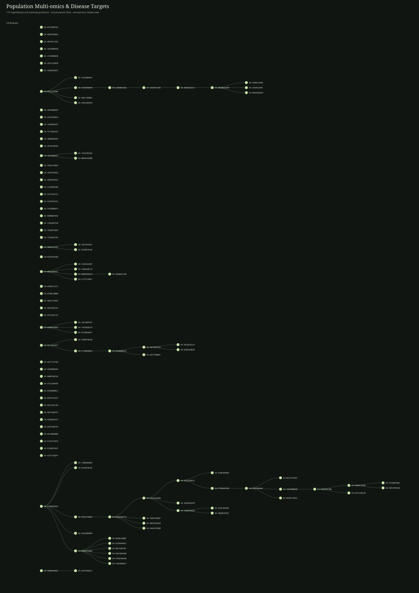

# Population Multi-omics & Disease Targets

115 nodes in this frozen domain forest. A node is one recorded hypothesis version or starting question; arrows show recorded derivation. Distinct roots remain distinct.

## UK Biobank

115 nodes

### D4-0747ABFE3A · 绝经相关脂蛋白变化是否超出体重变化

**Full scientific proposal:** [Read the public review copy](../proposals/D4-0747ABFE3A.md)

**Derived from:** —

### D4-08394FA826 · 长端粒相关的肿瘤与血管风险权衡

**Full scientific proposal:** [Read the public review copy](../proposals/D4-08394FA826.md)

**Derived from:** —

### D4-0847AC1163 · 低睾酮与低SHBG是否代表不同男性代谢状态

**Full scientific proposal:** [Read the public review copy](../proposals/D4-0847AC1163.md)

**Derived from:** —

### D4-0A9AC46BDC · Source-concordant absolute CBC cancer-type contrast

**Full scientific proposal:** [Read the public review copy](../proposals/D4-0A9AC46BDC.md)

**Derived from:** D4-CD25D7EDFD

### D4-0AE8F1E3ED · Absolute-risk CBC cancer-type contrast under generic burden and source ascertainment

**Full scientific proposal:** [Read the public review copy](../proposals/D4-0AE8F1E3ED.md)

**Derived from:** D4-A63BF8F2BB

### D4-0C96B9B593 · incident colorectal-cancer competing-risk reserve study — delivery repair

**Full scientific proposal:** [Read the public review copy](../proposals/D4-0C96B9B593.md)

**Derived from:** D4-C77EBFA8CF

### D4-0CC67A027B · CBC cancer-type contrast after generic burden and observation selection

**Full scientific proposal:** [Read the public review copy](../proposals/D4-0CC67A027B.md)

**Derived from:** D4-A63BF8F2BB

### D4-0E91D0A62C · UKB CBC cancer-type contrast: first-CBC estimand with explicit timing and ascertainment falsification

**Full scientific proposal:** [Read the public review copy](../proposals/D4-0E91D0A62C.md)

**Derived from:** D4-25C0150498

### D4-0EC3C1EEE2 · Corrected UKB cancer-type hypothesis with metabolic/liver restart audit

**Full scientific proposal:** [Read the public review copy](../proposals/D4-0EC3C1EEE2.md)

**Derived from:** D4-F94FB6B46C

### D4-16AD8A1A2A · Prospective thigh muscle fat infiltration and falls-report risk in UK Biobank

**Full scientific proposal:** [Read the public review copy](../proposals/D4-16AD8A1A2A.md)

**Derived from:** D4-5195309D49

### D4-16D206BA50 · 空气污染与肺功能遗传易感性的交互

**Full scientific proposal:** [Read the public review copy](../proposals/D4-16D206BA50.md)

**Derived from:** —

### D4-17A499D058 · 夜间噪声与睡眠脆弱性共同指向房颤

**Full scientific proposal:** [Read the public review copy](../proposals/D4-17A499D058.md)

**Derived from:** —

### D4-1E471250FB · 骨与肌肉衰退不同步的骨折路径

**Full scientific proposal:** [Read the public review copy](../proposals/D4-1E471250FB.md)

**Derived from:** —

### D4-1EAD2D482F · 肺功能下降与右心改变的先后关系

**Full scientific proposal:** [Read the public review copy](../proposals/D4-1EAD2D482F.md)

**Derived from:** —

### D4-1F11C24E00 · 内脏脂肪与肌肉浸润对应的两种风险

**Full scientific proposal:** [Read the public review copy](../proposals/D4-1F11C24E00.md)

**Derived from:** —

### D4-203A60B610 · CRP与GlycA不一致的炎症状态

**Full scientific proposal:** [Read the public review copy](../proposals/D4-203A60B610.md)

**Derived from:** —

### D4-24313D46CA · 脂肪分布与绝经后激素相关癌症的差异

**Full scientific proposal:** [Read the public review copy](../proposals/D4-24313D46CA.md)

**Derived from:** —

### D4-24A6840CD7 · 正常血糖下胰腺体积与脂肪的不同预警信息

**Full scientific proposal:** [Read the public review copy](../proposals/D4-24A6840CD7.md)

**Derived from:** —

### D4-25C0150498 · first-CBC cancer-type signal versus repeat-measurement selection

**Full scientific proposal:** [Read the public review copy](../proposals/D4-25C0150498.md)

**Derived from:** D4-D43D38E7CE

**Scientific question:** The hypothesis is descriptive and predictive, not causal.

### D4-269012459E · Does posterior-thigh MFI add to thigh-muscle distribution for later falls?

**Full scientific proposal:** [Read the public review copy](../proposals/D4-269012459E.md)

**Derived from:** D4-8B19BCA548

**Scientific question:** The hypothesis is a positive conditional prognostic association per 1-SD higher MFI.

### D4-2AA9F49DAF · CBC discordance, timing, and repeat-measurement selection

**Full scientific proposal:** [Read the public review copy](../proposals/D4-2AA9F49DAF.md)

**Derived from:** D4-D43D38E7CE

### D4-2CD445A307 · UKB muscle quantity versus quality/function: critical alternative

**Full scientific proposal:** [Read the public review copy](../proposals/D4-2CD445A307.md)

**Derived from:** D4-854234041C

### D4-317180CEFE · 高糖尿病遗传风险下的异位脂肪差异

**Full scientific proposal:** [Read the public review copy](../proposals/D4-317180CEFE.md)

**Derived from:** —

### D4-34C1EBF01F · repaired hypothesis: CRP-discordant GlycA and delayed infection admissions

**Full scientific proposal:** [Read the public review copy](../proposals/D4-34C1EBF01F.md)

**Derived from:** D4-A2660746EC

### D4-350907854D · repaired proposal: prediagnostic host reserve and competing mortality after colorectal-cancer diagnosis

**Full scientific proposal:** [Read the public review copy](../proposals/D4-350907854D.md)

**Derived from:** D4-A571401DF7

**Scientific question:** in incident CRC, lower prediagnostic reserve, measured at least two years before the CRC diagnosis, is associated with a larger five-year cumulative incidence of non-CRC death than CRC death after diagnosis, after adjustment for age, sex, BMI, smoking, and baseline calendar time. Formally, for a one-standard-deviation lower reserve score R, the primary contrast is

### D4-352580B5E4 · repair — prospective thigh MFI and falls/function

**Full scientific proposal:** [Read the public review copy](../proposals/D4-352580B5E4.md)

**Derived from:** D4-1F11C24E00

### D4-3B98A85D93 · 低血脂伴低白蛋白是否提示隐匿肝病

**Full scientific proposal:** [Read the public review copy](../proposals/D4-3B98A85D93.md)

**Derived from:** —

### D4-3D79C46556 · 早绝经与心脏重构是否独立于血压负荷

**Full scientific proposal:** [Read the public review copy](../proposals/D4-3D79C46556.md)

**Derived from:** —

### D4-41A15B031F · 癌症确诊前储备与确诊后的非癌死亡

**Full scientific proposal:** [Read the public review copy](../proposals/D4-41A15B031F.md)

**Derived from:** —

### D4-44878BB84B · CBC cancer-type contrast under source-dependent ascertainment

**Full scientific proposal:** [Read the public review copy](../proposals/D4-44878BB84B.md)

**Derived from:** D4-F94FB6B46C

### D4-44A49120FC · prespecified falls-burden secondary analysis

**Full scientific proposal:** [Read the public review copy](../proposals/D4-44A49120FC.md)

**Derived from:** D4-8B19BCA548

### D4-492D27A059 · 绝经后骨量与脂肪增加不同步

**Full scientific proposal:** [Read the public review copy](../proposals/D4-492D27A059.md)

**Derived from:** —

### D4-4A97E43953 · 脂肪分布与绝经后激素相关癌症的差异

**Full scientific proposal:** [Read the public review copy](../proposals/D4-4A97E43953.md)

**Derived from:** —

### D4-4AF194FF2A · Prediagnostic reserve and competing mortality after colorectal cancer

**Full scientific proposal:** [Read the public review copy](../proposals/D4-4AF194FF2A.md)

**Derived from:** D4-0C96B9B593

### D4-4E684892F0 · UKB metabolic mismatch and pancreatic-cancer timing

**Full scientific proposal:** [Read the public review copy](../proposals/D4-4E684892F0.md)

**Derived from:** D4-25C0150498

### D4-4E6F607EEC · 低血脂伴低白蛋白是否提示隐匿肝病

**Full scientific proposal:** [Read the public review copy](../proposals/D4-4E6F607EEC.md)

**Derived from:** —

### D4-4E7478ABEC · incident colorectal-cancer competing-risk reserve study

**Full scientific proposal:** [Read the public review copy](../proposals/D4-4E7478ABEC.md)

**Derived from:** D4-0C96B9B593

### D4-5170DA0390 · 相同炎症水平下的白细胞组成与感染结局

**Full scientific proposal:** [Read the public review copy](../proposals/D4-5170DA0390.md)

**Derived from:** —

### D4-5195309D49 · Prospective muscle-fat signal and falls in UK Biobank

**Full scientific proposal:** [Read the public review copy](../proposals/D4-5195309D49.md)

**Derived from:** D4-1F11C24E00

### D4-5472767FC5 · 绝经后骨量与脂肪增加不同步

**Full scientific proposal:** [Read the public review copy](../proposals/D4-5472767FC5.md)

**Derived from:** —

### D4-557B47E225 · 支链氨基酸变化是否早于糖代谢恶化

**Full scientific proposal:** [Read the public review copy](../proposals/D4-557B47E225.md)

**Derived from:** —

### D4-5AE7841857 · repaired direction: MRI muscle fat infiltration and same-visit functional discordance

**Full scientific proposal:** [Read the public review copy](../proposals/D4-5AE7841857.md)

**Derived from:** D4-80DF022525

### D4-5C93B9BA75 · 正常血糖下胰腺体积与脂肪的不同预警信息

**Full scientific proposal:** [Read the public review copy](../proposals/D4-5C93B9BA75.md)

**Derived from:** —

### D4-5E59DC91AE · repaired proposal: MRI thigh fat infiltration and same-visit functional limitation

**Full scientific proposal:** [Read the public review copy](../proposals/D4-5E59DC91AE.md)

**Derived from:** D4-80DF022525

### D4-5F083FDDD9 · UKB seed-39 comparison branch: does a low-ApoB/low-albumin pattern mark near-term liver cancer rather than generic illness?

**Full scientific proposal:** [Read the public review copy](../proposals/D4-5F083FDDD9.md)

**Derived from:** D4-0E91D0A62C

### D4-65973EE68F · Calendar-stable CBC cancer-type contrast: a competing-burden and ascertainment stress test

**Full scientific proposal:** [Read the public review copy](../proposals/D4-65973EE68F.md)

**Derived from:** D4-C2D64E3816

### D4-66EC74DB01 · repair — prospective thigh MFI and falls/function

**Full scientific proposal:** [Read the public review copy](../proposals/D4-66EC74DB01.md)

**Derived from:** D4-1F11C24E00

### D4-698B8EFD92 · 血糖升高伴体重下降的胰腺癌线索

**Full scientific proposal:** [Read the public review copy](../proposals/D4-698B8EFD92.md)

**Derived from:** —

### D4-6B2FE81650 · UKB CBC discordance

**Full scientific proposal:** [Read the public review copy](../proposals/D4-6B2FE81650.md)

**Derived from:** D4-D43D38E7CE

### D4-6BA8E42D55 · Lineage-aware CBC cancer-type contrast beyond ascertainment

**Full scientific proposal:** [Read the public review copy](../proposals/D4-6BA8E42D55.md)

**Derived from:** D4-C2D64E3816

**Scientific question:** The unresolved question is whether the contrast contains cancer-type information that survives a two-year washout and whether the additional CBC dimensions—WBC and RDW—change that interpretation.

### D4-7012B20C34 · CRP-discordant GlycA, persistent inflammation and future infection

**Full scientific proposal:** [Read the public review copy](../proposals/D4-7012B20C34.md)

**Derived from:** D4-A2660746EC

### D4-716A28F338 · 支链氨基酸变化是否早于糖代谢恶化

**Full scientific proposal:** [Read the public review copy](../proposals/D4-716A28F338.md)

**Derived from:** —

### D4-740B305BE9 · Method comparison for UKB seed 23

**Full scientific proposal:** [Read the public review copy](../proposals/D4-740B305BE9.md)

**Derived from:** D4-F78069665A

### D4-75861EB174 · Muscle quantity versus muscle quality for later mobility decline

**Full scientific proposal:** [Read the public review copy](../proposals/D4-75861EB174.md)

**Derived from:** D4-854234041C

### D4-75EADFFB3D · 房颤遗传风险与左房结构的不同组合

**Full scientific proposal:** [Read the public review copy](../proposals/D4-75EADFFB3D.md)

**Derived from:** —

### D4-7C93EACFDE · 肺功能下降与右心改变的先后关系

**Full scientific proposal:** [Read the public review copy](../proposals/D4-7C93EACFDE.md)

**Derived from:** —

### D4-7E457B201D · Prediagnosis physiologic reserve and competing mortality after colorectal cancer

**Full scientific proposal:** [Read the public review copy](../proposals/D4-7E457B201D.md)

**Derived from:** D4-41A15B031F

### D4-80DF022525 · 肌肉量保留但肌力下降的风险来源

**Full scientific proposal:** [Read the public review copy](../proposals/D4-80DF022525.md)

**Derived from:** —

### D4-8355C8CAA8 · 乳腺癌遗传风险与绝经后激素背景

**Full scientific proposal:** [Read the public review copy](../proposals/D4-8355C8CAA8.md)

**Derived from:** —

### D4-854234041C · 肌肉量保留但肌力下降的风险来源

**Full scientific proposal:** [Read the public review copy](../proposals/D4-854234041C.md)

**Derived from:** —

### D4-8590CC7271 · 肺功能与全身储备不一致时的感染后结局

**Full scientific proposal:** [Read the public review copy](../proposals/D4-8590CC7271.md)

**Derived from:** —

### D4-87ABC18B0D · 冠心病遗传风险在不同脂蛋白背景下的表达

**Full scientific proposal:** [Read the public review copy](../proposals/D4-87ABC18B0D.md)

**Derived from:** —

### D4-8B19BCA548 · Does posterior-thigh MFI add to thigh-muscle distribution for later falls?

**Full scientific proposal:** [Read the public review copy](../proposals/D4-8B19BCA548.md)

**Derived from:** D4-ADA0A35211

**Scientific question:** The hypothesis is a positive conditional prognostic association per 1-SD higher MFI.

### D4-8C56D458C3 · Source-concordant absolute CBC cancer-type contrast

**Full scientific proposal:** [Read the public review copy](../proposals/D4-8C56D458C3.md)

**Derived from:** D4-CD25D7EDFD

### D4-90E8F092C6 · Seed 03 : prospective muscle-quality increment beyond thigh quantity

**Full scientific proposal:** [Read the public review copy](../proposals/D4-90E8F092C6.md)

**Derived from:** D4-854234041C

### D4-9308AFCA3B · Delivery-ready UKB MRI muscle-quality

**Full scientific proposal:** [Read the public review copy](../proposals/D4-9308AFCA3B.md)

**Derived from:** D4-90E8F092C6

### D4-94616745B9 · CBC discordance, timing, and repeat-measurement selection

**Full scientific proposal:** [Read the public review copy](../proposals/D4-94616745B9.md)

**Derived from:** D4-D43D38E7CE

### D4-94CAE2E124 · among incident C18-C20 cases, lower measured reserve at least two years before diagnosis is associated with greater five-year cumulative incidence of non-cancer death than CRC-spec

**Full scientific proposal:** [Read the public review copy](../proposals/D4-94CAE2E124.md)

**Derived from:** D4-4AF194FF2A

### D4-99DC272992 · 内脏脂肪与肌肉浸润对应的两种风险

**Full scientific proposal:** [Read the public review copy](../proposals/D4-99DC272992.md)

**Derived from:** —

### D4-9D5C6E147A · 空气污染与肺功能遗传易感性的交互

**Full scientific proposal:** [Read the public review copy](../proposals/D4-9D5C6E147A.md)

**Derived from:** —

### D4-9F7529C72F · 房颤遗传风险与左房结构的不同组合

**Full scientific proposal:** [Read the public review copy](../proposals/D4-9F7529C72F.md)

**Derived from:** —

### D4-A2660746EC · CRP与GlycA不一致的炎症状态

**Full scientific proposal:** [Read the public review copy](../proposals/D4-A2660746EC.md)

**Derived from:** —

### D4-A4CD01819F · Repaired UKB seed 23: repeated CBC discordance and cancer-type-specific prediagnostic risk

**Full scientific proposal:** [Read the public review copy](../proposals/D4-A4CD01819F.md)

**Derived from:** D4-F78069665A

### D4-A54517DA03 · Method comparison for UKB seed 23

**Full scientific proposal:** [Read the public review copy](../proposals/D4-A54517DA03.md)

**Derived from:** D4-F78069665A

### D4-A571401DF7 · 癌症确诊前储备与确诊后的非癌死亡

**Full scientific proposal:** [Read the public review copy](../proposals/D4-A571401DF7.md)

**Derived from:** —

### D4-A63BF8F2BB · CBC cancer-type contrast under source-dependent ascertainment

**Full scientific proposal:** [Read the public review copy](../proposals/D4-A63BF8F2BB.md)

**Derived from:** D4-44878BB84B

### D4-AA177147AD · 骨与肌肉衰退不同步的骨折路径

**Full scientific proposal:** [Read the public review copy](../proposals/D4-AA177147AD.md)

**Derived from:** —

### D4-AA3D8BA64A · 早绝经与心脏重构是否独立于血压负荷

**Full scientific proposal:** [Read the public review copy](../proposals/D4-AA3D8BA64A.md)

**Derived from:** —

### D4-ADA0A35211 · does MFI add to thigh-muscle distribution for later falls?

**Full scientific proposal:** [Read the public review copy](../proposals/D4-ADA0A35211.md)

**Derived from:** D4-C825872785

### D4-AF20D48ACF · CRP-discordant GlycA, persistent inflammation and future infection

**Full scientific proposal:** [Read the public review copy](../proposals/D4-AF20D48ACF.md)

**Derived from:** D4-A2660746EC

### D4-B08EC6BC5A · 夜间噪声与睡眠脆弱性共同指向房颤

**Full scientific proposal:** [Read the public review copy](../proposals/D4-B08EC6BC5A.md)

**Derived from:** —

### D4-B1D3D86DD0 · Method comparison for UKB seed 23

**Full scientific proposal:** [Read the public review copy](../proposals/D4-B1D3D86DD0.md)

**Derived from:** D4-F78069665A

### D4-B2B591BB39 · follow-up/outcome audit

**Full scientific proposal:** [Read the public review copy](../proposals/D4-B2B591BB39.md)

**Derived from:** D4-4AF194FF2A

### D4-B407683053 · Does posterior-thigh MFI add to thigh-muscle distribution for later falls?

**Full scientific proposal:** [Read the public review copy](../proposals/D4-B407683053.md)

**Derived from:** D4-8B19BCA548

**Scientific question:** The hypothesis is a positive conditional prognostic association per 1-SD higher MFI.

### D4-BA073B74EC · CBC cancer-type ordering boundary after delayed entry

**Full scientific proposal:** [Read the public review copy](../proposals/D4-BA073B74EC.md)

**Derived from:** D4-CD25D7EDFD

**Scientific question:** The unresolved question is > Among adults with complete CBC measurements at two verified UKB assessment instances, does a prespecified trajectory create a reproducible absolute-risk boundary in which the later 5-year cumulative incidence of registry-coded CRC exceeds that of hematologic cancer, after a two-year delayed-entry stress test and comparison with other primary cancers?

### D4-BA94FC0912 · UKB CBC specificity versus generic pre-diagnostic observation

**Full scientific proposal:** [Read the public review copy](../proposals/D4-BA94FC0912.md)

**Derived from:** D4-F94FB6B46C

### D4-BB4EFEE88B · Pre-diagnosis physiologic reserve and competing mortality after colorectal cancer

**Full scientific proposal:** [Read the public review copy](../proposals/D4-BB4EFEE88B.md)

**Derived from:** D4-41A15B031F

### D4-C0FA103AFB · repair — prospective thigh MFI and falls/function

**Full scientific proposal:** [Read the public review copy](../proposals/D4-C0FA103AFB.md)

**Derived from:** D4-1F11C24E00

### D4-C2D64E3816 · CBC discordance: a delayed first-CBC cancer-type contrast, with repeat observation as a selection stress test

**Full scientific proposal:** [Read the public review copy](../proposals/D4-C2D64E3816.md)

**Derived from:** D4-25C0150498

### D4-C371CC9AE1 · UKB seed 03: does muscle function and posterior thigh myosteatosis add information beyond thigh muscle quantity for future mobility decline or falls?

**Full scientific proposal:** [Read the public review copy](../proposals/D4-C371CC9AE1.md)

**Derived from:** D4-854234041C

### D4-C77EBFA8CF · pre-diagnostic host reserve and competing mortality after incident colorectal cancer

**Full scientific proposal:** [Read the public review copy](../proposals/D4-C77EBFA8CF.md)

**Derived from:** D4-A571401DF7

### D4-C825872785 · does MFI add to thigh-muscle distribution for later falls?

**Full scientific proposal:** [Read the public review copy](../proposals/D4-C825872785.md)

**Derived from:** D4-16AD8A1A2A

### D4-CD25D7EDFD · Repaired UKB seed 23: repeated CBC discordance and cancer-site risk

**Full scientific proposal:** [Read the public review copy](../proposals/D4-CD25D7EDFD.md)

**Derived from:** D4-F78069665A

### D4-CF2C3A64E4 · 低睾酮与低SHBG是否代表不同男性代谢状态

**Full scientific proposal:** [Read the public review copy](../proposals/D4-CF2C3A64E4.md)

**Derived from:** —

### D4-CF50AB76B2 · Source-robust, calibrated CBC profile contrast for CRC versus other primary cancers

**Full scientific proposal:** [Read the public review copy](../proposals/D4-CF50AB76B2.md)

**Derived from:** D4-0AE8F1E3ED

### D4-D249800B11 · 肺功能与全身储备不一致时的感染后结局

**Full scientific proposal:** [Read the public review copy](../proposals/D4-D249800B11.md)

**Derived from:** —

### D4-D43D38E7CE · Method comparison for UKB seed 23

**Full scientific proposal:** [Read the public review copy](../proposals/D4-D43D38E7CE.md)

**Derived from:** D4-A54517DA03

### D4-D4F9C3CA57 · 肝脂肪与胰腺脂肪不一致的糖代谢走向

**Full scientific proposal:** [Read the public review copy](../proposals/D4-D4F9C3CA57.md)

**Derived from:** —

### D4-D63136C14D · 绝经相关脂蛋白变化是否超出体重变化

**Full scientific proposal:** [Read the public review copy](../proposals/D4-D63136C14D.md)

**Derived from:** —

### D4-D6A78EAA0D · CBC cancer-type ordering boundary after delayed entry

**Full scientific proposal:** [Read the public review copy](../proposals/D4-D6A78EAA0D.md)

**Derived from:** D4-CD25D7EDFD

**Scientific question:** The unresolved question is > Among adults with complete CBC measurements at two verified UKB assessment instances, does a prespecified trajectory create a reproducible absolute-risk boundary in which the later 5-year cumulative incidence of registry-coded CRC exceeds that of hematologic cancer, after a two-year delayed-entry stress test and comparison with other primary cancers?

### D4-D851F9EA5B · Source-robust delayed CBC cancer-type contrast under ascertainment falsification

**Full scientific proposal:** [Read the public review copy](../proposals/D4-D851F9EA5B.md)

**Derived from:** D4-0AE8F1E3ED

### D4-D87F208FC5 · 血细胞变化指向隐匿失血还是造血异常

**Full scientific proposal:** [Read the public review copy](../proposals/D4-D87F208FC5.md)

**Derived from:** —

### D4-DCB6810CF3 · 肝脂肪与胰腺脂肪不一致的糖代谢走向

**Full scientific proposal:** [Read the public review copy](../proposals/D4-DCB6810CF3.md)

**Derived from:** —

### D4-DCEF26EFF8 · 乳腺癌遗传风险与绝经后激素背景

**Full scientific proposal:** [Read the public review copy](../proposals/D4-DCEF26EFF8.md)

**Derived from:** —

### D4-DCF5BD6B00 · 高糖尿病遗传风险下的异位脂肪差异

**Full scientific proposal:** [Read the public review copy](../proposals/D4-DCF5BD6B00.md)

**Derived from:** —

### D4-E153C7E676 · 冠心病遗传风险在不同脂蛋白背景下的表达

**Full scientific proposal:** [Read the public review copy](../proposals/D4-E153C7E676.md)

**Derived from:** —

### D4-E678398A21 · telomere rival stress test

**Full scientific proposal:** [Read the public review copy](../proposals/D4-E678398A21.md)

**Derived from:** D4-FB6AB1FB5C

### D4-E7E8AC6F6D · UKB CBC cancer-type contrast: same-table ascertainment bridge and selection stress test

**Full scientific proposal:** [Read the public review copy](../proposals/D4-E7E8AC6F6D.md)

**Derived from:** D4-0E91D0A62C

### D4-F29E87F047 · 相同炎症水平下的白细胞组成与感染结局

**Full scientific proposal:** [Read the public review copy](../proposals/D4-F29E87F047.md)

**Derived from:** —

### D4-F396788CDB · Source-concordant absolute CBC cancer-type contrast

**Full scientific proposal:** [Read the public review copy](../proposals/D4-F396788CDB.md)

**Derived from:** D4-CD25D7EDFD

### D4-F3F772ED7F · 血糖升高伴体重下降的胰腺癌线索

**Full scientific proposal:** [Read the public review copy](../proposals/D4-F3F772ED7F.md)

**Derived from:** —

### D4-F4E4D8D027 · Source-robust delayed CBC cancer-type contrast

**Full scientific proposal:** [Read the public review copy](../proposals/D4-F4E4D8D027.md)

**Derived from:** D4-CD25D7EDFD

### D4-F78069665A · 血细胞变化指向隐匿失血还是造血异常

**Full scientific proposal:** [Read the public review copy](../proposals/D4-F78069665A.md)

**Derived from:** —

### D4-F94FB6B46C · UKB CBC cancer-type contrast: absolute-risk boundary for timing and clinical selection

**Full scientific proposal:** [Read the public review copy](../proposals/D4-F94FB6B46C.md)

**Derived from:** D4-E7E8AC6F6D

### D4-FB6AB1FB5C · 长端粒相关的肿瘤与血管风险权衡

**Full scientific proposal:** [Read the public review copy](../proposals/D4-FB6AB1FB5C.md)

**Derived from:** —

